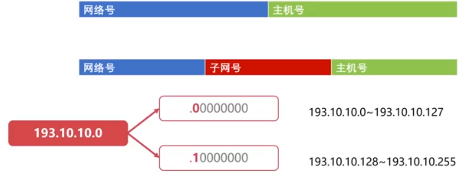
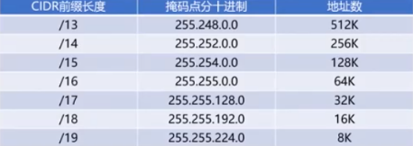

- [1. IP协议](#1-ip协议)
  - [1.1. IP协议详解](#11-ip协议详解)
  - [1.2. IP协议的转发流程](#12-ip协议的转发流程)
  - [1.3. IP地址的子网划分](#13-ip地址的子网划分)
    - [1.3.1. 分类的IP地址](#131-分类的ip地址)
    - [1.3.2. 划分子网](#132-划分子网)
  - [1.4. 网络地址转换`nat`技术](#14-网络地址转换nat技术)
    - [1.4.1. 网络地址转换NAT（`Network Address Translation`）](#141-网络地址转换natnetwork-address-translation)

## 1. IP协议

### 1.1. IP协议详解

虚拟互连网络
- [ ] 实际的计算机网络是错综复杂的
- [ ] 物理设备通过使用IP协议，**屏蔽了物理网络之间的差异**，无需关注网络细节

IP协议作用：
- [ ] IP协议使得复杂的实际网络变为一个虚拟互连的网络
- [ ] IP协议使得网络层可以屏蔽底层细节而专注网络层的数据转发
- [ ] IP协议解决了**在虚拟网络中数据报传输路径**的问题

IP协议
- [ ] **点分十进制**表示
- [ ] 32位，常分为4个8位

IP首部，至少有`20`个字节的长度（`4*5`）

- [ ] 版本
  - [ ] 占4位，当前是`IPv4`，也有`IPv6`，通信双方必须使用一致的版本
- [ ] 首部位长度
  - [ ] 占4位，最大数值为15，表示IP首部长度，单位是“32位字”（4个字节），也就是IP首部最大长度为60字节
- [ ] 总长度
  - [ ] 占16位，最大数值为65535，表示的是IP数据报总长度（IP首部+IP数据）比MTU高的时候分片
- [ ] TTL
  - [ ] 占8位，表明**IP数据报文在网络中的寿命**
  - [ ] 每经过一个设备，TTL减1，当TTL为0时，网络设备必须丢弃该报文。（找不到终点时，避免在网络中无限传输，来消耗带宽）
- [ ] 协议
  - [ ] 占8位，表明IP数据所携带的具体数据是什么协议的
  - [ ] （如TCP、UDP，还有可能是IP，即在IP数据中放IP）
- [ ] 首部校验和
  - [ ] 占16位，校验IP首部是否出错

### 1.2. IP协议的转发流程

逐跳（`hop-by-hop`）
- 一跳一跳，从一个设备跳到下一个设备

路由表
- [ ] **目的IP地址和下一跳IP地址**的对应关系
- [ ] 计算机和路由器都有路由表
 

IP协议的转发流程（`A=>E=>F`）：
- [ ] A**查询路由表**发现**下一跳IP**地址为E，将IP数据报**交给数据链路层**，查询**ARP缓存表**得到**目的Mac地址**后，并告知目的Mac地址是E，将数据链路层**填充源Mac地址和目的Mac地址E**，数据链路层**通过物理层将数据发送给E**
- [ ] E的数据链路层接收到数据帧，把帧数据交给**网络层**，网络层查询路由表，发现下一跳为F，E将IP数据报交给数据链路层，查询APR缓存表得到目的Mac地址后，并且告知目的Mac地址为F，数据链路层填充源Mac地址E和目的Mac地址F，封装成帧，通过物理层将数据发送给F。

转化过程中MAC地址和IP地址的不同：
- [ ] 数据帧每一跳的**Mac地址都在变化**
- [ ] IP数据报每一跳的**IP地址始终不变**

### 1.3. IP地址的子网划分

#### 1.3.1. 分类的IP地址

- [ ] A类地址前面是`0`，网络号`8`位，主机号`24`位
- [ ] B类地址前面是`10`，网络号`16`位，主机号`16`位
- [ ] C类地址前面是`110`，网络号`24`位，主机号`8`位
- [ ] D类地址前面是`1110`
- [ ] E类地址前面是`1111`

判断IP地址类别，并不是死记硬背界限，而是把前八位转为二进制，看前几位和哪一类的规则能匹配上

特殊的主机号：
- [ ] 主机号全为`0`表示当前网络段，不可分配为特定主机，如`1.0.0.0`
- [ ] 主机号全为`1`表示**广播地址**，**向当前网络段所有主机发消息**，如`1.255.255.255`

特殊的网络号：
- [ ] A类地址**网络段全0**表示特殊网络
- [ ] A类地址**网络段后7位全1**（`127`）表示回环地址
- [ ] B类地址网络段（`128.0`）不可使用
- [ ] C类地址网络段（`192.0.0`）不可使用

更正：

 

`127.0.0.1`回环地址
> 127.0.0.1，通常被称为本地回环地址（Loopback Address），不属于任何一个有类别地址类。它代表设备的本地虚拟接口，所以默认被看作是永远不会宕掉的接口。在windows操作系统中也有相似的定义，所以通常在安装网卡前就可以ping通这个本地回环地址。一般都会用来检查本地网络协议、基本数据接口等是否正常的。

#### 1.3.2. 划分子网

某公司`100`名员工，申请哪种网络段？
- `C`类地址拥有主机号`254`个，最节约

如果拥有`256`名员工，则需要申请B类地址，但极其浪费

划分子网的例子：
 

- [ ] 减少浪费
- [ ] 划分子网后，子网掩码能快速判断IP属于哪个网络号

子网掩码
- [ ] 32位
- [ ] 由**连续的1和连续的0**组成
- [ ] 某一个子网的子网掩码具备**网络号位数个连续的1**
- [ ] 作用：**能快速判断某IP属于哪个网络号**

上一个例子的子网掩码为：
 

- A类地址子网掩码为`255.0.0.0`
- B类地址子网掩码为`255.255.0.0`
- C类地址子网掩码为`255.255.255.0`

子网掩码与IP地址相与可以得到IP地址的网络号，如
`193.10.10.129`的子网掩码为`255.255.255.128`，两者相与可以得到`193.10.10.128`

无分类编地址`CIDR`
	没有ABC类网络号或子网划分
	将网络前缀相同的IP地址称为一个`CIDR`地址块
	网络前缀是任意位数的
	子网掩码等与前面相同，只是采用了斜线记法，比上面方法常用

斜线记法：
`193.10.10.129/25`表示它的网络前缀有`25`位，主机号则为7位
 
 

### 1.4. 网络地址转换`nat`技术

产生背景：
- [ ] IPv4最多只要40+亿个IP地址
- [ ] 不够用

分类：
- [ ] 内网地址：**内部机构**使用，避免与外网地址重复
- [ ] 外网地址：**全球范围**使用，全球公网唯一

三类内网地址
- [ ] `10.0.0.0 ~ 10.255.255.255`（支持千万数量级设备）
- [ ] `172.16.0.0 ~ 172.31.255.255`（支持百万数量级设备）
- [ ] `192.168.0.0~192.168.255.255`（支持万数量级设备）

内部多个设备使用同一个外网IP请求外网的服务，外部怎么知道具体是哪一个设备在请求的？

#### 1.4.1. 网络地址转换NAT（`Network Address Translation`）

- [ ] NAT技术用于**多个主机**通过**一个公有IP访问互联网的私有网络中**
- [ ] 减缓了IP地址的消耗，但增加了网络通信的复杂度

过程：
- [ ] 发生在本地路由器，把**本地端口号**换成对外端口号进行通信，收到数据的时候把外网端口换成内网端口，关键是**内网中每个端口不同**

`NA(P)T`表

