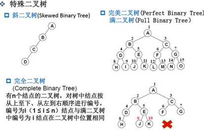
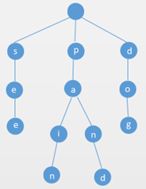
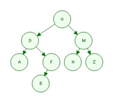

## 数据结构与算法

### 复杂度
- 像`O(1)`, `O(ln(n))`, `O(n^a)`等，我们把它叫做多项式级复杂度，因为它的规模n出现在底数的位置；
- 另一种像是`O(a^n)`和`O(n!)`等，它是非多项式级的复杂度。

`O(n)`=线性时间
`O(1)`=常量时间


#### `log`级别的时间复杂度
- 算法中`log`级别的时间复杂度都是由于使用了分治思想，这个底数直接由分治的复杂度决定。
- 如果采用二分法,那么就会以2为底数，三分法就会以3为底数，其他亦然。
- 不过无论底数是什么，log级别的渐进意义是一样的。
- 也就是说该算法的时间复杂度的增长与处理数据多少的增长的关系是一样的。


#### 时间复杂度按照阶排序


#### 复杂度分析窍门

1. 若两段算法分别有复杂度`T1(n) = O(f1(n))` 和`T2(n) = O(f2(n))`，则：
```
T1(n) + T2(n) = max(O(f1(n)), O(f2(n)))
T1(n) * T2(n) = O(f1(n) * f2(n))
```
2. 若`T(n)`是关于 n 的 k 阶多项式，那么`T(n) = θ(n^k)`
3. 一个`for`循环的时间复杂度等于循环次数乘以循环体代码的复杂度
4. `if-else`结构的复杂度取决于`if`的条件判断复杂度和两个分支部分的复杂度，总体复杂度**取三者中最大**。


#### 渐进时间复杂度

渐进时间复杂度是指**`n`趋于无穷时的复杂度**。向有序表中任意一个位置插入元素，插入位置之后的元素依次挪动一个位置，假设元素插入的位置坐标为`k`，则时间复杂度为`O(k)`，渐进时间复杂度为`O(n)`。


### 算法设计要求
1. 正确性
2. 可读性
3. 健壮性
4. 效率与低存储量需求


### 从哪几个方面进行算法分析
1. 时间复杂度
2. 空间复杂度
3. 稳定性


### 本质
1. 算法的本质是寻找规律并实现。
2. 如何找出规律？发现输入和输出的关系，寻找突破点


### 数据结构之逻辑结构与物理(存储)结构

1. 逻辑结构：
逻辑结构分为四种类型：**集合结构，线性结构，树形结构，图形结构**。

1.1 集合结构。数据元素同属一个集合，单个数据元素之间**没有任何关系**。

1.2 线性结构。类似于线性关系，也就是说，线性结构中的数据元素之间是**一对一**的关系。

1.3 树形结构。树形结构中的数据元素之间存在**一对多**的关系。（各元素及元素关系所组成图形类似于树状图）。

1.4 图形结构。数据元素之间是**多对多**的关系。

  

2. 物理结构（存储结构）：
物理结构又叫存储结构，分为四种，顺序存储结构、链式存储结构、索引结构、散列结构。

2.1 顺序存储结构。一段连续的内存空间。

- 优点：随机访问
- 缺点：插入删除效率低，大小固定

2.2 链式存储结构。不连续的内存空间。

- 优点：大小动态扩展，插入删除效率高
- 缺点：不能随机访问。

2.3 索引存储结构。为了方便查找，整体无序，但索引块之间有序，需要额外空间，存储索引表。

- 优点：对顺序查找的一种改进，查找效率高
- 缺点：需额外空间存储索引

2.4 散列存储结构。选取某个函数，数据元素根据散列函数计算存储位置可能存在多个数据元素存储在同一位置，引起地址冲突

- 优点：查找基于数据本身即可找到，查找效率高，存取效率高。
- 缺点：存取随机，不便于顺序查找。


### 链表与数组
链表类比：寻宝游戏，朋友们散坐在电影院


- 链表：读取O(n)、插入O(1)、删除O(1)
- 数组：读取O(1)、插入O(n)、删除O(n)

对比：
1. 链表擅长**插入和删除**
2. 数组擅长随机访问（数组擅长读取）。

解释：

- 数组查询元素：知道第一个按顺序遍历就行

- 数组增加元素：如果需要给index为10的位置添加，则从index为11的位置开始右移

- 数组删除元素：如果需要删除index为10的位置，则从index为11的位置开始左移

  

- 链表查找：当同时读取所有元素时，链表的效率很高，读第一个，读第二个，以此类推。

- 但当你需要跳跃，链表的效率就很低了，每次都必须从第一个开始查找

- 链表增加元素：只需要修改它前面的那个元素指向的地址就可以了

- 链表删除元素：只需要将前一个元素指向的地址更改即可


### 线性表的存储结构

可分为顺序存储结构和链式存储结构。

1. 顺序存储定义：把逻辑上相邻的数据元素存储在物理上相邻的存储单元中的存储结构。 
2. 链式存储结构: 其结点在存储器中的位置是随意的，即逻辑上相邻的数据元素在物理上不一定相邻。通过指针来实现

区别：
1. 顺序存储时，逻辑上相邻的数据元素，其物理存放地址也相邻。顺序存储的优点是存储密度大，存储空间利用率高；缺点是插入或删除元素时不方便。 
2. 链式存储时，相邻数据元素可随意存放，但所占存储空间分两部分，一部分存放结点值，另一部分存放表示**结点间关系的指针**。链式存储的优点是插入或删除元素时很方便，使用灵活。缺点是**存储密度小，存储空间利用率低**。


### 树的分类
斜二叉树、完全二叉树、满二叉树




### 二叉搜索树
二叉搜索树是一种节点值之间具有一定数量级次序的二叉树，对于树中每个节点：
1. 若其左子树存在，则其左子树中每个节点的值都不大于该节点值；
2. 若其右子树存在，则其右子树中每个节点的值都不小于该节点值。


特点
1. 二分搜索树不一定是完全二叉树
2. 二分搜索树的最大元素节点，一定没有右儿子，不一定是叶子节点。
3. 二分搜索树的最小值，是从根节点一直找左孩子，直到再没有左孩子，就是最小值。其最大值，就是从根节点一直找右孩子，直到再没有右孩子，就是最大值。
4. 若二分搜索树是完全二叉树，则其最小值一定是叶节点，最大值却不一定是叶节点。


#### 二分搜索树删除元素过程
1. 删除最小值时，如果它有右孩子，就把它的右孩子代替它的位置。
2. 删除最大值时，如果它有左孩子，就把它的左孩子代替它的位置。
3. 如果它左右孩子都有，就找到删除节点的后继节点，即它的右子树上的最小值，代替它。（`harborddeletion`）


如果插入的时候是有序的，那就像快排一样，退化，成了链表。
一个解决方法是提前打乱，但是元素是动态加入的，不能事先知道全部的数组。
另一个解决方法是平衡二叉树。


### 平衡二叉树定义(`AVL`)：
它或者是一颗空树，或者具有以下性质的二叉排序树：
它的左子树和右子树的深度之差（**平衡因子**）的绝对值不超过1，且它的左子树和右子树都是一颗平衡二叉树。


一棵AVL树有如下必要条件：
1. 它必须是二叉查找树。
2. 每个节点的左子树和右子树的高度差至多为1。


### Trie
Trie 是一种字典，查找效率比二分搜索树的`logN`还快，因为它只与被查找元素出现的个数有关。比如单词，一个个串起来。

`Trie`，又称前缀树或**字典树**，是一种有序树，用于保存关联数组，其中的键通常是字符串。

特点：

1. 与二叉查找树不同，键不是直接保存在节点中，而是由节点在树中的位置决定。
2. 一个节点的所有子孙都有相同的前缀，也就是这个节点对应的字符串，而根节点对应空字符串。
3. 一般情况下，不是所有的节点都有对应的值，只有叶子节点和部分内部节点所对应的键才有相关的值。

应用：
1. `Trie` 的典型应用是用于**统计、排序和保存大量的字符串**（但不仅限于字符串），所以经常被搜索引擎系统用于文本词频统计。
2. 它的优点是：**利用字符串的公共前缀来减少查询时间**，最大限度地减少无谓的字符串比较，查询效率比哈希树高。



### 前序、中序、后序遍历的特性

前序遍历：
1. 访问根节点
2. 前序遍历左子树
3. 前序遍历右子树

中序遍历：
1. 中序遍历左子树
2. 访问根节点
3. 中序遍历右子树

后序遍历：
1. 后序遍历左子树
2. 后序遍历右子树
3. 访问根节点


### 已知前序、中序遍历，求后序遍历
例：
```
前序遍历: GDAFEMHZ
中序遍历: ADEFGHMZ
```

画树求法：
1. 第一步，根据前序遍历的特点，我们知道根结点为`G`。

2. 第二步，观察中序遍历`ADEFGHMZ`。其中`root`节点`G`左侧的`ADEF`必然是`root`的左子树，`G`右侧的`HMZ`必然是`root`的右子树。

3. 第三步，观察左子树`ADEF`，左子树的中的根节点必然是大树的`root`的`leftchild`。在前序遍历中，大树的`root`的`leftchild`位于`root`之后，所以左子树的根节点为`D`。

4. 第四步，同样的道理，`root`的右子树节点HMZ中的根节点也可以通过前序遍历求得。在前序遍历中，一定是先把`root`和`root`的所有左子树节点遍历完之后才会遍历右子树，并且遍历的左子树的第一个节点就是左子树的根节点。同理，遍历的右子树的第一个节点就是右子树的根节点。

5. 第五步，观察发现，上面的过程是递归的。先找到当前树的根节点，然后划分为左子树，右子树，然后进入左子树重复上面的过程，然后进入右子树重复上面的过程。最后就可以还原一棵树了。该步递归的过程可以简洁表达如下：
```
1. 确定根,确定左子树，确定右子树。
2. 在左子树中递归。
3. 在右子树中递归。
4. 打印当前根。
```
那么，我们可以画出这个二叉树的形状：



那么，根据后序的遍历规则，我们可以知道，后序遍历顺序为：`AEFDHZMG`

### 已知中序和后序遍历，求前序遍历
依然是上面的题，这次我们只给出中序和后序遍历：
```
中序遍历: ADEFGHMZ
后序遍历: AEFDHZMG
```
画树求法：
1. 第一步，根据后序遍历的特点，我们知道后序遍历最后一个结点即为根结点，即根结点为`G`。
2. 第二步，观察中序遍历`ADEFGHMZ`。其中`root`节点`G`左侧的`ADEF`必然是`root`的左子树，`G`右侧的`HMZ`必然是`root`的右子树。
3. 第三步，观察左子树`ADEF`，后序遍历中，左子树`AEFD`的最后一个为左子树的`root`，也就是`D`为左子树的中的根节点。由中序遍历得，`A`为`D`的左子树，`EF`为`D`的右子树。观察后序遍历，`EF`中最后的一个`F`为其`root`。可以知道，`E`为`F`的左子树。
4. 第四步，同样的道理，`root`的右子树节点`HMZ`中的根节点也可以通过后序遍历求得。在后序遍历中，`HZM`最后一个`M`一定是右子树的根节点。
5. 第五步，观察发现，上面的过程是递归的。先找到当前树的根节点，然后划分为左子树，右子树，然后进入左子树重复上面的过程，然后进入右子树重复上面的过程。最后就可以还原一棵树了。

该步递归的过程可以简洁表达如下：
```
1. 确定根,确定左子树，确定右子树。
2. 在左子树中递归。
3. 在右子树中递归。
4. 打印当前根。
```
这样，我们就可以画出二叉树的形状，如上图所示，这里就不再赘述。
那么，前序遍历: `GDAFEMHZ`

### 如果一个二叉树，其中序遍历结果与前序遍历结果一样，那么
所有的结点都没有左儿子。


### 什么是后继节点和前驱节点
1. 后继节点：一个节点在**中序**遍历中的下一个节点
2. 前驱节点：一个节点在中序遍历中的上一个节点


### 二叉树的重要性质
1. n个节点的二叉树一共有`((2n)!)/(n!*(n+1)!)`种
2. 一个二叉树第`i`层的最大节点数为`2^(i-1)`个
3. 二叉树节点计算公式`N=n0+n1+n2`，度为`0`的叶子节点比度为`2`的节点数多一个，即`N=1*n1+2*n2+1`
4. 对任何一棵二叉树T，如果其终端节点数为`n0`，度为`2`的节点数为`n2`，则`n0=n2＋1`
5. 高度为`K`的二叉树中，最多有`2^k-1`个结点。
6. 具有`n`个节点的完全二叉树的深度为`[log2n]+1`，向下取整
7. 如果有一颗有`n`个节点的完全二叉树的节点按层次序编号，对任一层的节点`i`
(1) 如果`i=1`，则节点是二叉树的根，无双亲，如果`i>1`，则其双亲节点为`[i/2]`，向下取整
(2) 如果`2i>n`那么节点i没有左孩子，否则其左孩子为`2i`
(3) 如果`2i+1>n`那么节点没有右孩子，否则右孩子为`2i+1`

8. 设一棵完全二叉树共有699个节点，则在该二叉树中的叶节点数是什么？
```
n=n0+n1+n2
n0=n2+1
n=699，奇数，说明n1为0；
n=n0+n0-1
n0=350，所以叶节点数为350
```

### 并查集UnionFind
主要两个操作`unionfind`
解决是否连接的问题（比如网络）


连接问题和路径问题
1. 比路径问题要回答的问题少，不关心路径，就能设计更快的算法
2. 二分查找比顺序查找快，因为顺序查找做的事情多，不仅找到了rank，还找到了rank以前的所有元素


对动态连通图（并查集）有几种可能的操作：
- 查询节点属于的组`find`
  - 数组对应位置的值即为组号

- 判断两个节点是否属于同一个组`isConnected`
  - 分别得到两个节点的组号，然后判断组号是否相等

- 连接两个节点，使之属于同一个组`union`
  - 分别得到两个节点的组号，组号相同时操作结束，不同时，将其中的一个节点的组号换成另一个节点的组号

- 获取组的数目`count`
  - 初始化为节点的数目，然后每次成功连接两个节点之后，递减1


用数组表示，`d[i]=3`、`d[j]=3`，组号都为3，就说明它们是互相连接的。


### Quickfind
`Quickfind`，`find`的时间复杂度为`O(1)`，即返回`A[index]`，很快
举个例子，比如输入的 Pair 是`(5，9)`，那么首先通过`find`方法发现它们的组号并不相同，然后在`union`的时候通过一次遍历，将组号`1`都改成`8`。当然，由`8`改成`1`也是可以的，保证操作时都使用一种规则就行。
```
publicintfind(intp)
	{returnid[p];}

publicvoidunion(intp,intq)
{
//获得p和q的组号
intpID=find(p);
intqID=find(q);
//如果两个组号相等，直接返回
if(pID==qID)return;
//遍历一次，改变组号使他们属于一个组
for(inti=0;i<id.length;i++)
if(id[i]==pID)id[i]=qID;
count--;
}
```

对于需要添加新路径的情况，就涉及到对于组号的修改，因为并不能确定哪些节点的组号需要被修改，因此就必须对整个数组进行遍历，找到需要修改的节点，逐一修改，这一下每次添加新路径带来的复杂度就是线性关系了，如果要添加的新路径的数量是`M`，节点数量是`N`，那么最后的时间复杂度就是`MN`


### QuickUnion

为什么以上的解法会造成“牵一发而动全身”？因为每个节点所属的组号都是单独记录，各自为政的，没有将它们以更好的方式组织起来，当涉及到修改的时候，除了逐一通知、修改，别无他法。

如何将节点以更好的方式组织起来，组织的方式有很多种，但是最直观的还是将组号相同的节点组织在一起，想想所学的数据结构，什么样子的数据结构能够将一些节点给组织起来？常见的就是链表，图，树，什么的了。但是哪种结构对于查找和修改的效率最高？毫无疑问是树，因此考虑如何将节点和组的关系以树的形式表现出来。

```
privateintfind(intp)
{
	//寻找p节点所在组的根节点，根节点具有性质id[root]=root
	while(p!=id[p])p=id[p];
	return p;
}
publicvoidunion(intp,intq)
{
	//Givepandqthesameroot.
	intpRoot=find(p);
	intqRoot=find(q);
	if(pRoot==qRoot)
		return;
	id[pRoot]=qRoot;//将一颗树(即一个组)变成另外一课树(即一个组)的子树
	count--;
```

优化
1. 根据`size`（需要维护一个`size`数组）、`rank`（维护一个`rank`数组）决定谁指向谁，让高度更小，可以更快找到
2. 路径压缩，将层数减少


### 路径压缩：（巧妙的实现方式）
```
privateintfind(intp)
{
	while(p!=id[p])
	{
		//将p节点的父节点设置为它的爷爷节点
		id[p]=id[id[p]];
		p=id[p];
	}
	return p;
}
```

路径压缩后的并查集的操作，时间复杂度近乎是`O(1)`的。


