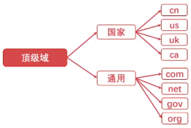
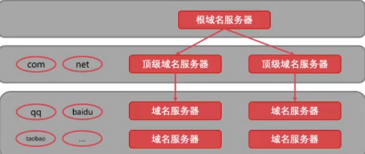

- [应用层之DNS详解](#应用层之dns详解)
- [DHCP协议](#dhcp协议)

### 应用层之DNS详解

- [ ] 应用层是**面向用户**的一层
- [ ] 而传输层以及以下的层**提供完整的通信服务**

TCP和UDP各自对应的应用层：
- [ ] UDP，**多媒体信息分发**，比如**视频、语音、实时信息**，这一秒数据丢失没关系（卡顿），下一秒会有新的数据展示，用户关注的实时信息
- [ ] TCP，**可靠的消息传输**，比如金融交易、可靠通讯、MQ

应用层主要功能：**定义应用间通信的规则**：
- [ ] 应用进程的报文类型（请求报文、应答报文）
- [ ] 报文的语法、格式
- [ ] 应用进程发送数据的时机、规则

DNS（`Domain Name System`）域名系统：
- [ ] 把域名转为IP，再进行网络通信
- [ ] 域：代表网络，比如前面的AS自治系统
- [ ] 名：代表名字
- [ ] 应用UDP协议

域名：
- [ ] 域名由**点、字母和数字**组成
- [ ] **点分割不同的域**
- [ ] 域名可以分为**顶级域**(如`com`)、**二级域**(如`baidu`)、**三级域**(如`www`)

顶级域分为**国家**和**通用**两种：

域名服务器：
1. 根域名服务器
2. 顶级域名服务器
3. 本地域名服务器
  

### DHCP协议

DHCP（`Dynamic Host Configuration Protocol`）动态主机设置协议
- [ ] DHCP是一个**局域网协议**（**由三类保留地址组成的网络称为局域网**）
- [ ] DHCP是应用**UDP**协议的应用层协议（DNS系统也是用UDP）

即插即用联网
- [ ] **临时IP**（自动获得IP地址），一般是**内网IP**，结合Nat技术（内网转换技术）进行网络连接
- [ ] **租期**

过程：
- [ ] DHCP服务器监听默认端口：`67`
- [ ] 主机使用UDP协议广播DHCP**发现报文**
- [ ] DHCP服务器发出DHCP**提供报文**
- [ ] 主机向DHCP服务器发出DHCP**请求报文**
- [ ] DHCP服务器**回应并提供IP地址**

类比：受伤的人大声呼救，周围人有的是医生，就先应答，再提供帮助

