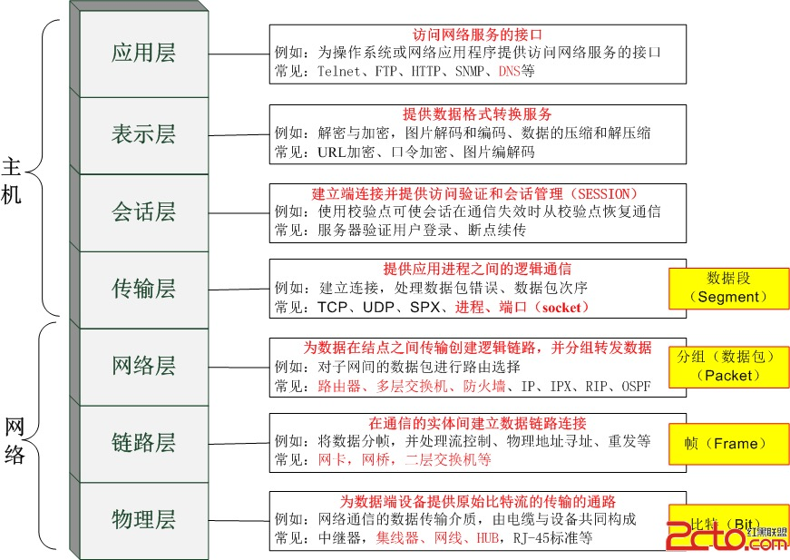

- [1. 计算机网络](#1-计算机网络)
  - [1.1. `OSI`，`TCP/IP`，五层协议的体系结构，以及各层协议](#11-ositcpip五层协议的体系结构以及各层协议)
    - [1.1.0.1. 每一层的协议如下](#1101-每一层的协议如下)
    - [1.1.0.2. 每一层的作用如下](#1102-每一层的作用如下)
  - [1.2. 关于冲突域、广播域](#12-关于冲突域广播域)
      - [1.2.0.1. 广播域的含义](#1201-广播域的含义)
      - [1.2.0.2. 冲突域的含义](#1202-冲突域的含义)
  - [1.3. 了解中继器、集线器、交换机、路由器、网关的概念和用途](#13-了解中继器集线器交换机路由器网关的概念和用途)
  - [1.4. ARP是地址解析协议，简单解释一下工作原理](#14-arp是地址解析协议简单解释一下工作原理)
  - [1.5. 描述RARP协议](#15-描述rarp协议)
  - [1.6. CDN原理](#16-cdn原理)

## 1. 计算机网络

### 1.1. `OSI`，`TCP/IP`，五层协议的体系结构，以及各层协议
1. `OSI`分层 （7层）：物理层、数据链路层、网络层、传输层、会话层、表示层、应用层（应、表、会、传、网、数、物）。
2. `TCP/IP`分层（4层）：网络接口层、 网际层、运输层、 应用层。
3. 五层协议（5层）：物理层、数据链路层、网络层、运输层、 应用层。

#### 1.1.0.1. 每一层的协议如下
1. 物理层：RJ45、CLOCK、IEEE802.3 （中继器，集线器）
2. 数据链路：PPP、FR、HDLC、VLAN、MAC （网桥，交换机）
3. 网络层：IP、ICMP、ARP、RARP、OSPF、IPX、RIP、IGRP、 （路由器）
4. 传输层：TCP、UDP、SPX
5. 会话层：NFS、SQL、NETBIOS、RPC
6. 表示层：JPEG、MPEG、ASII
7. 应用层：FTP、DNS、Telnet、SMTP、HTTP、WWW、NFS

#### 1.1.0.2. 每一层的作用如下
1. 物理层：通过媒介传输比特,确定机械及电气规范（比特Bit）
2. 数据链路层：将比特组装成帧和点到点的传递（帧Frame）
3. 网络层：负责数据包从源到宿的传递和网际互连（包Packet）
4. 传输层：提供端到端的可靠报文传递和错误恢复（段Segment）
5. 会话层：建立、管理和终止会话（会话协议数据单元SPDU）
6. 表示层：对数据进行翻译、加密和压缩（表示协议数据单元PPDU）
7. 应用层：允许访问OSI环境的手段（应用协议数据单元APDU）

### 1.2. 关于冲突域、广播域
- 物理层：中继器、集线器
- 数据链路层：交换机、网桥
- 网络层：路由器（分组转发和路由计算）

1. 第二层设备只能隔离冲突域，第三层设备才能隔离广播域
2. 路由器不但能隔离广播域，默认也是可以隔离冲突域的
3. 路由器下直连交换，则路由器到交换机之间也是存在冲突域的
4. router不仅能能够分割广播域，也能缩小冲突域
5. 交换机的每一个端口是一个冲突域
6. 集线器下连的所有端口是一个冲突域（上一个设备是路由器） 

##### 1.2.0.1. 广播域的含义
广播域就是说如果站点发出一个广播信号后能接收到这个信号的范围。
通常来说一个局域网就是一个广播域。（用路由器连接的除外）

##### 1.2.0.2. 冲突域的含义
冲突域：一个站点向另一个站点发出信号。除目的站点外，有多少站点能收到这个信号。这些站点就构成一个冲突域。 

### 1.3. 了解中继器、集线器、交换机、路由器、网关的概念和用途
(1) 中继器 
- 中继器工作在物理层，用来连接两个速率相同且数据链路层协议也相同的网段，连接起来的几个网段仍然是一个局域网。 
- 中继器功能是消除数字信号在基带传输中由于经过一长段电缆而造成的失真和衰减，使信号的波形和强度达到所需的要求，其原理是信号再生。 
- 中继器**既不能隔离冲突域，也不能隔离广播域**。 

(2) 集线器 
- 集线器也工作在物理层，相当于一个多接口的中继器，可以将多个节点连接成一个共享式局域网，但任何时刻只能有一个节点通过公共信道发送数据。 
- 集线器既不能隔离冲突域，也不能隔离广播域。 

(3) 网桥 
- 两个或多个以太网通过网桥连接起来后，就成为一个覆盖范围更大的以太网，而原来的每个以太网就可称为一个网段。 
- 网桥工作在数据链路层的MAC子层，可以互联不同的物理层、不同的MAC子层以及不同速率的以太网，使以太网各网段成为隔离开的碰撞域。 
- 网桥具有过滤帧以及存储转发帧的功能，**可以隔离冲突域**，但不能隔离广播域。 

(4) 交换机 
- 交换机工作在**数据链路层**，相当于一个多端口的网桥，是交换式局域网的核心设备。 
- 交换机允许端口之间建立多个并发的连接，允许多对计算机同时通信，实现多个节点之间的并发传输。因此，交换机的每个端口节点所占用的带宽不会因为端口节点数目的增加而减少，且整个交换机的总带宽会随着端口节点的增加而增加。 
- 交换机一般以全双工方式工作，有的局域网交换机采用存储转发方式进行转发，有的交换机采用直通交换方式(即在收到帧的同时立即按帧的目的MAC地址决定帧的转发端口，而不必进行先缓存再进行处理)。 
- 利用交换机可以实现虚拟局域网(VLAN)，VLAN**可以隔离冲突域，也可以隔离广播域**。 

(5) 路由器 
- 路由器是一种具有多个输入输出端口的专用计算机，其任务是连接不同的网络(连接异构网络)并完成路由转发。 
- 路由器是网络层设备，它实现了网络模型的下三层，即物理层、数据链路层和网络层。路由器隔离了广播域。 
- 路由器主要完成两个功能：**分组转发**和**路由计算**。前者处理通过路由器的数据流，关键操作是转发表查询、转发以及相关的队列管理和任务调度等；后者通过和其他路由器进行基于路由协议的交互，完成路由表的计算。 

(6) 网关 
- 在传统TCP/IP术语中，网关(`gateway`)与路由器(`router`)没有区别。 
- 在现代网络术语中，网关与路由器的定义不同。网关能在不同协议间移动数据，而路由器是在不同网络间移动数据，相当于传统所说的IP网关。
- 网关是连接两个网络的设备，对于语音网关来说，他可以连接PSTN网络和以太网，这就相当于VOIP，把不同电话中的模拟信号通过网关而转换成数字信号，而且加入协议再去传输。在到了接收端的时候再通过网关还原成模拟的电话信号，最后才能在电话机上听到。

### 1.4. ARP是地址解析协议，简单解释一下工作原理
1. 首先，每个主机都会在自己的 ARP 缓冲区中建立一个 ARP 列表，以表示 IP 地址和 MAC 地址之间的对应关系。
2. 当源主机要发送数据时，首先检查 ARP 列表中是否有对应 IP 地址的目的主机的 MAC 地址，如果有，则直接发送数据，如果没有，就向本网段的所有主机发送 ARP 数据包，该数据包包括的内容有：源主机 IP 地址，源主机 MAC 地址，目的主机的 IP 地址。
3. 当本网络的所有主机收到该 ARP 数据包时，首先检查数据包中的 IP 地址是否是自己的 IP 地址，如果不是，则忽略该数据包，如果是，则首先从数据包中取出源主机的 IP 和 MAC 地址写入到 ARP 列表中，如果已经存在，则覆盖，然后将自己的 MAC 地址写入 ARP 响应包中，告诉源主机自己是它想要找的 MAC 地址。
4. 源主机收到 ARP 响应包后。将目的主机的 IP 和 MAC 地址写入 ARP 列表，并利用此信息发送数据。如果源主机一直没有收到ARP响应数据包，表示 ARP 查询失败。

广播发送ARP请求，单播发送ARP响应。

### 1.5. 描述RARP协议
RARP是逆地址解析协议，作用是完成硬件地址到 IP 地址的映射，主要用于无盘工作站，因为给无盘工作站配置的 IP 地址不能保存。

工作流程：
1. 在网络中配置一台 RARP 服务器，里面保存着 IP 地址和 MAC 地址的映射关系。
2. 当无盘工作站启动后，就封装一个 RARP 数据包，里面有其 MAC 地址，然后广播到网络上去。
3. 当服务器收到请求包后，就查找对应的 MAC 地址的 IP 地址装入响应报文中发回给请求者。

因为需要广播请求报文，因此 RARP 只能用于具有广播能力的网络。

### 1.6. CDN原理
1. 输入`www.web51.com`，DNS 域名解析器设置了 CNAME，指向`www.web51cdn.com`。
2. 请求就指向了 CDN 网络中的 DNS 负载均衡系统，解析到最快的 IP 地址
3. 用户向该 IP（缓存服务器）发动请求，第一次访问，CDN 服务器会向原 web 站点请求，并缓存内容。

