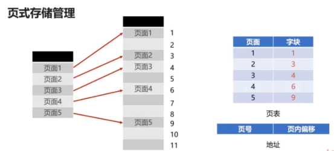
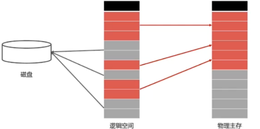

- [1. 进程管理之进程实体](#1-进程管理之进程实体)
  - [1.1. 进程](#11-进程)
  - [1.2. 进程的实体](#12-进程的实体)
  - [1.3. 进程 Process 与线程 Thread](#13-进程-process-与线程-thread)
  - [1.4. 进程和线程的对比](#14-进程和线程的对比)
- [2. 进程管理之五状态模型](#2-进程管理之五状态模型)
  - [2.1. 就绪状态](#21-就绪状态)
  - [2.2. 执行状态](#22-执行状态)
  - [2.3. 阻塞状态](#23-阻塞状态)
  - [2.4. 创建状态](#24-创建状态)
  - [2.5. 终止状态](#25-终止状态)
- [3. 进程管理之进程同步](#3-进程管理之进程同步)
  - [3.1. 临界资源](#31-临界资源)
  - [3.2. 进程间同步的原则](#32-进程间同步的原则)
  - [3.3. 进程间同步的方法](#33-进程间同步的方法)
    - [3.3.1. 进程同步之共享内存](#331-进程同步之共享内存)
    - [3.3.2. 进程同步之Unix域套接字](#332-进程同步之unix域套接字)
  - [3.4. 线程同步](#34-线程同步)
    - [3.4.1. 线程同步之互斥量](#341-线程同步之互斥量)
    - [3.4.2. 线程同步之自旋锁](#342-线程同步之自旋锁)
    - [3.4.3. 线程同步之读写锁](#343-线程同步之读写锁)
    - [3.4.4. 线程同步之条件变量](#344-线程同步之条件变量)
- [4. Linux进程管理](#4-linux进程管理)
  - [4.1. 进程的类型](#41-进程的类型)
  - [4.2. 前台进程](#42-前台进程)
  - [4.3. 后台进程](#43-后台进程)
  - [4.4. 守护进程( daemon )](#44-守护进程-daemon-)
  - [4.5. 特殊进程](#45-特殊进程)
  - [4.6. 什么是线程池](#46-什么是线程池)
    - [4.6.1. 为什么使用线程池](#461-为什么使用线程池)
- [5. 作业管理之进程调度](#5-作业管理之进程调度)
  - [5.1. 进程调度](#51-进程调度)
  - [5.2. 三个机制](#52-三个机制)
  - [5.3. 分类](#53-分类)
  - [5.4. 非抢占式的调度](#54-非抢占式的调度)
  - [5.5. 抢占式的调度](#55-抢占式的调度)
  - [5.6. 进程调度算法](#56-进程调度算法)
- [6. 作业管理之死锁](#6-作业管理之死锁)
  - [6.1. 死锁的产生](#61-死锁的产生)
  - [6.2. 死锁的四个必要条件](#62-死锁的四个必要条件)
  - [6.3. 预防死锁的方法](#63-预防死锁的方法)
  - [6.4. 银行家算法](#64-银行家算法)
- [7. 存储管理之内存分配与回收](#7-存储管理之内存分配与回收)
  - [7.1. 内存分配过程](#71-内存分配过程)
  - [7.2. 动态分区分配数据结构](#72-动态分区分配数据结构)
  - [7.3. 动态分区分配算法](#73-动态分区分配算法)
  - [7.4. 内存回收的过程](#74-内存回收的过程)
- [8. 存储管理之段页式存储管理](#8-存储管理之段页式存储管理)
  - [8.1. 字块和页面](#81-字块和页面)
  - [8.2. 页式存储管理](#82-页式存储管理)
  - [8.3. 段式存储管理](#83-段式存储管理)
  - [8.4. 段页式存储管理](#84-段页式存储管理)
- [9. 存储管理之虚拟内存](#9-存储管理之虚拟内存)
  - [9.1. 程序的局部性原理](#91-程序的局部性原理)
  - [9.2. 虚拟内存的置换算法](#92-虚拟内存的置换算法)
- [10. Linux的存储管理](#10-linux的存储管理)
  - [10.1. 伙伴系统](#101-伙伴系统)
  - [10.2. Linux交换空间](#102-linux交换空间)

## 1. 计算机操作系统  <!-- omit in toc -->

### 1. 进程管理之进程实体

#### 1.1. 进程

1. 进程是系统进行资源分配和调度的基本单位
2. 进程作为程序独立运行的载体保障程序的正常运行
3. 进程使资源的利用率大幅提升

#### 1.2. 进程的实体

1. 主存中进程形态：标识符、状态、优先级、序计数器、内存指针、上下文数据、IO状态信息、记账信息
2. 可分为进程标识符、处理机状态、进程调度信息、进程控制信息等几类

```
标识符：
唯一标记一个进程（id）

状态：
标记进程状态，如运行态

程序计数器：
进程即将被执行的下一条指令的地址

内存指针：
程序代码、进程数据相关指针

上下文数据：
进程执行时处理器存储的数据

IO状态信息：
被进程IO操作所占用的文件列表（如磁盘、内存、文件等）

记账信息：
使用处理器时间、时钟数总和等

PCB进程控制块：
1. 用于描述和控制进程运行的通用数据结构
2. 经常被读取，常驻内存，存放在系统专门开辟的PCB区域内
```

#### 1.3. 进程 Process 与线程 Thread

- 线程是操作系统进行运行调度的最小单位
- 包含在进程之中，是进程中实际运行工作的单位
- 一个进程可以并发多个线程，每个线程执行不同的任务
- 进程的线程共享进程资源

#### 1.4. 进程和线程的对比

|          | 进程               | 线程                 |
| -------- | ------------------ | -------------------- |
| 资源     | 资源分配的基本单位 | 不拥有资源           |
| 调度     | 独立调度的基本单位 | 独立调度的最小单位   |
| 系统开销 | 进程系统开销大     | 线程系统开销小       |
| 通信     | 进程IPC            | 读写同一进程数据通信 |

### 2. 进程管理之五状态模型

就绪、阻塞、执行、创建、终止

#### 2.1. 就绪状态

- 当进程被分配到CPU以外所有其他的资源（只差CPU资源）
- 就绪队列：多个处于就绪状态的进程组成一个队列

#### 2.2. 执行状态

- 进程获得CPU，其程序正在执行
- 在单处理机（单核）中，某个时刻只能有一个进程处于执行状态

#### 2.3. 阻塞状态

- 进程因某种原因（如其他设备未就绪而无法继续执行）放弃CPU的状态
- 阻塞队列：多个阻塞状态的进程组成的队列

#### 2.4. 创建状态

- 进程创建过程：分配PCB => 插入就绪队列
- 创建进程时拥有PCB但其他资源尚未就绪的状态

#### 2.5. 终止状态

- 系统清理 =>  PCB归还
- 进程结束后由系统清理或归还PCB的状态称为终止状态


### 3. 进程管理之进程同步

#### 3.1. 临界资源

一些作为共享资源却无法同时被多个线程共同访问的共享资源。


#### 3.2. 进程间同步的原则

- 空闲让进：资源无占用，允许使用
- 忙则等待：资源有占用，请求进程等待
- 有限等待：保证有限等待时间能够使用资源
- 让权等待：等待时，进程需要让出 CPU（执行变成阻塞状态）

#### 3.3. 进程间同步的方法

- 消息队列
- 共享存储
- 信号量

##### 3.3.1. 进程同步之共享内存

- 多进程共同使用物理内存
- 由于操作系统的进程管理，进程间的内存空间是独立的
- 进程默认 不能访问进程空间之外的内存空间

共享内存特点：

- 共享内存允许不相关的进程 访问同一片物理内存
- 共享内存是两个进程之间共享和传递数据 最快的方式（常用）
- 共享内存未提供同步机制，需要借助其他机制管理访问（自己设置can_read，即加锁/解锁）

步骤：

1. 申请共享内存 
2. 连接到进程空间 
3. 使用共享内存 
4. 脱离进程空间&删除

##### 3.3.2. 进程同步之Unix域套接字

- 域套接字是高级的进程间通信的方法
- 提供了单机 简单可靠的进程通信同步服务
- 只能在单机使用，不能跨机器使用
- Unix 域套接字提供了类似 网络套接字的功能

服务端使用：

- 创建套接字、绑定、监听套接字，接收并处理信息
  客户端使用：
- 创建套接字、连接套接字，发送信息


#### 3.4. 线程同步

- 因为进程的线程共享进程资源，所以也需要同步
- 方法：互斥量、读写锁、自旋锁、条件变量


##### 3.4.1. 线程同步之互斥量

当一个线程操作的时候，阻止另一个线程访问这个临界资源（加锁、解锁）

- 生产者、消费者模型的根本：两个线程的指令交叉执行
- 互斥量可以保证先后执行

原子性定义：

- 一系列操作不可被中断的特性
- 这一系列操作要么全部执行完，要么全部没有执行
- 不存在部分执行部分未执行的情况


互斥量：

- 互斥量是最简单的线程同步的方法
- 互斥量（互斥锁），处于两态之一的变量：解锁和加锁
- 两个状态可以保证资源访问的串行


##### 3.4.2. 线程同步之自旋锁

使用临界资源之前加锁，使用再解锁，和互斥锁一样

与互斥锁不同点：

- 使用自旋锁的线程会反复检查锁变量是否可用
- 自旋锁不会让出CPU，是一种忙等待状态
- 死循环，等待锁被释放

特点：

- 自旋锁避免了进程或线程上下文切换的开销
- 操作系统内部很多地方使用的是自旋锁
- 自旋锁不适合在单核CPU使用

##### 3.4.3. 线程同步之读写锁

- 临界资源多读少写
- 读取时候并不会改变临界资源的值

读写锁特点：

- 特殊的自旋锁
- 允许多个读者同时访问资源以提高性能
- 对于写操作则是互斥的

读和读不互斥，读和写互斥，写和写互斥


##### 3.4.4. 线程同步之条件变量

- 条件变量是相对复杂的线程同步方法
- 条件变量允许线程睡眠，直到满足条件
- 当满足条件时，可以向该线程发送信号，通知唤醒
- 配合互斥量使用

具体：

1. 缓冲区小于等于0时，不允许消费者消费，消费者必须等待
2. 缓冲区满时，不允许生产者往缓冲区生产，生产者必须等待
3. 前者情况，当生产者生产一个产品时，唤醒可能等待的消费者
4. 后者情况，当消费者消费一个产品时，唤醒可能等待的生产者

### 4. Linux进程管理

#### 4.1. 进程的类型

1. 前台进程
2. 后台进程
3. 守护进程

#### 4.2. 前台进程

具有终端，可以和用户交互的进程（占用了终端shell）

#### 4.3. 后台进程

1. 没有占用终端（可能有打印，但不影响使用Shell，同时Ctrl+C也不会停止）
2. 不和用户交互，优先级比前台进程低
3. 将需要执行的命令以&符号结束

#### 4.4. 守护进程( daemon )

1. 特殊的后台进程
2. 很多在在系统引导的时候启动，一直运行直到系统关闭
3. 进程名字一般以d结尾，比如 crond、httpd、sshd、mysqld


#### 4.5. 特殊进程

- ID为 0 的进程是`idle`进程，是系统创建的第一个进程
- ID为 1 的进程是`init`进程，是 0 号进程的子进程，完成系统初始化
- init 进程是所有用户进程的祖先进程


#### 4.6. 什么是线程池

- 线程池是存放多个线程的容器
- CPU调度线程执行后不会销毁线程
- 将线程放回线程池 重复利用


##### 4.6.1. 为什么使用线程池

- 线程是稀缺资源，不应该频繁创建和销毁
- 架构解耦，线程创建和业务处理解耦，更加优雅
- 线程池是使用线程的最佳实践

### 5. 作业管理之进程调度

#### 5.1. 进程调度

- 计算机通过决策决定哪个就绪进程可以获得CPU使用权
- 前提是多道程序设计
- 保存 旧进程的运行信息，清除旧进程（收拾包袱）
- 选择新进程，准备运行环境并分配CPU（新进驻）

#### 5.2. 三个机制

- 就绪队列的排队机制
- 选择运行进程的委派机制（选择就绪进程，分配CPU给它）
- 新老进程的上下文切换机制（保存当前进程的上下文信息，装入被委派执行进程的运行上下文）

#### 5.3. 分类

1. 非抢占式的调度
2. 抢占式调度


#### 5.4. 非抢占式的调度

- 处理器一旦分配给某个进程，就让该进程一直使用下去
- 调度程序不以任何原因抢占正在使用的处理器
- 直到进程完成工作或者因为IO阻塞才会让出处理器

#### 5.5. 抢占式的调度

- 允许调度程序以一定的策略暂停当前运行的进程
- 保存旧进程的上下文信息，分配处理器给新进程


#### 5.6. 进程调度算法

1. 先来先服务调度算法
2. 短进程优先调度算法（不利于长作业进程的执行）
3. 高优先权优先调度算法（前台进程 优先级高于后台进程）
4. 时间片轮转调度算法（最公平）

只有最后一个是抢占式的调度

### 6. 作业管理之死锁

什么是死锁？
死锁：互相等待，一直阻塞下去（如五哲学家进餐模型）


#### 6.1. 死锁的产生

- 竞争资源（本质：共享资源数量不足）
- 进程调度顺序不当

#### 6.2. 死锁的四个必要条件

1. 互斥条件（进程对资源的使用是排他性的使用，资源只能由一个进程使用，其他进程只能等待）
2. 请求保持条件（进程至少保持一个资源，又提出新的资源请求；新资源被占用，请求被阻塞；被阻塞的进程不释放自己保持的资源）
3. 不可剥夺条件（进程获得的资源在未完成使用前不能被剥夺，获得的资源只能由进程自身释放）
4. 环路等待条件（发生死锁时，必然存在进程-资源环形链）


#### 6.3. 预防死锁的方法

- 系统规定进程运行之前，一次性申请所有需要的资源（消除请求保持条件），进程在运行期间不会提出资源请求
- 当一个进程请求新的资源得不到满足时，必须释放占有的资源（消除不可剥夺条件）
- 可用资源线性排序，申请必须按照需要递增申请，不再形成环路（摒弃环路等待条件）

#### 6.4. 银行家算法

背景：

- 客户申请的贷款有限，每次申请需声明最大资金量
- 银行家在满足贷款时，都应该给用户贷款
- 客户在使用完贷款后，能够及时归还贷款

需要是三个表：已分配资源表、所需资源表、可分配资源表

过程：
所需资源表减去已分配资源表，可以得到还需分配资源表，与可分配资源表比较，看能满足哪个进程，就把资源分配给它，然后等它运行完，归还后运行其他进程


### 7. 存储管理之内存分配与回收

#### 7.1. 内存分配过程
1. 单一连续分配：只能在单用户、单进程的操作系统中使用，主存分为系统区和用户区
2. 固定分区分配：内存空间分为若干固定大小的区域，每个分区只提供给一个程序使用，互不干扰（多道程序中存储管理的最简单方式）
3. 动态分区分配（最常用）

#### 7.2. 动态分区分配数据结构
1. 动态分区空闲表数据结构
2. 动态分区空闲链数据结构（节点合并，节点需要记录可存储的容量）

#### 7.3. 动态分区分配算法
1. 首次适应算法（FF算法）（从开始顺序查找适合内存区，若没有合适的空闲区，则该次分配失败，一般是链表结构，每次从头部开始，使得头部地址空间不断被划分，循环适应算法，从上一次结束的位置开始）
2. 最佳适应算法（BF算法）（按照容量大小排序，找到最佳合适空闲区）
3. 快速使用算法（QF算法）（有多个空闲区链表，每个链表存储一种容量的空闲区）


#### 7.4. 内存回收的过程
四种情况：


- 第一种，回收区在空闲区后面：
  - 不需要新建空闲链表节点
  - 只需要把空闲区1的容量增大到回收区即可

- 第二种，回收区在空闲区前面：
  - 将回收区与空闲区合并
  - 新的空闲区使用回收区的地址

- 第三种，回收区在两个空闲区中间：
  - 将空闲区1、空闲区2和回收区合并
  - 新的空闲区使用空闲区1地址

- 第四种，单一的回收区：
  - 为回收区创建新的空闲节点
  - 插入到相应的空闲区链表中去


### 8. 存储管理之段页式存储管理

段页式是进程角度，上面是物理内存角度
#### 8.1. 字块和页面
1. 字块是相对物理设备的定义
2. 页面是相对逻辑空间的定义


#### 8.2. 页式存储管理
1. 将进程逻辑空间 等分成若干大小的页面
2. 相应的把物理内存空间分成与页面大小相同的物理块
3. 以页面为单位把进程空间装进物理内存中分散的物理块

注意：
1. 页面大小应该适中，过大难以分配，过小内存碎片过多
2. 页面大小通常是512B~8kB


页表记录进程逻辑空间与物理空间的映射，页面号和字块号的映射关系。地址中页号相当于字号、页内偏移相当于字块内偏移



多级页表，减少页表占用的空间，按需取页表，加载到内存中：


问题：有一段连续的逻辑分布在多个页面中，将大大降低执行效率

#### 8.3. 段式存储管理
1. 将进程逻辑空间划分为若干段（非等分）
2. 段的长度由连续逻辑的长度决定
3. 主函数MAIN、子程序段X、子函数Y等

段表：
短号、基址（起始地址）、段长


段式存储和页式存储的对比：
1. 段式存储和页式存储都离散地管理了进程的逻辑空间
2. 页是物理单位，段是逻辑单位
3. 分页是为了合理利用空间，分段是满足用户要求
4. 页的大小固定，段长度可以动态变化
5. 页表信息是一维的，段表信息是二维的

#### 8.4. 段页式存储管理
1. 分页可以提高内存利用率（虽然存在内存碎片），分段可以更好的满足用户需求
2. 先将逻辑空间按段式管理分成若干段
3. 再将段内空间按页式管理分成若干页

段页地址
段号、段内页号、页内地址


示例：


### 9. 存储管理之虚拟内存

一个游戏十几G，而物理内存只有4G，怎么运行起来？

产生原因：
1. 有些进程实际需要的内存很大，超过物理内存的容量
2. 多道程序设计，使得每个进程可用物理内存更加稀缺

原理：
把程序使用内存划分，将部分暂时不用的内存放置在辅存



#### 9.1. 程序的局部性原理
指CUP访问存储器时，无论是存取指令还是存取数据，所访问的存储单元都趋于聚集在一个较小的连续区域中。


1. 程序运行时，无需全部装入内存，装载部分即可
2. 如果访问页不在内存，则发出缺页中断，发起页面置换
3. 从用户角度看，程序拥有很大的空间，即是虚拟内存
4. 虚拟内存实际是对物理内存的补充，速度接近于内存，成本接近于辅存


#### 9.2. 虚拟内存的置换算法
1. 先进先出算法(FIFO)
2. 最不经常使用算法(LFU)
3. 最近最少使用算法(LRU)


### 10. Linux的存储管理

Buddy内存管理算法
1. 解决内存外碎片问题
2. 经典的内存管理算法
3. 算法基于计算机处理二进制的优势具有极高的效率
4. 将内存外碎片问题转移到内存内碎片问题

页内碎片：
已经被分配出去（能明确指出属于哪个进程）的内存空间大于请求所需的内存空间，不能被利用的内存空间
页外碎片：
还没有被分配出去（不属于任何进程），但由于太小无法分配给申请内存空间的新进程的内存空闲块。

页外碎片相当于太挫找不到对象，页内碎片相当于太优秀而对象太垃圾

原则
- 向上取整为2的幂大小
  - 70k => 128k
  - 129k => 256k
  - 666k => 1024k


#### 10.1. 伙伴系统
- 一片连续内存的伙伴是相邻的另一片大小一样的连续内存
- 创建一系列空闲块链表，每一种都是2的幂
- 以100k为例，看有没有128k、256k、512k、1M有没有空闲空间，直到找到1M才有，然后从1M拆下512k，再拆下256k，再拆下128k，分配完毕。
- 回收的时候，以后一点点拼回1M


#### 10.2. Linux交换空间
1. 交换空间(Swap)是磁盘的一个分区
2. Linux物理内存满时，会把一些内存交换至Swap空间
3. Swap空间是初始化系统时配置的

Swap空间与虚拟内存对比：
1. 都存在于磁盘，都与主存发生置换
2. Swap空间是操作系统概念，虚拟内存是进程概念
3. Swap空间解决系统物理内存不足的问题，虚拟内存解决进程物理内存不足的问题


