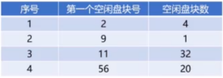

- [1. 概述](#1-概述)
  - [1.1. 目录管理](#11-目录管理)
- [Linux 的文件系统](#linux-的文件系统)
  - [EXT文件系统](#ext文件系统)

## 文件管理 <!-- omit in toc -->

### 1. 概述

文件的逻辑结构

有结构文件：
- [ ] 文件内容由**定长记录**和**可变长记录**组成
- [ ] 定长记录**存储文件格式**、**文件描述**等结构化数据项
- [ ] 可变长记录存储**文件具体内容**

无结构文件：
- [ ] 也称为**流式文件**
- [ ] 文件内容长度以**字节**为单位
- [ ] 比如`exe`文件、 `dll`文件、`so`文件

顺序文件：
- [ ] 按照顺序存放在存储介质中文件
- [ ] **磁带**的存储特性使得磁带文件**只能存储顺序文件**（只能顺序读取）
- [ ] 顺序文件是所有逻辑文件中**存储效率最高**的

问题：**增删查**

索引文件：
- [ ] **可变长文件**不适合使用顺序文件存储
- [ ] 索引文件是为了解决可变长文件存储而发明的
- [ ] 需要配合**索引表**完成存储

辅存的存储空间分配方式：
1. 连续分配
2. 链接分配
3. 索引分配

连续分配
- [ ] 读取快，容易
- [ ] 要求**满足容量的连续存储空间**

链接分配，
- [ ] 文件存储在离散的盘块中，
- [ ] 需要额外的存储空间存储文件的**盘块链接顺序**
- [ ] 分为**隐式链接**和**显式链接**

隐式链接，
- [ ] **下一个链接存储在当前盘块内**
- [ ] 适合顺序访问，随机访问效率很低，因为**不论访问哪一个都需要从第一个开始**
- [ ] **可靠性差**，任何一个链接出问题都会导致所有文件访问出错

显式连接：
- [ ] `FAT`表（物理块和下一盘块），`File Allocation Table`
- [ ] 不支持高效的直接存储（`FAT`记录项多）
- [ ] 检索时`FAT`表占用文件的逻辑结构间（需要将整个`FAT`加载到内存）

索引分配：
- [ ] 把文件的所有盘块集中存储（索引）
- [ ] 读取某个文件时，将文件索引读取进内存即可
- [ ] **每个文件都拥有一个索引块**，记录所有盘块信息
- [ ] 支持直接访问盘块
- [ ] **文件较大**时有优势

类比：
1. 笔记本上的笔记是连续分配
2. 解密游戏是链接分配
3. 字典是索引分配

辅存存储空间管理：
1. 空闲表
2. 空闲链表
3. 位示图

空闲表：

空闲表与空闲链表：
- [ ] 空闲盘区的分配与内存分配类似
- [ ] 首次适应算法、循环适应算法等
- [ ] 回收过程也与内存回收类似

位示图（0没被使用，1已经被使用）：

 

位示图：
- [ ] 维护成本很低
- [ ] 可以非常容易找到空闲盘块
- [ ] 使用0/1比特位，占用空间很小

#### 1.1. 目录管理
目录树
 

任何文件或目录都只有唯一路径

### Linux 的文件系统

1. `FAT` 
2. `NTFS` 
3. `EXT`

`FAT`(`File Allocation Table`)
- [ ] `FAT16`、`FAT32`等，微软`Doc/Windows`使用的文件系统
- [ ] 使用一张表保存盘块的信息

`NTFS`(`New Technology File System`)
- [ ] `WindowsNT`环境的文件系统（`win7/win8/win10` 都可以使用）
- [ ] 对`FAT`进行了改进

`EXT2/3/4`
- [ ] `EXT`(`Extended file system`)扩展文件系统
- [ ] `Linux`的文件系统（不能被`window`识别）
- [ ] `EXT2/3/4`数字表示**第几代**

格式化U盘一般格式为`NTFS`，能被`windows`和`linux`同时识别。

#### EXT文件系统

分为：
- `Boot Sector`：启动扇区，安装开机管理程序
- `Block Group`：块组，存储数据的实际位置

`Block Group`细分：

`Inode Table`
- [ ] 存放文件`Inode`
- [ ] 每一个文件（目录）都有一个`Inode`（索引节点）

`Inode`保存信息包括：
- [ ] 索引节点编号
- [ ] 文件类型
- [ ] 文件权限
- [ ] 文件物理地址（`Data block`位置）
- [ ] 文件长度
- [ ] 文件连接计数
- [ ] 文件存取时间
- [ ] 文件状态
- [ ] 访问计数
- [ ] 链接指针

**文件名**不是存放在`Inode`节点上的，而是存放在目录的`Inode`节点上
- 原因：列出目录文件的时候无需加载文件的`Inode`

`Inode bitmap`：
- [ ] `Inode`的位示图
- [ ] 记录已分配的`Inode`和未分配的`Inode`

`Data Block`：
- [ ] 存放文件内容
- [ ] 每个`block`都有唯一的编号
- [ ] 文件的`block`记录在文件的`Inode`上

`Block bitmap`：
- [ ] 功能与`Inode bitmap`类似
- [ ] 记录`Data block`使用情况

`Superblock`:
- [ ] 最重要
- [ ] 记录整个文件系统相关信息的地方
- [ ] `Block`和`Inode` 的使用情况
- [ ] 时间信息、控制信息等
