- [1. 计算机发展的四个阶段](#1-计算机发展的四个阶段)
- [2. 冯诺依曼体系](#2-冯诺依曼体系)
- [3. 程序翻译与程序解析](#3-程序翻译与程序解析)
- [4. 计算机的层次](#4-计算机的层次)
- [5. 计算机的计算单位](#5-计算机的计算单位)
  - [5.1. 容量单位：](#51-容量单位)
  - [5.2. 速度单位](#52-速度单位)
    - [5.2.1. 网络速度](#521-网络速度)
    - [5.2.2. CPU速度](#522-cpu速度)
- [6. 字符和编码集](#6-字符和编码集)
- [7. 计算机的总线](#7-计算机的总线)
- [8. 输入输出设备](#8-输入输出设备)
- [9. 存储器](#9-存储器)
  - [9.1. 主存和辅存](#91-主存和辅存)
    - [9.1.1. 主存储器（内存）](#911-主存储器内存)
    - [9.1.2. 辅助存储器——磁盘](#912-辅助存储器磁盘)
  - [9.2. 高速缓存](#92-高速缓存)
- [10. 缓存替换策略](#10-缓存替换策略)
- [11. 指令系统](#11-指令系统)
  - [11.1. 机器指令的形式](#111-机器指令的形式)
  - [11.2. 机器指令的操作类型](#112-机器指令的操作类型)
  - [11.3. 机器指令的寻址方式](#113-机器指令的寻址方式)
- [12. 控制器](#12-控制器)
- [13. 运算器](#13-运算器)
- [14. 计算机指令的执行过程](#14-计算机指令的执行过程)
- [15. 进制运算的基础](#15-进制运算的基础)
- [16. 原码、补码、反码](#16-原码补码反码)
- [17. 定点数与浮点数](#17-定点数与浮点数)
  - [17.1. 定点数](#171-定点数)
  - [17.2. 浮点数](#172-浮点数)
- [18. 定点数的加减法](#18-定点数的加减法)
  - [18.1. 定点数加法](#181-定点数加法)
  - [18.2. 定点数减法](#182-定点数减法)
- [19. 浮点数的加减法运算](#19-浮点数的加减法运算)
  - [19.1. 对阶](#191-对阶)
  - [19.2. 尾数求和](#192-尾数求和)
  - [19.3. 尾数规格化](#193-尾数规格化)
  - [19.4. 舍入](#194-舍入)
  - [19.5. 溢出判断](#195-溢出判断)
- [20. 浮点数的乘除法操作](#20-浮点数的乘除法操作)
  - [20.1. 乘法](#201-乘法)
  - [20.2. 除法](#202-除法)
  - [20.3. 乘除法过程与加减法相同：](#203-乘除法过程与加减法相同)
- [21. 大端字节序和小端字节序](#21-大端字节序和小端字节序)

## 计算机组成原理 <!-- omit in toc -->

### 1. 计算机发展的四个阶段
1. 电子管计算机（1946年`ENIAC`埃尼阿克）
2. 晶体管
3. 集成电路
4. 超大规模集成电路计算机


未来
- 生物计算机？
- 量子计算机？


微型计算机的发展历史，由单核CPU发展到多核CPU


计算机分类：
- 超级计算机(`TFlop/s`)
- 大型计算机(去IOE)
- 迷你计算机（普通服务器、云服务）
- 工作站
- 微型计算机（个人计算机）

`TFlop/s`=每秒一万亿次浮点计算


去IOE行动（阿里提出，高维护费用）：
 - `IBM Oracle EMC`，把大型机替换为普通服务器


### 2. 冯诺依曼体系

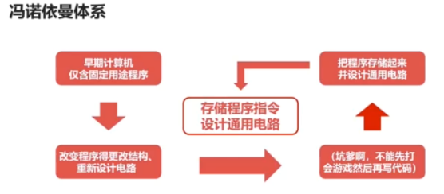
- 将**程序指令和数据**一起存储的计算机设计概念结构
- 存储程序指令，设计通用电路
- 必须有存储器、控制器、运算器、输入设备、输出设备
- 现代计算机都是冯诺依曼机
- CPU=运算器+控制器

冯诺依曼瓶颈：
- CPU和存储器分开，CPU和存储器速率之间的问题无法调和，CPU处理速度快，经常空转等待数据传输


现代计算机结构：
- 在冯诺依曼体系结构基础上修改，解决CPU与存储设备之间的性能差异问题
- CPU=`运算器+控制器+存储器`（内存和CPU的寄存器）
- 可以理解为`以存储器为核心`


### 3. 程序翻译与程序解析

1. 程序翻译：`L1`编译成`L0`（编译器）
2. 程序解析：`L1`经`L0`变为`L0`（解释器）

- 计算机执行的指令都是`L0`
- 翻译过程中生成新的`L0`程序，解释过程中不生成新的`L0`程序(输入输出)
- 解释过程由`L0`编写的解释器去解释`L1`程序

举例：
1. 程序翻译：`c/c++`  `Object-C`  `Golang`
2. 程序解释：`Python` `Php` `JS`


翻译+解释：`Java`、`C#`
`Java`程序编译成`JVM`字节码，再解释成机器码


### 4. 计算机的层次


实际机器：
- [ ] 硬件逻辑层：门、触发器等逻辑电路组成，属于电子工程的领域
- [ ] 微程序机器层：编程语言是**微指令集**
- [ ] 传统机器层：编程语言是**CPU指令集**（机器指令），编程语言和硬件直接相关

注意：
- [ ] **一条机器指令**对应**一个微程序**，一个微程序对应**一组微指令**
- [ ] **微指令 < 微程序 = 机器指令**

虚拟机器：
- [ ] 操作系统层：管理硬件资源，提供简易的操作界面，是软件和硬件之间的适配层
- [ ] 汇编语言层：编程语言就是汇编语言
- [ ] 高级语言层：种类多
- [ ] 应用层：Office等


### 5. 计算机的计算单位

#### 5.1. 容量单位：
- 物理层面，高低电平记录信息，理论上只认识0/1两种状态（`bit`）
- 8比特 = 1字节
- `Byte < KB < MB < GB < TB < PB < EB`


硬盘商一般用10进位标记容量，所以买的硬盘小于标注的大小

#### 5.2. 速度单位

##### 5.2.1. 网络速度

为什么电信拉的100M光纤，测试峰值速度只有12M每秒？
- 网络常用单位为Mbps
- `1M/s = 1Mbps = 1Mbit/s = (100/8)MB/s = 12.5MB/s`


##### 5.2.2. CPU速度
- CPU的速度一般体现为CPU的时钟频率，单位一般是Hz
- 主流CPU的时钟频率都在`2GHz`以上，（高低电平变换频率在每秒20亿次以上）


Hz就是秒分之一，每秒钟周期性变动重复次数的计量
- 能听见蜜蜂翅膀振动而不能听见蝴蝶翅膀振动声音，只因为蜜蜂振动频率高（`400Hz`）与蝴蝶振动频率（`15Hz`）


### 6. 字符和编码集

ASCII码：
- [ ] `7个bits`就可以完全表示
- [ ] 包含`95`个可打印字符
- [ ] `33`个不可打印字符
- [ ] `33+95` = `128` = `2^7`


问题：很多符号无法表示


Extended ASCII码：
`128 => 255`个
- [ ] 包含了常见的数学运算符
- [ ] 带音标的欧洲字符
- [ ] 其他常用符号、表格符等

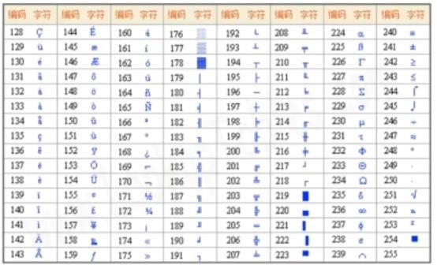

字符编码集的国际化：
- 语言多样性
- 语言体系不一样，不以有限字符组合的语言


中文编码集：
- `GB2312`(7445个字符)
- `GBK`，支持ISO标准
- 外国人使用这些编码的网页，由于本地没装这些字符集(`GB2312`、`GBK`)，就没法使用，乱码
- `Unicode`：统一码、万国码，定义了世界通用的符号集，`UTF-*`实现了编码，`UTF-8`以字节为单位对`Unicode`进行编码


Windows系统默认使用`GBK`编码，编程推荐使用`UTF-8`编码

### 7. 计算机的总线
总线：
- [ ] 提供了对外连接的接口
- [ ] 连接的标准，促使外围设备接口的统一
- [ ] 解决不同设备之间的通信问题


USB  `Universal Serial Bus`，通用串行总线
还有`PCI` `ISA`总线

总线分类：
- 片内总线
- 系统总线

片内总线：
- 芯片内部的总线
- 寄存器与寄存器之间，寄存器与控制器、运算器之间，高集成度芯片内部的信息传输线

系统总线分类：
- 数据总线（与CPU位数相同）
- 地址总线
- 控制总线（控制信号的传输线，监视组件状态，如就绪/未就绪）


总线的仲裁：
- 解决总线使用权的冲突问题


方法：
- 链式查询，电路复杂度低，优先级低的设备难以获得总线使用权（2, 3）,对电路故障敏感
- 计时器定时查询
- 独立请求，每个设备均有总线独立连接仲裁器，可独立发送请求和接收


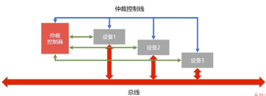


### 8. 输入输出设备

键盘：
- 薄膜键盘
- 机械键盘（黑轴/红轴/青轴）

输入输出接口的通用设计：
- 数据线
- 状态线
- 设备选择线（选择IO设备）
- 命令线


CPU与IO设备的通信（CPU速度与IO速度不一致）
- **程序的中断**，提供低速设备通知CPU的一种异步的方式，CPU可以高速运转同时兼顾低速设备的响应
- `DMA`（直接存储器访问），`DMA`直接连接主存与IO设备，主存与IO设备交换信息时，不需要中断CPU，可以提高CPU的效率


IO设备发送中断信号，CPU响应中断（可能不立即响应）：


DMA：


### 9. 存储器

存储器的分类：
1. 按存储介质：
   - 半导体存储器（内存/U盘/固态硬盘）
   - 磁存储器（磁盘/磁带）
2. 按存取方式：
   - 随机存储器`RAM`（随机读取，与位置无关）
   - 串行存储器（与位置有关，按顺序查找）
   - 只读存储器`ROM`（只读不写）


存储器的层次结构：
- 缓存
- 主存
- 辅存（位价最低）

> 位价：每比特位价格

不同点在于：
- 读写速度
- 存储容量
- 价格


缓存-主存层次
- [ ] 原理：局部性原理（最重要的很少，集中）
- [ ] 实现：在CPU与主存之间增加一层速度快（容量小）的Cache
- [x] 目的：解决**主存速度不足**的问题


主存-辅存层次
- [ ] 原理：局部性原理
- [ ] 在主存之外增加辅助存储器（磁盘、SD卡、U盘等）
- [x] 目的：解决**主存容量不足**的问题


#### 9.1. 主存和辅存
##### 9.1.1. 主存储器（内存）
计算机断电，内存内容消失
- `RAM`，`Random Access Memory`
- `RAM`通过电容存储数据，必须隔一段时间刷新一次
- 如果断电，那么一段时间后将丢失所有数据


32位系统和64位系统对比：
- [ ] 32位系统，至多支持4GB的内存（地址总线），`2^32 = 4^30 = 4GB`
- [ ] 64位系统，`2^64=2^34*2^30=2^34GB`


##### 9.1.2. 辅助存储器——磁盘

磁道、扇区


举例：读取磁道`1 4 2 3 1 5`，其中`1`磁道在最外面，`5`磁道在最里面，现在在`4`道上 
- [ ] **先来先服务算法**，`1 4 2 3 1 5`
- [ ] **最短寻道时间优先**,`4 5 3 2 1`
- [ ] **扫描算法（电梯算法）**：每次只往一个方向移动，达到尽头才返回，可以两个方向读取`4 3 2 1 5`
- [ ] **循环扫描算法**，由内往外，或由外往内，只能一个方向的读取，`4 5 1 2 3`


#### 9.2. 高速缓存
工作原理
- 字：是指存放在**一个存储单元**中的**二进制代码的组合**
- 字块：存储在**连续的存储单元**中而被看做是一个单元的一组字


假设一个字有`32`位，一个字块共`B`个字，主存共`M`个字块，`B*M`=主存总字数，`B*M*32`=主存总容量(`bits`)


字的地址包含两个部分：
- 前`m`位指定字块的地址（`2^m=M`）
- 后`b`位指定字在字块中的地址（`2^b=B`）


高速缓存内部的存储结构与主存类似，有字块和字的概念，但是缓存的容量（字块数）远小于主存容量，缓存里的数据是主存数据的复制


CPU需要的数据不在缓存里时，需要去主存拿


衡量高速缓存性能的两个指标：
1. 缓存命中率`h`
2. 访问效率`e`


缓存命中率，CPU每次从高速缓存取数据的概率，为访问`Cache`次数除以访问主存和`Cache`次数之和
- 访问主存次数：`Nm`
- 访问`Cache`次数：`Nc`
- 所以，缓存命中率公式：`h=Nc/(Nc+Nm)`


访问效率`e`为访问`Cache`时间除以访问`Cache`和主存平均时间：
- [ ] 访问主存时间：`tm`， 访问缓存时间：`tc`
- [ ] 访问`Cache`-主存系统平均时间：`ta = htc + (1-h)tm`
- [ ] 所以，访问效率`e=tc/ta = tc/(htc + (1-h)tm)`


### 10. 缓存替换策略
高速缓存的替换时机，当CPU所需要的数据不在`Cache`时，需要从主存载入所需数据

- [ ] **随机算法**
- [ ] **先进先出算法**(`FIFO`)，把`Cache`当成队列，优先替换最先进入`Cache`的字块
- [ ] **最不经常使用算法**(`LFU`)，需要额外的空间记录字块的**使用频率**，同频率节点按`FIFO`算法淘汰
- [ ] **最近最少使用算法**(`LRU`)，**优先淘汰一段时间内没有使用的字块**，一般使用**双向链表**实现，把当前访问节点置于链表前面（保证链表头部节点是最近使用的）


`LRU`举例：


### 11. 指令系统
#### 11.1. 机器指令的形式
由两部分组成：
1. 操作码
    - 操作码指明指令所要完成的的操作
    - 操作码的位数反映了机器的操作种类，`2^8=256`
2. 地址码
   - 地址码直接给出操作数或者操作数的地址
   - 分**三地址指令**、**二地址指令**和**一地址指令**

三地址指令，比如【把结果放到地址三，比如加法操作，`a+b=c`】：


二地址指令：


一地址指令，自己对自己的操作，或者一个操作数的默认行为，比如**自增**：


还有**零地址指令**：
- 在机器指令中无地址码
- 空操作、停机操作、中断返回操作等

#### 11.2. 机器指令的操作类型

机器指令的操作类型举例：
- 数据传输
- 算术逻辑
- 移位操作
- 控制指令等

数据传输：
- **寄存器之间**、**寄存器与存储单元**、**存储单元之间**
- 数据读写、交换地址数据、清零置一等操作

算术逻辑：
- 操作数的加减乘除
- 操作数的与或非

移位操作：
- 数据左移（乘2）
- 数据右移（除2）


控制指令：
- 等待指令
- 停机
- 空操作
- 中断指令等


#### 11.3. 机器指令的寻址方式
分为：
1. 指令寻址
  指令寻址，分为：
    - 顺序寻址
    - 跳跃寻址
2. 数据寻址
   数据寻址，分为：
     - 立即寻址（地址码存的是操作数，无需访问存储器）
     - 直接寻址（地址码直接给出操作数在主存的位置）
     - 间接寻址（地址码给出的是操作数地址的地址）

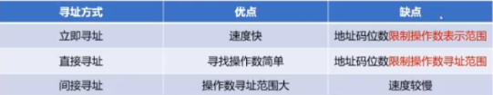
 
类比：
1. 立即寻址相当于我天生有钱
2. 直接寻址相当于我努力挣钱
3. 间接寻址相当于傍大款，大款身上有钱的地址

### 12. 控制器
协调和控制计算机的运行
 
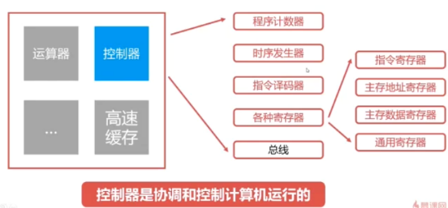

程序计数器：
- [ ] 用来存储下一条指令的地址
- [ ] 循环从程序计数器中拿出指令
- [ ] 当指令被拿出时，指向下一条指令


时序发生器：
- [ ] 属于电气工程领域，用于发送时序脉冲
- [ ] CPU根据不同的时序脉冲有节奏的工作（节拍）


**指令译码器**：
- [ ] 主要部件之一
- [ ] 计算机指令由操作码和地址码组成
- [ ] 翻译操作码对应的操作以及控制传输地址码对应的数据


**指令寄存器**：
- [ ] 主要部件之一
- [ ] **从主存或高速缓存取计算机指令**


**主存地址寄存器**：
- [ ] 保存当前CPU正要访问的内存单元的地址


**主存数据寄存器**：
- [ ] 保存当前CPU正要读或写的主存数据


通用寄存器：
- [ ] 用于暂时存放或传送 数据或指令
- [ ] 可保存ALU的的运算中间结果
- [ ] 容量比一般专用寄存器要大


### 13. 运算器
用来进行数据运算加工


数据缓冲器：
- [ ] 分为**输入缓冲**和**输出缓冲**
- [ ] 输入缓冲暂时存放外设送过来的数据
- [ ] 输出缓冲暂时存放往外设的数据


**ALU**：
- [ ] **算术逻辑单元**，是运算器的主要组成
- [ ] 常见的位运算（左右移、与或非）
- [ ] 算术运算（加减乘除）


ALU：


**状态字**寄存器：
- [ ] 存放运算状态（条件码、进位、溢出、结果正负等）
- [ ] 存放运算控制信息（调试跟踪标记位、允许中断位等）


通用寄存器
- [ ] 用于暂时存放或传送 数据或指令
- [ ] 可保存ALU的的运算中间结果
- [ ] 容量比一般专用寄存器要大


### 14. 计算机指令的执行过程

指令执行过程：
1. 取指令
2. 分析指令
3. 执行指令

右上角是高速缓存，右下角是控制器，左边是运算器


指令执行过程（具体）：
 
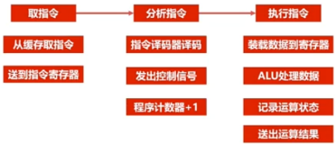


问题：CPU综合利用率不高（控制器和运算器不能同时工作）

CPU的流水线设计：
- [ ] 类似工厂的装配线
- [ ] 多个产品可以同时被加工
- [ ] 在同一时刻，不同产品均位于不同的加工阶段


 

 
当`m`很大时，流水线效率可以看做是串行的**三倍**

### 15. 进制运算的基础
进制概述
- 有限的数字符号来表示无限的数值

小数的二进制转十进制：


- 整数的十进制转二进制（**重复相除法**）：不断除以2，得到余数和商x，继续除以2，直到商为0，最后将所有的余数 倒过来。`10=>1010`
- 小数的十进制转二进制（**重复相乘法**），不断乘以2，取出1，得到x，继续乘2取1，直到x为0：


### 16. 原码、补码、反码
原码表示法：
- 使用0表示正数，1表示负数
- 规定符号位位于数值第一位
- 人类最容易理解


问题：
- 0有两种表示方法：`00`、`10`
- 原码运算复杂，操作数符号不同时，需要判断操作数绝对值大小，使用绝对值大的数减去绝对值小的数，对于符号值，以绝对值大的为准


补码：
目的：
- 正数代替负数表示
- 加法代替减法，从而消除减法（但没有解决）

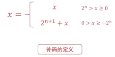

反码：
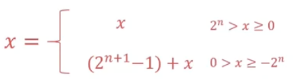


规律：


- 正数的原码、补码、反码一样
- **负数的反码**等于**原码 除符号位外按位取反**
- **负数的补码等于反码+1**


小数的补码计算和整数的补码计算相同


### 17. 定点数与浮点数

#### 17.1. 定点数

- [ ] 小数点 固定放在某个位置的数，分为两种
  - [ ] 一种放在符号位和数值位的中间（纯小数）
  - [ ] 一种放在数值位的最后（纯整数）
- [ ] 不是纯小数或者纯整数的话，需要**乘以比例因子**，成为 **纯小数或纯整数**，比如`1.01`变成`0.101`或者`101`


问题：数据范围很大时，定点数难以表达，也不够灵活

#### 17.2. 浮点数

浮点数的表示格式：


注意：
- 尾数必须使用纯小数

举例：


浮点数的表示范围：


浮点数分类：
- [ ] 单精度浮点数：4个字节、32位，`float`
- [ ] 双精度浮点数：8个字节、64位，`double`


浮点数的规格化：
- [ ] 尾数必须为纯小数
- [ ] 尾数最高位必须为1


举例，只有第一个正确：

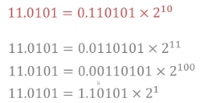

举例：


定点数和浮点数的对比：
- [ ] 浮点数在表示**范围、精度、溢出处理、编程**等方面优于 定点数
- [ ] 浮点数在**运算规则、运算速度、硬件成本**等方面不如 定点数
- [ ] 计算机大多使用**浮点数**，成本比较低的芯片中使用定点数


### 18. 定点数的加减法

#### 18.1. 定点数加法
**`A`的补码+`B`的补码=`A+B`的补码**（对其求原码，即为结果）
注意：
- 数值位与符号位 一同运算，并将符号位产生的进位自然丢掉

 


举例：
 

 

判断溢出，双符号位判断法：
- [ ] 单符号位表示变成双符号位：`0=>00`, `1=>11`
- [ ] 双符号位产生的进位丢弃
- [ ] 结果的双符号位不同则表示溢出

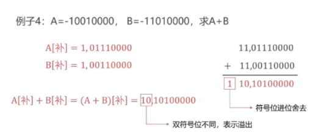 

#### 18.2. 定点数减法
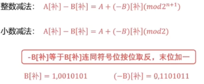 


`-B`的补码等于`B`的补码 连同符号位 按位取反，末位加一


### 19. 浮点数的加减法运算

步骤：
1. 对阶
2. 尾数求和
3. 尾数规格化
4. 舍入
5. 溢出判断


#### 19.1. 对阶
- 目的是使得两个浮点数**阶码一致**，使得**尾数可以进行运算**
- 阶码按**小阶看齐大阶**的原则


 


#### 19.2. 尾数求和
- [ ] 使用**补码**运算
- [ ] `A-B = A + (-B)`


#### 19.3. 尾数规格化
- [ ] 符号位与最高位不一致
- [ ] 一般情况下是左移

尾数规格化（右移）：
- [ ] 双符号位不一致下需要右移（定点运算的溢出情况）
- [ ] 右移的话则需要进行舍入操作


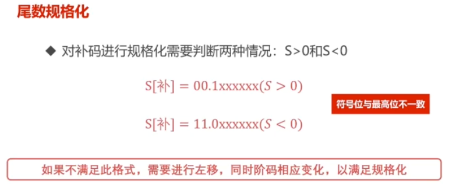

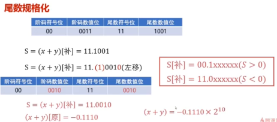

#### 19.4. 舍入
- [ ] 0舍1入法（二进制的四舍五入）。若舍去的是1需要加1，若舍去的是0不需要加1。记得阶码加1
- [ ] 可能溢出


#### 19.5. 溢出判断
- [ ] 定点运算**双符号位**不一致为溢出
- [ ] 浮点运算**尾数双符号位**不一致**不算溢出**
- [ ] 浮点运算**阶码双符号位**判断是否溢出（不一致为溢出）

整个过程：


### 20. 浮点数的乘除法操作

#### 20.1. 乘法
- [ ] 阶码相加，尾数求积
 
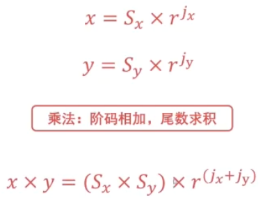


#### 20.2. 除法
- [ ] 阶码相减，尾数求商


 
#### 20.3. 乘除法过程与加减法相同：
1. 阶码运算
2. 尾数运算
3. 尾数规格化
4. 舍入
5. 溢出判断


### 21. 大端字节序和小端字节序
使用2个字节表示255的话，`255 = 00000000, 11111111`

- [ ] 大端字节序：`00000000, 11111111`  **低字节放在后面**，高字节放在前面(高字节保存在内存的低地址)
- [ ] 小端字节序：`11111111, 00000000` **低字节放在前面**，高字节放在后面(高字节保存在内存的高地址)


用途：
- [ ] 大端字节序主要在**网络**中使用
- [ ] 小端字节序主要在**主机**中使用（计算机的CPU或者硬盘）


原因：
- [ ] 计算机电路先处理低位字节效率比较高
- [ ] 人类习惯读写大端字节序，所以在网络上中使用


举例：
`var = 0x11223344`，对于这个变量的最高字节为`0x11`，最低字节为`0x44`

(1) 大端模式存储（存储地址为16位）
```
地址                    数据
0x0004(高地址)          0x44
0x0003                 0x33
0x0002                 0x22
0x0001(低地址)          0x11
```
 

(2) 小端模式存储（存储地址为16位）
```

地址                    数据
0x0004(高地址)          0x11
0x0003                 0x22
0x0002                 0x33
0x0001(低地址)          0x44
```

如何记忆？
- 自大的人眼高手低--其中，**自大代表大端序，眼高代表高地址，手低代表低字节**


