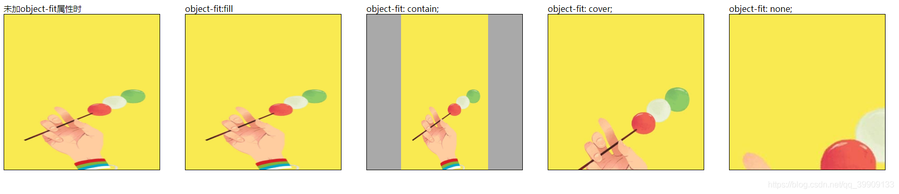

### `object-fit`：控制图片展示状态

- `object-fit` 属性指定元素的内容应该如何去适应指定容器的高度与宽度。
- `object-fit` 一般用于 `img` 和 `video` 标签，一般可以对这些原素进行保留原始比例的剪切、缩放或者直接进行拉伸等。
- 可以与 [object-position](https://www.runoob.com/cssref/pr-object-position.html) 属性一起使用，后者用来设置元素的位置 (默认值: 50% 50%)。

[object-fit](https://www.runoob.com/cssref/pr-object-fit.html)一共有五个对应值，分别是：

1. `fill`: “填充”。默认值。使图片拉伸填满整个容器, 不保证保持原有的比例。
1. `contain`: “包含”。保持原有尺寸比例缩放。保证整个图片都可以出现在容器中。因此，此参数可能会在容器内留下空白。
1. `cover`: “覆盖”。保持原有尺寸比例缩放。宽度和高度至少有一个和容器一致（尺寸小的一致）。因此，此参数可能会让图片部分区域不可见。
1. `none`: “无”。保持原有尺寸比例。同时保持图片原始尺寸大小。多出的部分隐藏。
1. `scale-down`: “降低”。就好像依次设置了`none`或`contain`, 最终呈现的是尺寸比较小的那个。

注意：`scale-down`具有动态属性：当实际图片尺寸大于容器尺寸时，表现为`contain`属性的结果；当实际图片尺寸小于容器尺寸时，表现为`none`属性的结果

