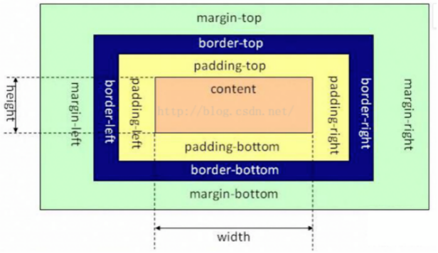

- [1. 介绍一下标准的CSS的盒子模型？与低版本IE的盒子模型有什么不同？](#1-介绍一下标准的css的盒子模型与低版本ie的盒子模型有什么不同)
  - [1.1. `box-sizing`的属性](#11-box-sizing的属性)
- [2. absolute、relative、fixed、static 的区别](#2-absoluterelativefixedstatic-的区别)
- [3. `display:none`与`visibility：hidden`的区别？](#3-displaynone与visibilityhidden的区别)
- [4. 实现一个两列等高布局](#4-实现一个两列等高布局)
- [5. 垂直水平居中](#5-垂直水平居中)
- [6. CSS 实现固定宽高比，比如 4 : 3](#6-css-实现固定宽高比比如-4--3)
- [7. HTML标签的类型](#7-html标签的类型)
  - [7.1. 块级元素特点：](#71-块级元素特点)
  - [7.2. 内联元素特点](#72-内联元素特点)
  - [7.3. `inline-block`元素特点](#73-inline-block元素特点)


### 1. 介绍一下标准的CSS的盒子模型？与低版本IE的盒子模型有什么不同？

1. 标准盒子模型：宽度 = **内容的宽度（content）**+ border + padding + margin
2. 低版本IE盒子模型：宽度 = **内容宽度（content+border+padding）**+ margin

标准盒子模型：


IE盒子模型：


在标准的盒子模型中，`width`指`content`部分的宽度，在IE盒子模型中，`width`表示`content+padding+border`这三个部分的宽度，故这使得在计算整个盒子的宽度时存在着差异：

1. 标准盒子模型的盒子宽度：`左右border+左右padding+width`
2. IE盒子模型的盒子宽度：`width`

#### 1.1. `box-sizing`的属性

1. 用来控制元素的盒子模型的解析模式，默认为`content-box`。
2. `context-box`：W3C的标准盒子模型，设置元素的`height/width`属性指的是`content`部分的高/宽。
3. `border-box`：IE传统盒子模型。设置元素的`height/width`属性指的是`border + padding + content`部分的高/宽。
4. `padding-box`,这个属性值的宽度包含了`左右padding+width`。
5. 也很好理解性记忆，包含什么，`width`就从什么开始算起。


### 2. absolute、relative、fixed、static 的区别
- `absolute`：相对于**上一级不是static的元素**定位，脱离文档流。
- `relative`：相对于**上一级**定位，`static`也可以，不脱离文档流，保留原来的位置。
- `fixed`：相对于**浏览器窗口**定义，脱离文档流。
- `static`：不定位。


### 3. `display:none`与`visibility：hidden`的区别？
1. `display：none` 不显示对应的元素，在文档布局中不再分配空间（**回流reflow + 重绘repaint**）
2. `visibility：hidden` 隐藏对应元素，在文档布局中仍保留原来的空间（**重绘repaint**）


### 4. 实现一个两列等高布局

为了实现两列等高，可以给每列加上 `padding-bottom:9999px; margin-bottom:-9999px;`
同时父元素设置`overflow:hidden;`


### 5. 垂直水平居中

```scss
// 1
.wrapper {
  position: relative;
  .box {
    position: absolute;
    top: 50%;
    left: 50%;
    width: 100px;
    height: 100px;
    margin: -50px 0 0 -50px;
  }
}

// 2
.wrapper {
  position: relative;
  .box {
    position: absolute;
    top: 50%;
    left: 50%;
    transform: translate(-50%, -50%);
  }
}
// translate()函数是css3的新特性.在不知道自身宽高的情况下，可以利用它来进行水平垂直居中

// 3
.wrapper {
  .box {
    display: flex;
    justify-content:center;
    align-items: center;
    height: 100px;
  }
}

// 4
.wrapper {
  display: table;
  .box {
    display: table-cell;
    vertical-align: middle;
  }
}
```

### 6. CSS 实现固定宽高比，比如 4 : 3

首先需要知道，**一个元素的 `padding`，如果值是一个百分比，那这个百分比是相对于其父元素的宽度而言的**，即使对于 `padding-bottom` 和 `padding-top` 也是如此。

另外，在计算 `Overflow` 时，是将元素的内容区域（即 `width` & `height` 对应的区域）和 `Padding` 区域一起计算的。换句话说，**即使将元素的 `overflow` 设置为 `hidden`，“溢出”到 `Padding` 区域的内容也会照常显示**。

综上两条所述，我们可以使用 `padding-bottom` 来代替 `height` 来实现高度与宽度成比例的效果。因为 `item` 元素的宽度是其父元素宽度的 `100%`，**所以我们将 `padding-bottom` 设置为它的 `3/4` 倍，即 `75%`。同时将其 `height` 设置为 `0` 以使元素的“高度”等于 `padding-bottom` 的值**，从而实现需要的效果。
```html
<div class='container'>
  <div class='box'></div>
</div>
```
```css
.container{
  width: 100px; /*变化的*/
}
.box{
  overflow: hidden;
  width: 100%;
  height: 0;
  padding-bottom: 75%;
}
```

若父元素宽度是 `100vw`，则子元素可以为 `75vw`，也能实现 `4:3`

### 7. HTML标签的类型

在CSS中，html中的标签元素大体被分为三种不同的类型：块状元素、内联元素(又叫行内元素)和内联块状元素。

常用的块状元素有：
`<div>、<p>、<h1>...<h6>、<ol>、<ul>、<dl>、<table>、<address>、<blockquote> 、<form>`

常用的内联元素有：
`<a>、<span>、<br>、<i>、<em>、<strong>、<label>、<q>、<var>、<cite>、<code>`

常用的内联块状元素有：
`、<input>`


#### 7.1. 块级元素特点：

1. 每个块级元素都从新的一行开始，并且其后的元素也另起一行。（真霸道，一个块级元素独占一行）
2. 元素的高度、宽度、行高以及顶和底边距都可设置。
3. 元素宽度在不设置的情况下，是它本身父容器的100%（和父元素的宽度一致），除非设定一个宽度。


#### 7.2. 内联元素特点

1. 和其他元素都在一行上；
2. 元素的高度、宽度及顶部和底部边距不可设置；
3. 元素的宽度就是它包含的文字或图片的宽度，不可改变。


#### 7.3. `inline-block`元素特点

1. 和其他元素都在一行上；
2. 元素的高度、宽度、行高以及顶和底边距都可设置。


