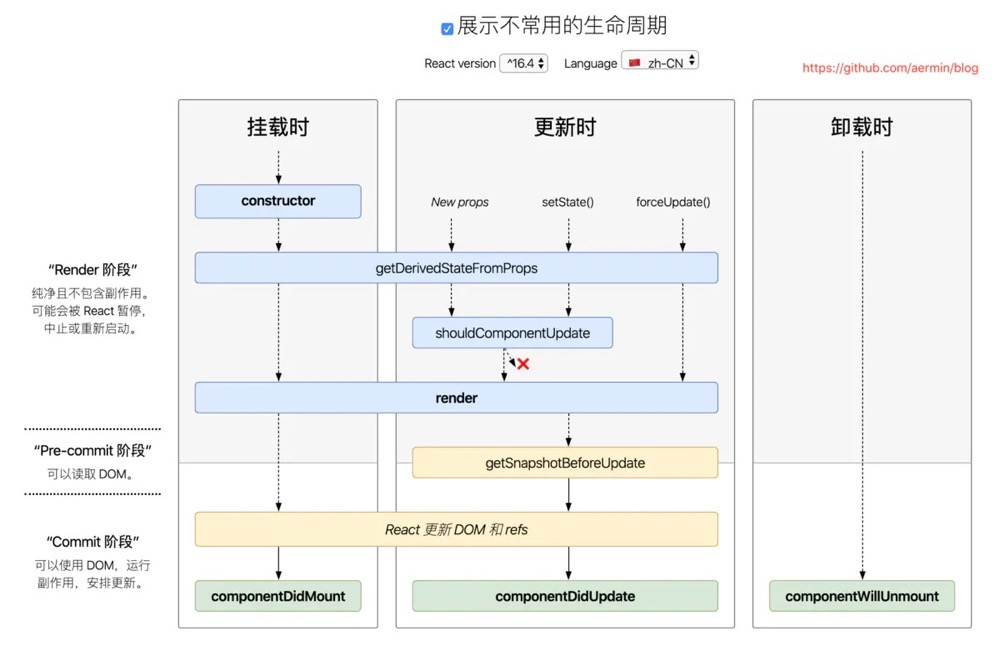

- [1. React 的生命周期](#1-react-的生命周期)
  - [1.1. getDerivedStateFromProps(nextProps, prevState)](#11-getderivedstatefrompropsnextprops-prevstate)
  - [1.2. getSnapshotBeforeUpdate(prevProps, prevState)](#12-getsnapshotbeforeupdateprevprops-prevstate)
  - [1.3. componentDidUpdate(prevProps, prevState, snapshot)](#13-componentdidupdateprevprops-prevstate-snapshot)

## 1. React 的生命周期

16.0之前的生命周期：


16.4之后的生命周期：



React 16之后有三个生命周期被废弃(但并未删除)
- componentWillMount
- componentWillReceiveProps
- componentWillUpdate


### 1.1. getDerivedStateFromProps(nextProps, prevState)

代替`componentWillMount()`、`componentWillReceiveProps()`。

老版本中的`componentWillReceiveProps()`方法判断前后两个 `props` 是否相同，如果不同再将新的 `props` 更新到相应的 `state` 上去。这样做一来会破坏 `state` 数据的单一数据源，导致组件状态变得不可预测，另一方面也会增加组件的重绘次数。

举个例子:


```js
// before
componentWillReceiveProps(nextProps) {
  if (nextProps.isLogin !== this.props.isLogin) {
    this.setState({ 
      isLogin: nextProps.isLogin,   
    });
  }
  if (nextProps.isLogin) {
    this.handleClose();
  }
}

// after
static getDerivedStateFromProps(nextProps, prevState) {
  if (nextProps.isLogin !== prevState.isLogin) {
    return {
      isLogin: nextProps.isLogin,
    };
  }
  return null;
}

componentDidUpdate(prevProps, prevState) {
  if (!prevState.isLogin && this.props.isLogin) {
    this.handleClose();
  }
}
```

这两者最大的不同就是:

在 `componentWillReceiveProps` 中，我们一般会做以下两件事，一是根据 `props` 来更新 `state`，二是触发一些回调，如动画或页面跳转等。

1. 在老版本的 React 中，这两件事我们都需要在 `componentWillReceiveProps` 中去做。
2. 而在新版本中，官方将更新 `state` 与触发回调重新分配到了 `getDerivedStateFromProps` 与 `componentDidUpdate` 中，使得组件整体的更新逻辑更为清晰。而且在 `getDerivedStateFromProps` 中还禁止了组件去访问 `this.props`，强制让开发者去比较 `nextProps` 与 `prevState` 中的值，以确保当开发者用到 `getDerivedStateFromProps` 这个生命周期函数时，就是在根据当前的 props 来更新组件的 state，而不是去做其他一些让组件自身状态变得更加不可预测的事情。

注意：
1. `getDerivedStateFromProps`无论是`Mounting`还是`Updating`，也无论是因为什么引起的`Updating`，全部都会被调用。而componentWillMount只在初次挂载前执行。
2. `getDerivedStateFromProps`前面要加上`static`保留字，声明为静态方法，不然会被`react`忽略掉
3. `getDerivedStateFromProps`里面的`this`为`undefined`
    - `static`静态方法只能`Class`(构造函数)来调用(`App.staticMethod`✅)，而实例是不能的( `(new App()).staticMethod` ❌ )；
    - 当调用`React Class`组件时，该组件会实例化；
    - 所以，`React Class`组件中，静态方法`getDerivedStateFromProps`无权访问`Class`实例的`this`，即`this`为`undefined`。


### 1.2. getSnapshotBeforeUpdate(prevProps, prevState)

代替`componentWillUpdate`。

常见的 `componentWillUpdate` 的用例是在组件更新前，读取当前某个 DOM 元素的状态，并在 `componentDidUpdate` 中进行相应的处理。

这两者的区别在于：

1. 在 React 开启异步渲染模式后，在 `render` 阶段读取到的 DOM 元素状态并不总是和 `commit` 阶段相同，这就导致在
    `componentDidUpdate` 中使用 `componentWillUpdate` 中读取到的 DOM 元素状态是不安全的，因为这时的值很有可能已经失效了。
2. `getSnapshotBeforeUpdate` 会在最终的 `render` 之前被调用，也就是说在 `getSnapshotBeforeUpdate` 中读取到的 DOM 元素状态是可以保证与 `componentDidUpdate` 中一致的。

此生命周期返回的任何值都将作为参数传递给`componentDidUpdate()`。

官网例子：

```js
class ScrollingList extends React.Component {
  constructor(props) {
    super(props);
    this.listRef = React.createRef();
  }

  getSnapshotBeforeUpdate(prevProps, prevState) {
    // 我们是否要添加新的 items 到列表?
    // 捕捉滚动位置，以便我们可以稍后调整滚动.
    if (prevProps.list.length < this.props.list.length) {
      const list = this.listRef.current;
      return list.scrollHeight - list.scrollTop;
    }
    return null;
  }

  componentDidUpdate(prevProps, prevState, snapshot) {
    // 如果我们有snapshot值, 我们已经添加了 新的items.
    // 调整滚动以至于这些新的items 不会将旧items推出视图。
    // (这边的snapshot是 getSnapshotBeforeUpdate方法的返回值)
    if (snapshot !== null) {
      const list = this.listRef.current;
      list.scrollTop = list.scrollHeight - snapshot;
    }
  }

  render() {
    return (
      <div ref={this.listRef}>{/* ...contents... */}</div>
    );
  }
}
```
### 1.3. componentDidUpdate(prevProps, prevState, snapshot)

注意`componentDidUpdate()`的参数

参考资料：
1. [详解React生命周期(包括react16最新版)](https://www.jianshu.com/p/514fe21b9914)
2. [React的生命周期](https://www.jianshu.com/p/b331d0e4b398)