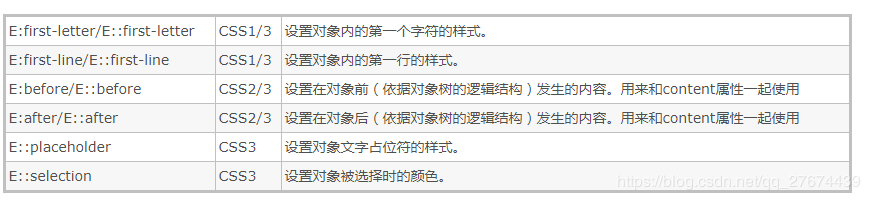

- [1. CSS优先级](#1-css优先级)
    - [a. CSS选择器的优先级关系](#a-css选择器的优先级关系)
    - [b. 浏览器具体的优先级算法是怎样的？](#b-浏览器具体的优先级算法是怎样的)
    - [c. 怎么比较两个优先级的高低？](#c-怎么比较两个优先级的高低)
    - [d. 覆盖内联样式方法](#d-覆盖内联样式方法)
- [2. 伪类和伪元素的区别](#2-伪类和伪元素的区别)
    - [a. `:after/::after`和`:before/::before`的异同](#a-after/after和before/before的异同)
- [3. absolute、relative、fixed、static 的区别](#3-absoluterelativefixedstatic-的区别)
- [4. `display:none`与`visibility：hidden`的区别？](#4-displaynone与visibilityhidden的区别)
- [5. 为什么会出现浮动？什么时候需要清除浮动？](#5-为什么会出现浮动什么时候需要清除浮动)
- [6. 清除浮动的方式](#6-清除浮动的方式)
- [7. overflow 清除浮动的原理](#7-overflow-清除浮动的原理)
- [8. img标签的title与alt区别](#8-img标签的title与alt区别)
- [9. 实现一个两列等高布局](#9-实现一个两列等高布局)
- [10. flex布局](#10-flex布局)
- [11. `flex:1;`的含义](#11-flex1;的含义)
- [12. BFC及其作用](#12-bfc及其作用)
- [13. 哪些元素会生成BFC？](#13-哪些元素会生成bfc)
- [14. 关于js动画和CSS3动画的差异性](#14-关于js动画和css3动画的差异性)
- [15. `link`标签和`@import`标签的区别](#15-link标签和@import标签的区别)
- [16. F5 和 Ctrl+F5 的区别](#16-f5-和-ctrl+f5-的区别)
- [17. ajax解决浏览器缓存问题](#17-ajax解决浏览器缓存问题)
- [18. 径向渐变](#18-径向渐变)
- [19. 线性渐变](#19-线性渐变)
- [20. CSS `attr()` 函数](#20-css-attr-函数)
- [21. text-shadow和box-shadow对比](#21-text-shadow和box-shadow对比)
- [22. 关于`vw`、`vh`、`vmin`、`vmax`](#22-关于vwvhvminvmax)
    - [a.  vw、vh、vmin、vmax 的含义](#a--vwvhvminvmax-的含义)
    - [b.  vw、vh 与 % 百分比的区别](#b--vwvh-与--百分比的区别)
    - [c. vmin、vmax 用处](#c-vminvmax-用处)
- [23. 样式中困扰我们的offsetWidth、clientWidth、width、scrollWidth、clientX、screenX、offsetX、pageX](#23-样式中困扰我们的offsetwidthclientwidthwidthscrollwidthclientxscreenxoffsetxpagex)
- [24. `input`的`placeholder`样式：](#24-input的placeholder样式)
- [25. CSS Modules](#25-css-modules)
- [26. `calc()`注意事项](#26-calc注意事项)
- [27. 如何去掉 antd 的 Input 组件获取焦点时的蓝色边框](#27-如何去掉-antd-的-input-组件获取焦点时的蓝色边框)
- [28. 关于`Normalize.css`](#28-关于normalizecss)
- [29. 如何设置选中文字的背景颜色？](#29-如何设置选中文字的背景颜色)
- [30. Chrome中文字体下限`12px`](#30-chrome中文字体下限12px)
- [31. 如何排除第一个`li`元素？](#31-如何排除第一个li元素)
- [32. `stroke-dasharray` 和 `stroke-dashoffset`](#32-stroke-dasharray-和-stroke-dashoffset)
- [33. `nth-child`和`nth-of-type`的区别](#33-nth-child和nth-of-type的区别)
- [34. select:last-child](#34-selectlast-child)
- [35. CSS类选择器并排](#35-css类选择器并排)
- [36. 伪元素注意事项](#36-伪元素注意事项)
- [37. CSS改变input光标颜色](#37-css改变input光标颜色)
- [38. 唱片旋转CSS](#38-唱片旋转css)
- [39. `animation`中的`steps()`逐帧动画](#39-animation中的steps逐帧动画)
- [40. SCSS](#40-scss)
    - [a. Sass和SCSS区别](#a-sass和scss区别)
    - [b. 默认变量](#b-默认变量)
    - [c. 全局变量和局部变量](#c-全局变量和局部变量)
    - [d. 混合宏、继承、占位符](#d-混合宏继承占位符)
    - [e. Sass中注释类型的区别](#e-sass中注释类型的区别)
- [41. `active`、`hover`、`link`、`visited`、`focus`的区别](#41-activehoverlinkvisitedfocus的区别)
- [42. `a`标签伪类的触发顺序 ](#42-a标签伪类的触发顺序-)
- [43. `background-size`](#43-background-size)
- [44. bootstrap栅格系统](#44-bootstrap栅格系统)
- [45. bootstrap 栅格系统的工作原理](#45-bootstrap-栅格系统的工作原理)
- [46. bootstrap快速添加margin、padding](#46-bootstrap快速添加marginpadding)
- [47. `z-index`理解](#47-z-index理解)
- [48. `zoom:1`的常见作用](#48-zoom1的常见作用)
- [49. `em`与`rem`的重要区别](#49-em与rem的重要区别)
- [50. HTML标签的类型](#50-html标签的类型)
    - [a. 块级元素特点：](#a-块级元素特点)
    - [b. 内联元素特点](#b-内联元素特点)
    - [c. `inline-block`元素特点](#c-inline-block元素特点)
- [51. 介绍一下标准的CSS的盒子模型？与低版本IE的盒子模型有什么不同？](#51-介绍一下标准的css的盒子模型与低版本ie的盒子模型有什么不同)
    - [a. `box-sizing`的属性](#a-box-sizing的属性)
- [52. 多行元素的文本省略号](#52-多行元素的文本省略号)
- [53. 双边距重叠问题（外边距折叠）](#53-双边距重叠问题外边距折叠)
- [54. 区分`animation`（动画）、`transition`（过渡）、`transform`（变形）、`translate`（移动）](#54-区分animation动画transition过渡transform变形translate移动)
    - [a. `transition`属性](#a-transition属性)
    - [b. `animation`属性](#b-animation属性)
- [55. `word-wrap/word-break/white-space`区别](#55-word-wrap/word-break/white-space区别)
- [56. filter属性](#56-filter属性)
- [57. `input`的`autofill`不能用`rgba`模式；加上`transition`看不到圆角处的白边](#57-input的autofill不能用rgba模式；加上transition看不到圆角处的白边)
- [58. 移动端强制横屏显示](#58-移动端强制横屏显示)
- [59. 警报闪烁CSS](#59-警报闪烁css)
- [60. 垂直水平居中](#60-垂直水平居中)
- [61. input 自动填充颜色改变或透明](#61-input-自动填充颜色改变或透明)
- [62. 如何实现圆角钝角？](#62-如何实现圆角钝角)

### 1. CSS优先级

#### a. CSS选择器的优先级关系
内联 > ID选择器 > 类选择器 > 标签选择器。


#### b. 浏览器具体的优先级算法是怎样的？

优先级是由A、B、C、D的值来决定的，其中它们的值计算规则如下：
1. 如果存在**内联样式**，那么A = 1, 否则A = 0;
2. B的值等于**ID选择器**出现的次数;
3. C的值等于**类选择器**和**属性选择器**和**伪类**出现的总次数;
4. D的值等于**标签选择器**和**伪元素**出现的总次数 。

这样子直接看好像也还是很明白 ，那先上个例子：
```css
#nav-global > ul > li > a.nav-link
```
套用上面的算法，依次求出ABCD的值：
1. 因为没有内联样式 ，所以A = 0;
2. ID选择器总共出现了1次，B = 1;
3. 类选择器出现了1次， 属性选择器出现了0次，伪类选择器出现0次，所以C = (1 + 0 + 0) = 1；
4. 标签选择器出现了3次， 伪元素出现了0次，所以D = (3 + 0) = 3;
上面算出的A、B、C、D可以简记作：(0, 1, 1, 3)。


#### c. 怎么比较两个优先级的高低？

现在已经弄清楚了优先级是怎么算的了。但是，还有一个问题，怎么比较两个优先级的高低呢？
比较规则是: **从左往右依次进行比较 ，较大者胜出，如果相等，则继续往右移动一位进行比较** 。**如果4位全部相等，则后面的会覆盖前面的**。


#### d. 覆盖内联样式方法

内联样式的优先级是最高的，但是外部样式有没有什么办法覆盖内联样式呢？有的，那就要`!important`出马了。因为一般情况下，很少会使用内联样式 ，所以`!important`也很少会用到！如果不是为了要覆盖内联样式，建议尽量不要使用`!important`。
如果内联样式用了`!important`，外部样式就没有办法了。所以**千万不要在内联样式中使用`!important`**。


### 2. 伪类和伪元素的区别

伪类和伪元素的根本区别在于：它们是否**创造了新的元素**。

1. 伪元素/伪对象：不存在在DOM文档中，是虚拟的元素，是创建新元素。代表某个元素的子元素，这个子元素虽然在**逻辑上存在**，但却**并不实际存在于文档树中**。例如：用`::before`和`::after`。
2. 伪类：表示**已存在的某个元素处于某种状态**，但是通过dom树又无法表示这种状态，就可以通过伪类来为其添加样式。例如a元素的`:hover`, ` :active`等。

伪元素：



伪类：


另外：

1. 伪类的效果可以通过**添加实际的类**来实现
2. 伪元素的效果可以通过**添加实际的元素**来实现
3. 所以它们的本质区别就是是否抽象**创造了新元素**

注意：
1. 伪类只能使用`：`
2. 除了`::placeholder`和`::selection`，伪元素既可以使用`:`，也可以使用`::`。
3. 因为伪类是类似于添加类所以可以是多个，而伪元素在一个选择器中只能出现一次，并且只能出现在末尾。


#### a. `:after/::after`和`:before/::before`的异同
相同点
1. 都可以用来表示伪元素，用来设置对象前的内容。
2. `:before`和`::before`写法是等效的， `:after`和`::after`写法是等效的。


不同点

1. `:before/:after`是CSS2的写法，`::before/::after`是CSS3的写法。
2. `:before/:after`的兼容性要比`::before/::after`好 ，不过在H5开发中建议使用`::before/::after`比较好。


注意：

1. 伪元素要配合`content`属性一起使用
2. 伪元素**不会出现在DOM中**，所以**不能通过js来操作**，仅仅是在**CSS 渲染层加入**
3. 伪元素的特效通常要使用`:hover`伪类样式来激活
eg: 当鼠标移在`span`上时，`span`前插入”mike”
```css
span:hover::before{
    content: 'mike'
}
```

参考资料：[伪类和伪元素的区别](https://www.cnblogs.com/xmbg/p/11608268.html)，[伪类和伪元素的区别总结](https://blog.csdn.net/qq_27674439/article/details/90608220)


### 3. absolute、relative、fixed、static 的区别
- absolute：相对于**上一级不是static的元素**定位，脱离文档流。
- relative：相对于**上一级**定位，static也可以，不脱离文档流，保留原来的位置。
- fixed：相对于**浏览器窗口**定义，脱离文档流。
- static：不定位。


### 4. `display:none`与`visibility：hidden`的区别？
1. `display：none` 不显示对应的元素，在文档布局中不再分配空间（**回流reflow + 重绘repaint**）
2. `visibility：hidden` 隐藏对应元素，在文档布局中仍保留原来的空间（**重绘repaint**）


### 5. 为什么会出现浮动？什么时候需要清除浮动？

浮动元素碰到包含它的边框或者浮动元素的边框停留。由于浮动元素不在文档流中，所以文档流的块框表现得就像浮动框不存在一样。浮动元素会漂浮在文档流的块框上。

浮动带来的问题：
1. 父元素的高度无法被撑开，影响与父元素同级的元素
2. 与浮动元素同级的非浮动元素（内联元素）会跟随其后
3. 若非第一个元素浮动，则该元素之前的元素也需要浮动，否则会影响页面显示的结构。


### 6. 清除浮动的方式

1. 父级div定义`height`
2. 最后一个浮动元素后加空div标签 并添加样式`clear:both`。
3. 包含浮动元素的父标签添加样式`overflow为hidden或auto`。
4. 父级div定义`zoom`


### 7. overflow 清除浮动的原理

要讲清楚这个解决方案的原理，首先需要了解块格式化上下文，块格式化上下文是CSS可视化渲染的一部分，它是一块区域，规定了内部块盒 的渲染方式，以及浮动相互之间的影响关系

当元素设置了overflow样式且值不为visible时，该元素就**构建了一个BFC，BFC在计算高度时，内部浮动元素的高度也要计算在内**，也就是说技术BFC区域内只有一个浮动元素，BFC的高度也不会发生塌缩，所以达到了清除浮动的目的。


另外，注意`onerror`属性：
`onerror`属性找图片加载失败了的时候，可以使用`onerror`将图片替换为默认图片。注意，一定要**在`onerror`里面将`onerror`置空**，不然在新的图片也加载失败后，会形成死循环。

```

```


### 9. 实现一个两列等高布局

为了实现两列等高，可以给每列加上 `padding-bottom:预加载; margin-bottom:-9999px;`
同时父元素设置`overflow:hidden;`


### 10. flex布局
首先要有个容器，并设置`display: flex; display: -webkit-flex;`
该容器有以下六个属性：

- flex-direction (元素排列方向)
  - row, row-reverse, column, column-reverse
- flex-wrap (换行)
  - nowrap, wrap, wrap-reverse
- flex-flow (以上两者的简写)
  - flex-direction || flex-wrap
- justify-content (水平对齐方式)主轴
  - flex-start, flex-end, center, space-between, space-around
- align-items (垂直对齐方式)交叉轴
  - stretch（拉伸）, flex-start, flex-end, center, baseline（文字底部对齐）
- align-content (多行垂直对齐方式)
  - stretch, flex-start, flex-end, center, space-between, space-around


项目的属性：

- order 排列顺序，数值，默认`0`
  - "integer"
- flex-grow定义放大比例，默认`0`，即如果存在剩余空间，也不放大。
  - "number"
- flex-shrink定义缩小比例，默认`1`，如果所有项目的flex-shrink属性都为1，当空间不足时，都将等比例缩小。如果一个项目的flex-shrink属性为0，其他项目都为1，则空间不足时，前者不缩小。
   - "number"
- flex-basis 定义**项目占据的主轴空间**，默认`auto`。会根据flex-direction定义的主轴（水平或者垂直），定义项目本来的大小，跟width或者height一样。

- flex 推荐，以上三个的缩写，默认`0 1 auto`
  - "flex-grow" "flex-shrink" "flex-basis"
- align-self单个项目有与其他项目不一样的对齐方式，可覆盖align-items
  - "auto","flex-start","flex-end","center","baseline","stretch"　


注意：flex 弹性盒子**消除了里面元素的 block 属性**，因此里面**不用加 Inline-block**


### 11. `flex:1;`的含义

- 默认`flex`属性是`0 1 auto`，【父控件有剩余控件也不放大，父控件空间不足按1缩小，保持本身的空间大小】

- `flex:1;`的值是`1 1 0%`，【父控件有剩余空间占1份放大，父控件空间不足按1缩小，自身的空间大小是0%】

```
flex为none：0 0 auto  （不放大也不缩小）
flex为auto：1 1 auto  （放大且缩小）

flex为一个非负数字n：该数字为flex-grow的值，
flex：n；=  flex-grow：n；
           flex-shrink：1；
           flex-basis：0%；

flex为两个非负数字n1，n2： 分别为flex-grow和flex-shrink的值，
flex：n1 n2; = flex-grow：n1；
               flex-shrink：n2；
               flex-basis：0%；

flex为一个长度或百分比L：视为flex-basis的值，
flex: L; =  flex-grow：1；
            flex-shrink：1；
            flex-basis：L；

flex为一个非负数字n和一个长度或百分比L：分别为flex-grow和flex-basis的值，
flex：n L；= flex-grow：n；
            flex-shrink：1；
            flex-basis：L;
```


参考资料：[flex, 博客园](https://www.cnblogs.com/LangZ-/p/12703858.html)，[flex, MDN](https://developer.mozilla.org/zh-CN/docs/Web/CSS/flex)


### 12. BFC及其作用

BFC( block formatting context ）：简单来说，BFC 就是一种属性，这种属性会影响着元素的定位以及与其兄弟元素之间的相互作用。 

中文常译为**块级格式化上下文**。是 W3C CSS 2.1 规范中的一个概念，它决定了元素如何对其内容进行定位，以及与其他元素的关系和相互作用。 
在进行盒子元素布局的时候，BFC提供了一个环境，在这个环境中按照一定规则进行布局不会影响到其它环境中的布局。比如浮动元素会形成BFC，浮动元素内部子元素的主要受该浮动元素影响，两个浮动元素之间是互不影响的。
也就是说，**如果一个元素符合了成为BFC的条件，该元素内部元素的布局和定位就和外部元素互不影响(除非内部的盒子建立了新的 BFC)**，是一个隔离了的独立容器。（在 CSS3 中，BFC 叫做 Flow Root）


BFC（块级格式化上下文，用于**清除浮动，防止margin重叠**等）
- 直译成：块级格式化上下文，是一个**独立的渲染区域，并且有一定的布局规则**。
- BFC区域不会与float box重叠
- BFC是页面上的一个独立容器，**子元素不会影响到外面**
- 计算BFC的高度时，浮动元素也会参与计算


### 13. 哪些元素会生成BFC？

1. 根元素
2. float不为none的元素
3. position为fixed和absolute的元素
4. display为inline-block、table-cell、table-caption，flex，inline-flex的元素
5. overflow不为visible的元素


### 14. 关于js动画和CSS3动画的差异性

渲染线程分为`main thread`和`compositor thread`，如果css动画**只改变`transform和opacity`，这时整个CSS动画得以在`compositor trhead`完成（而js动画则会在`main thread`执行，然后触发`compositor thread`进行下一步操作）**，特别注意的是如果改变`transform和opacity`是不会layout或者paint的。
区别：

1. **功能涵盖面**，js比CSS3大
2. **实现/重构难度**不一，CSS3比js更加简单，性能调优方向固定
3. 对帧速表现不好的低版本浏览器，CSS3可以做到**自然降级**
4. CSS3动画有天然事件支持
5. CSS3有兼容性问题


### 15. `link`标签和`@import`标签的区别

1. `link`属于`html`标签，而`@import`是`css`提供的
2. 页面被加载时，`link`会**同时被加载**，而`@import`引用的css会等到**页面加载结束后**加载。
3. link是html标签，因此没有**兼容性**，而@import只有`IE5`以上才能识别。
4. 当用`JS`控制`dom`去**改变样式**的时候，只能使用link标签，由于 DOM 方法是**基于文档**的，无法使用@import的方式插入样式。

注意：
- CSS 的`link`标签是同时加载的 
- `script`标签才会加载完一个再加载另一个（默认，加上`defer/async`就不同了）


### 16. F5 和 Ctrl+F5 的区别

1. `F5`触发的HTTP请求的请求头中，通常包含了**`If-Modified-Since`或`If-None-Match`字段**，或者两者兼有。如果服务器认为被请求的文件没有发生变化，则返回**304响应**,也就没有跳过缓存。
2. `CTRL+F5`触发的HTTP请求的请求头中没有上面的那两个头，却有**`Pragma: no-cache`或`Cache-Control: no-cache`字段**，或者两者兼有。服务器看到no-cache这样的值就会把**最新的文件**响应过去，也就跳过了缓存。


### 17. ajax解决浏览器缓存问题
1. 在ajax发送请求前加上`anyAjaxObj.setRequestHeader ( "If-Modified-Since","0")`。
2. 在ajax发送请求前加上 `anyAjaxObj.setRequestHeader ( "Cache-Control","no-cache")`。
3. 在URL后面加上一个**随机数**：` "fresh=" + Math.random()`。
4. 在URL后面加上**时间戳**：`"nowtime=" + new Date().getTime()`。
5. 如果是使用`jQuery`，直接这样就可以了`$.ajaxSetup({cache:false})`。这样页面的所有ajax都会执行这条语句就是不需要保存缓存记录。


### 18. 径向渐变

`radial-gradient`的**渐变轴**是**圆心到顶点的一条线**，设置渐变色都是在渐变轴上设置的。
线性渐变的渐变轴比较简单，就是**那条线**。
径向渐变可以实现内凹圆角


### 19. 线性渐变

`background-image: linear-gradient(direction, color-stop1, color-stop2, ...);`
比如：
```
linear-gradient(12deg, red, yellow); 
linear-gradient(to bottom right, red , yellow);
linear-gradient(red 0%, orange 25%, yellow 50%, green 75%, blue 100%)
```
如果两个或多个颜色终止在同一位置，则在该位置声明的第一个颜色和最后一个颜色之间的过渡将是一条生硬线。
`to top`, `to bottom`, `to left` 和 `to right`这些值会被转换成角度`0度`、`180度`、`270度`和`90度`。其余值会被转换为一个以**向顶部中央方向为起点** **顺时针**旋转的角度。


### 20. CSS `attr()` 函数
`attr()` 函数返回**选择元素的属性值**
如`attr(data-name)`, `attr(href)`

 

### 21. text-shadow和box-shadow对比
`text-shadow`和`box-shadow`都有`blur`属性（模糊距离），`box-shadow`还有`spread`（阴影的大小）。

- `h-shadow`：必需的。水平阴影的位置。允许负值
- `v-shadow`：必需的。垂直阴影的位置。允许负值


比如，`text-shadow: 1px 1px 1px #333`，指的是，水平阴影位置，垂直阴影位置，模糊距离，阴影的颜色


### 22. 关于`vw`、`vh`、`vmin`、`vmax`

#### a.  vw、vh、vmin、vmax 的含义
- vw：视窗宽度的百分比（1vw 代表视窗的宽度为 1%）
- vh：视窗高度的百分比
- vmin：当前 vw 和 vh 中较小的一个值
- vmax：当前 vw 和 vh 中较大的一个值


#### b.  vw、vh 与 % 百分比的区别

- % 是相**对于父元素**的大小设定的比率，vw、vh 是**视窗大小**决定的。
- vw、vh 优势在于能够**直接获取高度**，而用 % 在没有设置 body 高度的情况下，是无法正确获得可视区域的高度的，所以这是挺不错的优势。


#### c. vmin、vmax 用处

做**移动页面开发**时，如果使用 vw、wh 设置**字体大小**（比如 5vw），在**竖屏**和**横屏**状态下显示的字体大小是不一样的。
由于 vmin 和 vmax 是当前较小的 vw 和 vh 和当前较大的 vw 和 vh。这里就可以用到 vmin 和 vmax。使得文字大小在横竖屏下保持一致。


### 23. 样式中困扰我们的offsetWidth、clientWidth、width、scrollWidth、clientX、screenX、offsetX、pageX

1. offsetWidth, offsetHeight //返回元素的宽度, 高度（包括元素宽度、内边距和边框，不包括外边距）
2. clientWidth, clientHeight //返回元素的宽度, 高度（包括元素宽度、内边距，不包括边框和外边距）
3. style.width, style.height //返回元素的宽度, 高度（包括元素宽度，不包括内边距、边框和外边距）
4. scrollWidth, scrollHeight //返回元素的宽度, 高度（包括元素宽度、内边距和溢出尺寸，不包括边框和外边距），无溢出的情况，与clientWidth相同


注意:

1. style.width 返回的是字符串，如28px，offsetWidth返回的是数值28；
2. style.width/style.height与scrollWidth/scrollHeight是可读写的属性，clientWidth/clientHeight与offsetWidth/offsetHeight是只读属性
3. style.width的值需要事先定义，否则取到的值为空。而且必须要定义在html里(内联样式)，如果定义在css里，style.height的值仍然为空，但元素偏移有效；而offsetWidth则仍能取到。


在处理鼠标事件时,我们通常要知道鼠标的x,y位置

1. clientX 鼠标相对于浏览器（这里说的是浏览器的有效区域）左上角x轴的坐标； 不随滚动条滚动而改变；
2. clientY 鼠标相对于浏览器（这里说的是浏览器的有效区域）左上角y轴的坐标； 不随滚动条滚动而改变；
3. pageX 鼠标相对于浏览器（这里说的是浏览器的有效区域）左上角x轴的坐标； 随滚动条滚动而改变；
4. pageY 鼠标相对于浏览器（这里说的是浏览器的有效区域）左上角y轴的坐标； 随滚动条滚动而改变；
5. screenX 鼠标相对于显示器屏幕左上角x轴的坐标；
6. screenY 鼠标相对于显示器屏幕左上角y轴的坐标；
7. offsetX 鼠标相对于事件源左上角X轴的坐标
8. offsetY 鼠标相对于事件源左上角Y轴的坐标


### 24. `input`的`placeholder`样式：

`input::-webkit-input-placeholder`不能和`moz`、`ms`连起来写，需要分开

 

### 25. CSS Modules

CSS的规则都是全局的，任何一个组件的样式规则，都对整个页面有效。产生局部作用域的唯一方法，就是使用一个独一无二的class的名字，不会与其他选择器重名。但是当我们与其他人共同开发的时候，无法保证一定与其他人不同，这时候就要用到 CSS Modules了。

将样式文件`App.css`输入到`style`对象，然后引用`style.title`代表一个class。构建工具会将类名`style.title`编译成一个**哈希字符串**。`App.css`也会同时被编译。

我们使用的`antd`组件的样式大部分都是全局样式，使用局部方式声明class经过编译后，无法与组件的默认样式class匹配，样式自然就无法进行覆盖，要覆盖默认样式就需要使用全局样式。使用`global`声明的class，都不会被编译成**哈希字符串**也就能够进行覆盖了。


注意:
css module在react使用的时候，如果类不存在或者写的位置或方法不对，是挂载不上去的。


### 26. `calc()`注意事项

`calc(50% - 470px)`，中间必须加**空格**


### 27. 如何去掉 antd 的 Input 组件获取焦点时的蓝色边框

最初尝试通过设置`outline:none`的方法去掉这个边框，但是发现这个方法不起作用。

其实，antd的Input组件在获取焦点情况下的蓝色边框是通过`box-shadow`来实现的。


### 28. 关于`Normalize.css`

`Normalize.css`是一种`CSS reset`的替代方案。它在默认的HTML元素样式上提供了跨浏览器的高度一致性。相比于传统的`CSS reset`，`Normalize.css`是一种现代的、为HTML5准备的优质替代方案。


### 29. 如何设置选中文字的背景颜色？

```css
::selection{
  background-color: #b3d4fc;
  text-shadow: none;
}
```


### 30. Chrome中文字体下限`12px`


### 31. 如何排除第一个`li`元素？
```css
li + li {  
  border-left: 1px solid #ddd; 
}
```

### 33. `nth-child`和`nth-of-type`的区别

1. `p:nth-child(2)`是**先找到第2个元素**，然后看看它是否是p，**是p才渲染**
2. `p:nth-of-type(2)`是**找到这些个p元素**，然后**渲染第2个p元素**(如果第二个p存在，一定会渲染)


### 34. select:last-child

选择父元素的最后一个子元素，且同时满足select条件的。两者缺一不可！


### 35. CSS类选择器并排

1. `.nav .user`（中间有空格）匹配到`.nav`的元素**下面的`.user`的元素**
2. `.user.login`（中间没有空格）匹配到**同时含有**`.user`和`.login`的元素


### 36. 伪元素注意事项
1. 伪元素，它是一个元素的子元素，其意思就是说，我们无法用JS获取到这些伪元素，我们无法通过JS对其进行增、删、改，所以这也是它们的优点，因为它们不会增加JS查询DOM的负担，即对于JS来说伪元素是透明的。然后因为它们也不是实际的HTML标签，所以可以加快浏览器加载HTML文件，对SEO也有帮助（SEO 搜索引擎优化）。
2. 如果我们把伪类的样式有absolute定位的话会把伪类强制变成块级元素，伪类本身是行内元素的。
3. img、input和其他的单标签是没有after和before伪元素的，因为单标签本身不能有子元素。


### 37. CSS改变input光标颜色

这种效果有两种实现方式：
1. 使用color来实现
光标的颜色是继承自当前输入框字体的颜色，所以用color属性即可改变：
```
input{
  color:red;
}
```
2. 使用caret-color来实现
上一种方式已经修改了光标的颜色但是字体的颜色也改变了，如果只想改变光标的颜色而不改变字体的颜色那就使用caret-color属性:
```
input{
  caret-color:red;
}
```


### 38. 唱片旋转CSS
```
1. `animation: linear infinite`
2. `keyframes`中`0%`时`transform:rotate(0deg)`，`100%`时 `360deg`

JS控制唱片暂停时，如果用 this.setAttribute(‘class’, ‘play’) 会跳到初始位置，可以用this.style.annimationPalyState(webkitAni…) = ‘running’ 或者’paused’
```


### 39. `animation`中的`steps()`逐帧动画

语法：`steps(n, start/end)`

steps 函数指定了一个阶跃函数，第一个参数指定了时间函数中的间隔数量（必须是正整数）；第二个参数可选，接受 start 和 end 两个值，指定在每个间隔的起点或是终点发生阶跃变化，默认为 end。


- 第一个参数 number 为指定的间隔数，即把动画分为n步阶段性展示
- 第二个参数默认是end，设置最后一步的状态
  - start 第一帧是第一步动画结束
  - end 第一帧是第一步动画开始

举例：
- `steps(1,start)` 动画分成1步，动画执行时为开始左侧端点的部分开始。
- `steps(1,end)` 动画分成1步，动画执行时以结尾端点为开始，默认值end


### 40. SCSS

#### a. Sass和SCSS区别

Sass 和 SCSS 其实是同一种东西，我们平时都称之为 Sass，两者之间不同之处有以下两点：
- 文件扩展名不同，Sass 是以`“.sass”`后缀为扩展名，而 SCSS 是以`“.scss”`后缀为扩展名
- 语法书写方式不同，Sass 是以**严格的缩进式语法**规则来书写，不带大括号(`{}`)和分号(`;`)，而 SCSS 的语法书写和我们的 CSS 语法书写方式非常类似。


#### b. 默认变量

sass 的默认变量一般是用来设置默认值，然后根据需求来覆盖的，覆盖的方式也很简单，只需要在默认变量之前重新声明下变量即可。


```scss
$baseLineHeight: 2;
$baseLineHeight: 1.5 !default;
body{
  line-height: $baseLineHeight; 
}
```


#### c. 全局变量和局部变量

在选择器、函数、混合宏...的外面定义的变量为全局变量。

当在局部范围（选择器内、函数内、混合宏内...）声明一个已经存在于全局范围内的变量时，局部变量就成为了全局变量的影子。基本上，局部变量只会在局部范围内覆盖全局变量。


#### d. 混合宏、继承、占位符

Sass 中的占位符 `%placeholder`可以取代以前 CSS 中的基类造成的代码冗余的情形。因为 `%placeholder` 声明的代码，如果不被 `@extend`调用的话，不会产生任何代码。

通过`@extend`调用的占位符，编译出来的代码会将相同的代码合并在一起。这也是我们希望看到的效果，也让你的代码变得更为干净。


- 如果你的代码块中涉及到**变量**，建议使用**混合宏**来创建相同的代码块。
- 如果你的代码块不需要任何变量参数，而且有一个**基类**已在文件中存在，那么建议使用 Sass 的**继承**。


#### e. Sass中注释类型的区别
- `/* */`是多行注释,会被编译到css文件中
- 用`//`单行注释不会被编译到css文件中


### 41. `active`、`hover`、`link`、`visited`、`focus`的区别

- `link`表示链接在正常情况下（即页面刚加载完成时）显示的颜色。
- `visited`表示**链接被点击后**显示的颜色。
- `hover`表示鼠标悬停时显示的颜色。
- `focus`表示**元素获得光标焦点**时使用的颜色，主要用于**文本框**输入文字时使用（鼠标松开时显示的颜色）。
- `active`表示当所指元素处于**激活**状态（**鼠标在元素上按下还没有松开**）时所显示的颜色。


### 42. `a`标签伪类的触发顺序 

触发顺序为`link`-->`visited`--->`hover`--->`active`即记为`love and hate`， 然后单独记住`focus`在`hover`和`active`之间即可


### 43. `background-size`
```scss
background-size：contain; // 缩小图片来适应元素的尺寸（保持像素的长宽比）；
background-size ：cover; // 扩展图片来填满元素（保持像素的长宽比）；
background-size ：100px 100px; // 调整图片到指定大小；
background-size ：50% 100%; // 调整图片到指定大小，百分比相对于包含元素的尺寸。
```


常见用法：
`background-size: cover`与`background-position: 50% 50%`配合，保证背景图片居中


### 44. bootstrap栅格系统

栅格布局，一共12份，父级`className='row'`，子元素`className='col-8'`


### 45. bootstrap 栅格系统的工作原理

- 行（`row`）必须包含在`.container`（固定宽度）或`.container-fluid`（100%宽度）中，以便为其赋予合适的排列（`aligment`）和内补（`padding`）。
- 通过行（`row`）在水平方向创建一组“列（`column`）”。
- 你的内容应当放置于“列（column）”内，并且，只有“列（column）”可以作为行（row）”的直接子元素。
- 通过为“列（`column`）”设置`padding`属性，从而创建列与列之间的间隔（`gutter`）。通过为`.row`元素设置负值`margin`从而抵消掉为`.container`元素设置的`padding`，也就间接为“行（`row`）”所包含的“列（`column`）”抵消掉了`padding`。

- 栅格系统中的列是通过指定1到12的值来表示其跨越的范围。例如，三个等宽的列可以使用三个`.col-xs-4`来创建。
- 如果一“行（`row`）”中包含了的“列（`column`）”大于12，多余的“列（`column`）”所在的元素将被作为一个整体另起一行排列。


### 46. bootstrap快速添加margin、padding

bootstrap中，`mx-/px-`对应的尺寸：
- mx-0为0，
- mx-1: 0.25rem, 
- mx-2: 0.5rem, 
- mx-3: 1rem, 
- mx-4: 1.5rem, 
- mx-5: 3rem


### 47. `z-index`理解

html中页面元素可以并列，也可以层叠。`z-index`是用来控制元素重叠时堆叠顺序的属性。`z-index`属性适用于已经定位的元素（即`position`不为`static`的元素）

1. 堆叠上下文

即`stacking content`，在一个页面中可能有多个堆叠上下文，每个页面上的元素都只属于一个堆叠上下文，元素的`z-index`属性也只描述同一个堆叠上下文中"z轴"的层级表示，不同堆叠上下文的元素无法通过`z-index`来控制元素的层叠


2. `z-index`的取值

- `z-index`的默认值是`auto`，当页面生成一个新的元素时，如果不显式地设置它的`z-index`值，它就不会自己产生一个新的`stacking content`，而是处于和父元素相同的`stacking content`中。
- `z-index`的值可以为`inherit`，表示继承父级的属性。
- `z-index`的值也可以设置为整数值，甚至可以设置为负值，当元素的`z-index`值设置为整数时（包括0），它就会产生一个自己的`stacking content`，它的父元素的`z-index`值就不会和它的`z-index`值做比较。
- 

3. 不使用`z-index`的情况

页面元素在页面中的布局是流式的，即从上到下，从左到右排布，而堆叠顺序是从下到上的，也就是说一个元素A先于另一个元素B出现，那么A就是处于B之下的（如果两者有重叠的部分，A就会被B覆盖），另一个关注点是非定位元素（即不显式地设置position的元素）总是先于定位元素（显式地设置position的元素）渲染的，所以它始终是在定位元素之下的，与在HTML中出现的顺序无关。

比如最后一个normal元素出现在position为absolute和relative的后面，却被它们遮盖


4. 浮动堆叠顺序
    浮动元素的层叠位置介于非定位元素与定位元素之间

  

5. `z-index`的堆叠
    如果一个元素未设置`position`，那么即使设置了`z-index`的值，也无法提高它的层级。

    
    
6. 子元素的`z-index`值只在父元素范围内有效。子堆叠上下文被看做是父堆叠上下文中一个独立的模块，相邻的堆叠上下文完全没关系。


总结：
1. `z-index`的默认值是`auto`，表示和父元素在相同等堆叠上下文中。
2. 只有设置了`position`为`absolute`或者`relative`，才可以通过`z-index`提高层级。
3. 非定位元素（即不显式地设置`position`的元素）总是在定位元素（显式地设置`position`的元素）之下。
4. 浮动元素的层叠位置介于非定位元素与定位元素之间


### 48. `zoom:1`的常见作用

设置`zoom:1`可以在`IE6下`清除浮动、解决margin导致的重叠等问题。

通常，当浮动子元素导致父元素塌陷的时候，只要给父元素加上`overflow: hidden;`来解决，但是对于IE不行，需要触发其`hasLayout`属性才可以。

`zoom:1`就是`IE6`专用的触发 `haslayout`属性的。`hasLayout`是IE特有的一个属性。很多的IE下的css bug都与其息息相关。在IE中，一个元素要么自己对自身的内容进行计算大小和组织，要么依赖于父元素来计算尺寸和组织内容。当一个元素的`hasLayout`属性值为true时，它负责对自己和可能的子孙元素进行尺寸计算和定位。


### 49. `em`与`rem`的重要区别

`rem`是CSS3新增的一个相对单位（`root em`，根em），相对于根元素(即`html`元素)`font-size`计算值的倍数

em是相对于父元素的`font-size`，继承的特点，浏览器有默认(`16px`)

区别：它们计算的规则一个是依赖父元素，另一个是依赖根元素计算。


### 50. HTML标签的类型

在CSS中，html中的标签元素大体被分为三种不同的类型：块状元素、内联元素(又叫行内元素)和内联块状元素。

常用的块状元素有：
`<div>、<p>、<h1>...<h6>、<ol>、<ul>、<dl>、<table>、<address>、<blockquote> 、<form>`

常用的内联元素有：
`<a>、<span>、<br>、<i>、<em>、<strong>、<label>、<q>、<var>、<cite>、<code>`

常用的内联块状元素有：
`、<input>`


#### a. 块级元素特点：

1. 每个块级元素都从新的一行开始，并且其后的元素也另起一行。（真霸道，一个块级元素独占一行）
2. 元素的高度、宽度、行高以及顶和底边距都可设置。
3. 元素宽度在不设置的情况下，是它本身父容器的100%（和父元素的宽度一致），除非设定一个宽度。


#### b. 内联元素特点

1. 和其他元素都在一行上；
2. 元素的高度、宽度及顶部和底部边距不可设置；
3. 元素的宽度就是它包含的文字或图片的宽度，不可改变。


#### c. `inline-block`元素特点

1. 和其他元素都在一行上；
2. 元素的高度、宽度、行高以及顶和底边距都可设置。


### 51. 介绍一下标准的CSS的盒子模型？与低版本IE的盒子模型有什么不同？

1. 标准盒子模型：宽度=内容的宽度（content）+ border + padding + margin
2. 低版本IE盒子模型：宽度=内容宽度（content+border+padding）+ margin

标准盒子模型：


IE盒子模型：


在标准的盒子模型中，`width`指`content`部分的宽度，在IE盒子模型中，`width`表示`content+padding+border`这三个部分的宽度，故这使得在计算整个盒子的宽度时存在着差异：

1. 标准盒子模型的盒子宽度：`左右border+左右padding+width`
2. IE盒子模型的盒子宽度：`width`

#### a. `box-sizing`的属性

1. 用来控制元素的盒子模型的解析模式，默认为content-box。
2. `context-box`：W3C的标准盒子模型，设置元素的`height/width`属性指的是`content`部分的高/宽。
3. `border-box`：IE传统盒子模型。设置元素的`height/width`属性指的是`border + padding + content`部分的高/宽。
4. `padding-box`,这个属性值的宽度包含了`左右padding+width`。
5. 也很好理解性记忆，包含什么，width就从什么开始算起。


### 52. 多行元素的文本省略号
```css
display: -webkit-box;
-webkit-box-orient: vertical;
-webkit-line-clamp: 3;
overflow: hidden;
```


### 53. 双边距重叠问题（外边距折叠）

多个相邻（兄弟或者父子关系）普通流的块元素垂直方向marigin会重叠。

折叠的结果为：
- 两个相邻的外边距都是**正数**时，折叠结果是它们两者之间**较大的值**。
- 两个相邻的外边距都是**负数**时，折叠结果是两者**绝对值的较大值**。
- 两个外边距**一正一负**时，折叠结果是两者的**相加**的和。


### 54. 区分`animation`（动画）、`transition`（过渡）、`transform`（变形）、`translate`（移动）

 - CSS3中的`transform`(变形)属性用于内联元素和块级元素，可以旋转、扭曲、缩放、移动元素，它的属性值有以下五个：旋转`rotate`、扭曲`skew`、缩放`scale`和移动`translate`以及矩阵变形`matrix`；
 - `transform`(变形)是CSS3中的元素的属性，而`translate`只是`transform`的一个属性值；`transform`是`transition`（过渡动画）的`transition-property`的一个属性值。
 - `animation`（动画）、`transition`（过渡）是css3中的两种动画属性。`animation`强调流程与控制，对元素的一个或多个属性的变化进行控制，可以有多个关键帧（`animation` 和`@ keyframes`结合使用）；
 - `transition`强调过渡，是元素的一个或多个属性发生变化时产生的过渡效果，同一个元素通过两个不同的途径获取样式，而第二个途径当某种改变发生（例如`hover`）时才能获取样式，这样就会产生过渡动画。可以认为它有两个关键帧（`transition` ＋ `transform` ＝ 两个关键帧的`animation`）。


- `animation`和`transition`大部分属性是相同的，他们都是随时间改变元素的属性值，他们的主要区别是`transition`需要**触发一个事件**才能改变属性，而`animation`**不需要触发任何事件**的情况下才会随时间改变属性值；
并且`transition`为2帧，从`from .... to`，而`animation`可以一帧一帧的。


#### a. `transition`属性

1、语法
`transition`是一个复合属性，可设置四个过渡属性，简写方式如下：

```
transition{transition-property, transition-duration, transition-timing-function, transition-delay}
```
- `transition-property`：是用来指定当元素其中一个属性改变时执行`transition`效果，值有`none`（没有属性改变）、`all`（默认值，所有属性改变），`indent`（某个属性名，一条`transition`规则，只能定义一个属性的变化，不能涉及多个属性，如果要设置多个属性时，需分别设置，中间以逗号隔开）【当其值为`none`时，`transition`马上停止执行，当指定为`all`时，则元素产生任何属性值变化时都将执行`transition`效果】。
- `transition-duration`：过渡时间，是用来指定元素转换过程的持续时间，单位为`s`（秒）或`ms`（毫秒）
- `transition-timing-function`：时间函数，允许你根据时间的推进去改变属性值的变换速率，值`ease`（逐渐变慢）、`linear`（匀速）、`ease-in`(加速)、`ease-out`（减速）、`ease-in-out`（加速然后减速）、`cubic-bezier`（该值允许你去自定义一个时间曲线）
- `transition-delay`：延迟，指定一个动画开始执行的时间，也就是说当改变元素属性值后多长时间开始执行`transition`效果，单位为s（秒）或ms（毫秒）

2、触发方式
- 伪类触发：`:hover` `:focus` `:checked` `:active`
- js触发：`toggleClass`

3、以下情况下，属性值改变不能产生过渡效果
```
background-image，如`url(a.jpg)`到`url(b.jpg)`（与浏览器支持相关，有的浏览器不支持）等
float 浮动元素
height 或 width 使用 auto 值
display 属性在 none 和其他值（block、inline-block、inline）之间变换
position 在 static 和 absolute 之间变换
```


#### b. `animation`属性
语法
设置好了关键帧，就可以设置`animation`属性了，`animation`也是一个复合属性，可以简写，语法如下：

```
animation{animation-name, animation-duration, animatino-timing-function, animation-delay, animation-iteration-count, animation-direction, animtion-play-state, animation-fill-mode}
```

- `animation-name`：用来调用`@keyframes`定义好的动画，与`@keyframes`定义的动画名称一致
- `animation-duration`：指定元素播放动画所持续的时间
- `animatino-timing-function`： 和`transition`中的`transition-timing-function`中的值一样。根据上面`@keframes`中分析的`animation`中可能存在多个小动画，因此这里的值设置是针对每一个小动画所在时间范围内的属性变换速率。
- `animation-delay`：定义在浏览器开始执行动画之前等待的时间，这里是指整个`animation`执行之前的等待时间，而不是上面说的多个小动画
- `animation-iteration-count`：定义动画的播放次数，其通常为整数，默认是`1`；取值为`infinite`，动画将无限次的播放。
- `animation-direction`：主要用来设置动画播放方向，其主要有两个值
  - `normal` 默认值，如果设置为`normal`时，动画每次循环都是向前（即按顺序）播
  - `alternate`（轮流），动画播放在第偶数次向前播放，第奇数次向反方向播放（`animation-iteration-count`取值大于1时设置有效）
  
- `animtion-play-state`：属性是用来控制元素动画的播放状态。其主要有两个值：

  - `running`，可以通过该值将暂停的动画重新播放，这里的重新播放不是从元素动画的开始播放，而是从暂停的那个位置开始播放。
  - `paused`，暂停播放
注意：使用`animtion-play-state`属性，当元素动画结束后，元素的样式将**回到最原始设置状态**（这也是为什么要引入`animation-fill-mode`属性的原因）

- `animation-fill-mode`：默认情况下，动画结束后，元素的样式将回到起始状态，`animation-fill-mode`属性可以控制动画结束后元素的样式。主要具有四个属性值：
  - `none`（默认，回到动画没开始时的状态。）
  - `forwards`（动画结束后动画停留在结束状态）
  - `backwords`（动画回到第一帧的状态）
  - `both`（根据`animation-direction`轮流应用`forwards`和`backwards`规则）。


### 55. `word-wrap/word-break/white-space`区别

- `white-space`，**控制空白字符的显示**，同时还能控制**是否自动换行**。它有五个值：`normal | nowrap | pre | pre-wrap | pre-line`
- `word-break`，**控制单词如何被拆分换行**。它有三个值：`normal | break-all | keep-all`
- `word-wrap`（overflow-wrap）**控制长度超过一行的单词是否被拆分换行**，是`word-break`的补充，它有两个值：`normal | break-word`

 

### 56. filter属性

- filter：blur（5）模糊
- filter：grayscale（5）灰度
- filter：sepia（5）黄棕色
- filter：saturate（5）饱和度
- filter：hue-rotate（50deg）色相
- filter：invert（1）反色
- filter：opacity（0.2）不透明度
- filter：brightness（0.2）明度
- filter：contrast（2）对比度
- filter：drop-shadow（10px 10px 2px #aaa）阴影


### 57. `input`的`autofill`不能用`rgba`模式；加上`transition`看不到圆角处的白边

```css
input:-webkit-autofill,
input:-webkit-autofill:focus,
input:-webkit-autofill:hover{
  -webkit-box-shadow: 0 0 0 1000px #191d2d inset !important;
     -moz-box-shadow: 0 0 0 1000px #191d2d inset !important;
          box-shadow: 0 0 0 1000px #191d2d inset !important;

 -webkit-text-fill-color: #fff !important;
  caret-color: #fff !important; /*光标颜色*/
  
  border: 1px solid #2e3243 !important;
  transition: background-color 50000s ease-in-out 0s;
}
```


### 58. 移动端强制横屏显示

通过竖屏时旋转解决横屏问题

```css
@media screen and (orientation: portrait){
  #wrapper {
    -webkit-transform:rotate(90deg);
    -webkit-transform-origin:0% 0%;/*1.重置旋转中心*/
    
    -moz-transform: rotate(90deg);
    -moz-transform-origin:0% 0%;
      
    -ms-transform: rotate(90deg);
    -ms-transform-origin:0% 0%;
    
    transform: rotate(90deg);
    transform-origin:0% 0%;
    
    width: 100vh;/*2.利用 vh 重置 ‘宽度’ */
    height: 100vw;/* 3.利用 vw 重置 ‘高度’ */
    
    top: 0;
    left: 100vw;/* 4.旋转后页面超出屏幕，重置页面定位位置 */
  }
}
```

注意，`transform: rotate(90deg)`默认旋转中心为 x，y 的 50% 50%


### 59. 警报闪烁CSS

```css
@keyframes scaleout{
 0%{
  /*transform: scale(1.0);*/
  /*display: none;*/
  opacity: 1.0;
 }
 50%{
  opacity: 0.0;
 }
 100%{
  opacity: 1.0;
 }
}

.alarm{
  background: red !important;
  animation: scaleout 0.5s infinite ease-in-out;
 }
```


### 60. 垂直水平居中

```scss
// 1
.wrapper {
  position: relative;
  .box {
    position: absolute;
    top: 50%;
    left: 50%;
    width: 100px;
    height: 100px;
    margin: -50px 0 0 -50px;
  }
}

// 2
.wrapper {
  position: relative;
  .box {
    position: absolute;
    top: 50%;
    left: 50%;
    transform: translate(-50%, -50%);
  }
}
// translate()函数是css3的新特性.在不知道自身宽高的情况下，可以利用它来进行水平垂直居中

// 3
.wrapper {
  .box {
    display: flex;
    justify-content:center;
    align-items: center;
    height: 100px;
  }
}

// 4
.wrapper {
  display: table;
  .box {
    display: table-cell;
    vertical-align: middle;
  }
}
```


### 61. input 自动填充颜色改变或透明

设置黄色背景变成白色背景：


```css
input:-webkit-autofill {
  box-shadow: 0 0 0px 1000px white inset !important;
} 
input:-webkit-autofill:focus {
  box-shadow: 0 0 0px 1000px white inset !important;
} 
```


设置透明：

```css
input:-internal-autofill-previewed,
input:-internal-autofill-selected {
  -webkit-text-fill-color: #FFFFFF !important;
  transition: background-color 5000s ease-in-out 0s !important;
}
```


注意，不要混合用

 

### 62. 如何实现圆角钝角
```html
<div class="uTabWrap">
  <span class='uTab active'>空</span>
  <span class='uTab'>风火</span>
  <span class='uTab'>风火轮</span>
  <span class='uTab'>中华民族</span>
  <span class='uTab'>醉醺醺酒鬼</span>
</div>
```
```css
.uTabWrap {
  background: #15161b;
  line-height: 32px;
  padding: 20px;
}

.uTab {
  display: inline-block;
  cursor: pointer;
  margin-right: 8px;
  color: rgba(255, 255, 255, 0.7);
  padding: 0 24px;
  height: 32px;
  text-align: center;
  background: rgba(49, 55, 69, 1);
  border-radius: 8px 8px 0px 0px;
  font-size: 14px;
  z-index: 100;
}
.uTab.active {
  background: rgba(45, 113, 246, 1);
  position: relative; /*关键*/
  font-weight: 600;
  color: #fff;
}

.uTab.active::after, 
.uTab.active::before{
  content: "";
  display: block;
  width: 35px;
  height: 32px;
  position: absolute;
  background: rgba(45, 113, 246, 1);
  top: 0;
  z-index: -1;
}

.uTab::after {
  transform: skewX(20deg); /*关键*/
  border-top-right-radius: 6px;
  right: -8px;
}

.uTab::before {
  transform: skewX(-20deg); /*关键*/
  border-top-left-radius: 6px;
  left: -8px;
}

.uTab:first-child.active::before,
.uTab:nth-last-of-type(1).active::after {
  display: none !important;
}
```
效果图：


### CSS 实现固定宽高比，比如 4 : 3
```
首先需要知道，一个元素的 padding，如果值是一个百分比，那这个百分比是相对于其父元素的宽度而言的，即使对
于 padding-bottom 和 padding-top 也是如此。

另外，在计算 Overflow 时，是将元素的内容区域（即 width & height 对应的区域）和 Padding 区域一起
计算的。换句话说，即使将元素的 overflow 设置为 hidden，“溢出”到 Padding 区域的内容也会照常显示。

综上两条所述，我们可以使用 padding-bottom 来代替 height 来实现高度与宽度成比例的效果。因为 item 元素
的宽度是其父元素宽度的 100%，所以我们将 padding-bottom 设置为它的 3/4 倍，即 75%。同时将其 height 
设置为 0 以使元素的“高度”等于 padding-bottom 的值，从而实现需要的效果。
```
```html
<div class='container'>
  <div class='box'></div>
</div>
```
```css
.container{
  width: 100px; /*变化的*/
}
.box{
  overflow: hidden;
  width: 100%;
  height: 0;
  padding-bottom: 75%;
}
```

```
若父元素宽度是 100vw，则子元素可以为 75vw，也能实现 4:3
```


### 画一条0.5px的线
- 采用meta viewport的方式：  
```
<meta name="viewport" content="initial-scale=1.0, maximum-scale=1.0, user-scalable=no" />
```
- 采用`border-image`的方式
- 采用`transform: scale()`的方式

### 移动端 1px 像素问题及解决办法
问题出现原因：如果移动显示屏的分辨率始终是普通屏幕的2倍，1px的边框在`devicePixelRatio=2`（设备的物理像素和逻辑像素的比值）的移动显示屏下会显示成`2px`，所以在高清屏下看着`1px总是感觉变胖了

解决方案：
1. 媒体查询
优点：简单，好理解
缺点：兼容性差，目前IOS8+才支持，在IOS7及其以下、安卓系统都是显示0px。
```css
.border { 
  border: 1px solid #999 
}
@media screen and (-webkit-min-device-pixel-ratio: 2) {
  .border { 
    border: 0.5px solid #999 
  }
}
@media screen and (-webkit-min-device-pixel-ratio: 3) {
  .border { 
    border: 0.333333px solid #999 
  }
}
```


2. 设置 `border-image` 方案
缺点：需要制作图片，圆角可能出现模糊
```css
.border-image-1px {
    border-width: 1px 0px;
    -webkit-border-image: url("border.png") 2 0 stretch;
    border-image: url("border.png") 2 0 stretch;
}
```
3. `background-image` 渐变实现
缺点：因为每个边框都是线性渐变颜色实现，因此无法实现圆角。
```css
.border {
    background-image:linear-gradient(180deg, red, red 50%, transparent 50%),
    linear-gradient(270deg, red, red 50%, transparent 50%),
    linear-gradient(0deg, red, red 50%, transparent 50%),
    linear-gradient(90deg, red, red 50%, transparent 50%);
    background-size: 100% 1px,1px 100% ,100% 1px, 1px 100%;
    background-repeat: no-repeat;
    background-position: top, right top,  bottom, left top;
    padding: 10px;
}
```
4. `box-shadow`

利用阴影也可以实现，优点是没有圆角问题，缺点是颜色不好控制
```css
div {
  -webkit-box-shadow: 0 1px 1px -1px rgba(0, 0, 0, 0.5);
}
```
5. `transform: scale(0.5)` 方案 - 推荐: 很灵活


参考资料：[移动端 1px 像素问题及解决办法](https://www.jianshu.com/p/31f8907637a6)

### 什么是 FOUC？如何避免

Flash Of Unstyled Content：用户定义样式表加载之前浏览器使用默认样式显示文档，用户样式加载渲染之后再从新显示文档，造成页面闪烁。

**解决方法**：把样式表放到文档的`head`


### margin 叠加几种情况

margin 叠加的意思是：当两个或者更多的垂直外边距 相遇时，它们将形成一个外边距，这个外边距的高度等于两个发生叠加的外边距中高度较大者。

1. 当一个元素出现在另一个元素上面时，第一个元素的底边外边距与第二个元素的顶边外边距发生叠加。如图： 
2. 当一个元素在另一个元素中时，它们的顶边距和底边距也会发生叠加  
3. 如果一个元素是空元素（即一个元素没有内容，内边距和边框），这种情况外边距的顶边距和底边距碰在一起也会发生叠加  
4. 在上面那种空元素的情况，如果该空元素与另一个元素的外边距碰在一起，也会发生叠加。 
  
以上 4 种外边距叠加情况**只会发生在普通文档流的垂直方向**。行内框、浮动框、绝对定位框之间的外边距不会发生叠加，同样水平方向也不会发生叠加。

### 单行文本溢出显示省略号

```css
overflow: hidden;
text-overflow: ellipsis;
white-space: no-wrap;
```

### 多行文本溢出显示省略号

```css
overflow: hidden;
text-overflow: ellipsis;
display: -webkit-box;
-webkit-line-clamp: 3;
-webkit-box-orient: vertical;
```

### inline-block 的间隙

两个并列的 inline-block 中间会有一条裂缝，这个的原因是两个标签之间有空格，浏览器把这些空格当成文字中空格，所以这两个块中间多少有间隙。

解决办法：

1. 删除两个标签间的空格，但是这样 html 排版不好
2. 容器元素 font-size: 0 然后再在里面再重新设置字体大小

### 你对 line-height 是如何理解的？

- line-height 指一行字的高度，包含了字间距，实际上是下一行基线到上一行基线距离
- 如果一个标签没有定义 height 属性，那么其最终表现的高度是由 line-height 决定的
- 一个容器没有设置高度，那么撑开容器高度的是 line-height 而不是容器内的文字内容
- 把 line-height 值设置为 height 一样大小的值可以实现单行文字的垂直居中
- line-height 和 height 都能撑开一个高度，height 会触发 haslayout（一个低版本 IE 的东西），而 line-height 不会

### line-height 三种赋值方式有何区别？（带单位、纯数字、百分比）

- 带单位：px 是固定值，而 em 会参考父元素 font-size 值计算自身的行高
- 纯数字：会把比例传递给后代。例如，父级行高为 1.5，子元素字体为 18px，则子元素行高为 1.5 * 18 = 27px
- 百分比：将计算后的值传递给后代

### 图片下面有一个缝隙是因为什么


因为 img 也相当于一个 inline 的元素， inline 就要遵守行高的构成，它会按照 base 基线对齐，基线对齐的话那么它就会和底线间有一个缝隙。

如何解决： 因为它会遵守文字对齐方案，那么就把图片的对齐方式修改为 `vertical-align: bottom`。或者让他`display: block`，这样图片虽然会换行，但是没有间隙了。

### target、currentTarget的区别？

currentTarget当前所绑定事件的元素

target当前被点击的元素