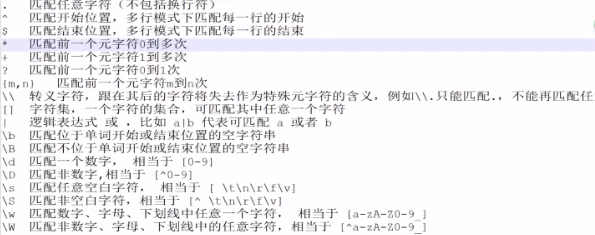

- [1. 特殊符号](#1-特殊符号)
- [2. 正则中的`()`和`[]`有本质的区别](#2-正则中的和有本质的区别)
  - [2.1. 圆括号()是组，主要应用在限制多选结构的范围/分组/捕获文本/环视/特殊模式处理](#21-圆括号是组主要应用在限制多选结构的范围分组捕获文本环视特殊模式处理)
  - [2.2. 方括号是单个匹配，字符集/排除字符集/命名字符集](#22-方括号是单个匹配字符集排除字符集命名字符集)
  - [2.3. `[]`注意事项](#23-注意事项)
- [3. 正则断言](#3-正则断言)
- [4. 判断是否由重复子串构成，比如`abcabc`，`abab`](#4-判断是否由重复子串构成比如abcabcabab)
- [5. `o|cb`](#5-ocb)
- [6. `(x)`](#6-x)
- [7. `(?:x)`](#7-x)
- [8. Python的re库中`match`方法和`search`的不同](#8-python的re库中match方法和search的不同)
- [9. 常见正则](#9-常见正则)
  - [9.1. MAC和IP地址正则匹配](#91-mac和ip地址正则匹配)
  - [9.2. 正则匹配两位以内有效数字](#92-正则匹配两位以内有效数字)
  - [获取`cookie`的正则](#获取cookie的正则)


### 1. 特殊符号




### 2. 正则中的`()`和`[]`有本质的区别

- ()内的内容表示的是一个子表达式，()本身不匹配任何东西，也不限制匹配任何东西，只是把括号内的内容作为同一个表达式来处理，例如(ab){1,3}，就表示ab一起连续出现最少1次，最多3次。如果没有括号的话，ab{1,3},就表示a，后面紧跟的b出现最少1次，最多3次。另外，括号在匹配模式中也很重要。
- []表示匹配的字符在[]中，并且只能出现一次，并且特殊字符写在[]会被当成普通字符来匹配。例如[(a)]，会匹配(、a、)、这三个字符。

所以() [] 无论是作用还是表示的含义，都有天壤之别，没什么联系

#### 2.1. 圆括号()是组，主要应用在限制多选结构的范围/分组/捕获文本/环视/特殊模式处理

示例：

1. `(abc|bcd|cde)`，表示这一段是abc、bcd、cde三者之一均可，顺序也必须一致
2. `(abc)?`，表示这一组要么一起出现，要么不出现，出现则按此组内的顺序出现
3. `(?:abc)`表示找到这样abc这样一组，但不记录，不保存到$变量中，否则可以通过$x取第几个括号所匹配到的项，比如：`(aaa)(bbb)(ccc)(?:ddd)(eee)`，可以用`$1`获取`(aaa)`匹配到的内容，而`$3`则获取到了`(ccc)`匹配到的内容，而`$4`则获取的是由`(eee)`匹配到的内容，因为前一对括号没有保存变量
4. `a(?=bbb)` 顺序环视 表示a后面必须紧跟3个连续的b
5. `(?i:xxxx)` 不区分大小写 (?s:.*) 跨行匹配.可以匹配回车符

#### 2.2. 方括号是单个匹配，字符集/排除字符集/命名字符集

示例：

1. `[0-3]`，表示找到这一个位置上的字符只能是0到3这四个数字，与(abc|bcd|cde)的作用比较类似，但圆括号可以匹配多个连续的字符，而一对方括号只能匹配单个字符
2. `[^0-3]`，表示找到这一个位置上的字符只能是除了0到3之外的所有字符
3. `[:digit:]`：0-9，`[:alnum:]` ：A-Za-z0-9

#### 2.3. `[]`注意事项
- 中括号的`-`有特殊意义，表示区间
- `[.]`中括号的点失去通配符的意义，变成了一个纯字符串 `点`

### 3. 正则断言

- `(?=)`这个语法结构在正则里表示“设定后面是”的意思。
- `(?=.*[a-zA-Z])`  这句的意思就是后面必须有一位大写或小写字母
- `(?=.*[1-9])` 这句的意思是后面必须有一位数字

正则表达式从文本头部向尾部开始解析，文本尾部方向为“前”，头部方向为“后”
前瞻：正则表达式匹配到规则的时候，向前检查是否符合断言，后顾/后瞻方向相反（javascript不支持）

- `reg(?=exp)`，零宽度正先行断言，reg匹配的内容后面内容满足exp规则
- `reg(?!exp)`，零宽度负先行断言，reg匹配的内容后面内容不满足exp规则
- `(?<=exp)reg`，零宽度正后发断言，reg匹配的内容前面内容满足exp规则
- `(?<!exp)reg`，零宽度负后发断言，reg匹配的内容前面内容不满足exp规则

"先行"表示待校验的位置在前，即校验的位置在exp匹配的内容之前
"正"表示exp描述的规则，匹配校验位置后面的内容


例如：

- `x(?=exp)`  匹配 exp 前面的位置`x`
  - 比如，要匹配后面跟着百分号的数字，可以写成`/\d+(?=%)/`
  - `"How are you doing"` 正则`"(.+(?=ing))"` 这里取ing前所有的字符，值为`"How are you do";`

- `(?<=exp)x`  匹配 exp 后面的位置`x`
  - 如 `"How are you doing"` 正则`"((?<=How).+)"` 这里取`"How"`之后所有的字符，值为`" are you doing";`
- `x(?!exp)`  匹配后面跟的不是 exp 的位置`x`
  - 比如，要匹配后面跟的不是百分号的数字，就要写成`/\d+(?!%)/`。
  - `"123abc"` 正则 `"\d{3}(?!\d)"`匹配3位数字后非数字的结果
- `(?<!exp)x`  匹配前面不是 exp 的位置`x`
  - 如 `"abc123 "` 正则`"(?<![0-9])123"` 匹配"123"前面是非数字的结果也可写成`"(?!<\d)123"`


另外，`?:` 非获取匹配

- `(?:x)`匹配x但是不会捕获，不会 $n 获取到（与()有区别），但是可以被替换


### 4. 判断是否由重复子串构成，比如`abcabc`，`abab`

```js
function solution(str) {
  const reg = /^(\w+)\1+$/
  return reg.test(str)
}

```

### 5. `o|cb`
`o|cb`出现`o`或者`cb`，不是`o`或者`c`、然后后面加`b`。可以使用`(o|c)b`


### 6. `(x)`
1. 模式 `/(foo) (bar) \1 \2/` 中的 `'(foo)'` 和 `'(bar)'` 匹配并记住字符串 `"foo bar foo bar"` 中前两个单词。
2. 模式中的 `\1` 和 `\2` 表示第一个和第二个被捕获括号匹配的子字符串，即 `foo` 和 `bar`，匹配了原字符串中的后两个单词。
3. 注意 `\1`、`\2`、...、`\n` 是用在正则表达式的匹配环节，详情可以参阅后文的 `\n` 条目。
4. 而在正则表达式的替换环节，则要使用像 `$1、$2、...、$n` 这样的语法，例如，`'bar foo'.replace(/(...) (...)/, '$2 $1')`。
5. `$&` 表示整个用于匹配的原字符串。


### 7. `(?:x)`
1. 匹配 `'x'` 但是不记住匹配项。这种括号叫作非捕获括号，使得你能够定义与正则表达式运算符一起使用的子表达式。
2. 看看这个例子 `/(?:foo){1,2}/`。如果表达式是 `/foo{1,2}/，{1,2}` 将只应用于 `'foo'` 的最后一个字符 `'o'`。
3. 如果使用非捕获括号，则 `{1,2}` 会应用于整个 `'foo'` 单词。


### 8. Python的re库中`match`方法和`search`的不同
1. `match`方法从字符串最开始位置开始
2. `search`方法不会从最开始匹配


### 9. 常见正则
#### 9.1. MAC和IP地址正则匹配
1. MAC地址正则匹配：
```js
([A-Fa-f0-9]{2}-){5}[A-Fa-f0-9]{2}
```
2. IP地址正则匹配：
```js
((2(5[0-5]|[0-4]\d))|[0-1]?\d{1,2})(\.((2(5[0-5]|[0-4]\d))|[0-1]?\d{1,2})){3}
```
其中：

`2(5[0-5]|[0-4]\d)` 匹配：200 ~ 255
`[0-1]?\d{1,2}` 匹配：0 ~ 199

#### 9.2. 正则匹配两位以内有效数字
```js
const pattern = /^\d+([.]{1}(\d){0,2}){0,1}$/
```
#### 获取`cookie`的正则

```ts
function getCookie(key: string) {
  // 从cookie里面取
  const reg = new RegExp(key + "=([^;]*)");
  const m = document.cookie.match(reg);
  if (m && m.length > 1) {
    return m[1];
  }
  return null;
}
```


