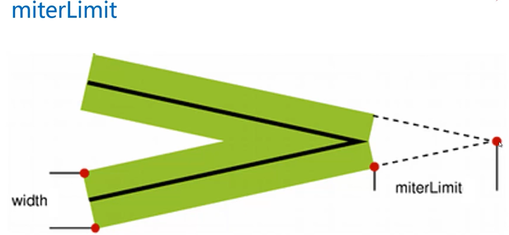
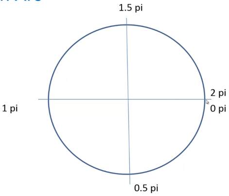
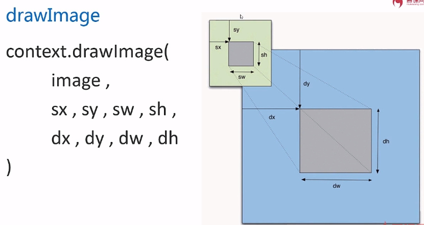
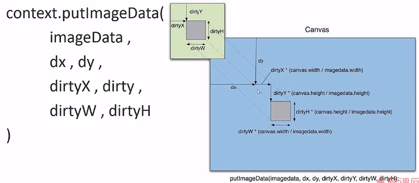

## Canvas
### 基本使用
1. html:
```html
<canvas id="canvas1" width="800" height="800"></canvas>
```
canvas的宽高只能写在行内，同时决定**画布分辨率的大小**。css里面设定canvas的宽高并不是真正的大小，而是**同比缩放**

2. js:
```js
var canvas = document.getElementById("canvas1");
var context = canvas .getContext('2d');//绘图环境
```
### a. 若浏览器不支持canvas
1. html  
    `<canvas>不支持canvas的内容</canvas>`（写在canvas标签的里面）
2. js     
``` js
if (canvas.getContext('2d')){//判断浏览器是否支持canvas
//支持
}else{
//不支持
alert("");
}
```
### b. canvas方法
- `canvas.width`
- `canvas.height`
- `canvas.getContext('2d')`


### c. canvas 是基于状态绘制的，即先定义状态，后绘制
1. 起始 `context.moveTo(100,100)`
2. 终止 `context.lineTo(700,700)`
3. 线条 `context.stroke()`
4. 线宽 `context.lineWidth=5`
5. 线条颜色 `context.strokeStyle='orange'`
6. 填充颜色 `context.fillStyle = 'rgba(2,2,2,0.3)'`
7. 填充 `context.fill()`
8. 既可填充，又可描边
9. 声明开始路径 `context.beginPath()`
10. 声明结束路径 `context.closePath()`


### d. 绘制一个数字，格子系统

设圆的半径为R，圆与圆之间的间距为2px，所以圆所在的正方形格子的边长为`2*（R+1）`。
其中x表示起始的横坐标，y表示起始的纵坐标，i表示行数，j表示列数，因此：
第（i, j）个圆的圆心位置：

```
CenterX：x+j*2*(R+1)+(R+1)
CenterY：y+i*2*(R+1)+(R+1)
```


### e. 自动绘制矩形

- `context.rect(x, y, width, height);`  自动绘制矩形，规划路径
- `context.fillRect(x, y, width, height);`  绘制填充矩形 不但规划路径，还把矩形给画出来
- `context.strokeRect(x, y, width, height);`  绘制矩形边框 不但规划路径，还把矩形给画出来


### f. `canvas`的`save`与`restore`方法的作用

- `save`：用来保存`Canvas`的状态。`save`之后，可以调用`Canvas`的平移、放缩、旋转、错切、裁剪等操作。
- `restore`：用来恢复`Canvas`之前保存的状态。防止`save`后对`Canvas`执行的操作对后续的绘制有影响。
- 对`canvas`中特定元素的旋转平移等操作实际上是对整个画布进行了操作，所以如果不对`canvas`进行`save`以及`restore`，那么每一次绘图都会在上一次的基础上进行操作，最后导致错位。
- 比如说你相对于起始点每次30度递增旋转，`30，60，90`.如果不使用save 以及 restore 就会变成`30, 90, 150`，每一次在前一次基础上进行了旋转。`save`是入栈，`restore`是出栈。


### g. lineCap
- `lineCap`设置线条的帽子：`butt`（默认）、`round`、`square`。后两者绘制出的线条都要长一些（戴上了帽子）。`lineCap`适用于线条的起始处和结尾处不适用于连接处。
- 通常绘制一个封闭的多边形用`beginPath()`和`closePath()`（推荐），但也可以不用`closePath()`而用`lineCap = “square”`来实现

### h. lineJoin

lineJoin： 线条与线条相交的形式

- `miter(default)` 尖角；
- `bevel` 方角、斜切；
- `round` 圆角；

`miterLimit`:内角与外角的距离。默认值是10，此属性只有在`lineJoin = "miter"`下才有效，意思是`miterLimit >10`，线条连接处自动斜切（`lineJoin ="bevel"`)


### i. 绘制五角星

大圆坐标：

```
x: Math.cos((18 + i * 72 - rot) / 180 * Math.PI) * R + x
y: -Math.sin((18 + i * 72 - rot) / 180 * Math.PI) * R + y
```

小圆坐标：
```
x: Math.cos((54 + i * 72 - rot) / 180 * Math.PI) * r + x
y: -Math.sin((54 + i * 72 - rot) / 180 * Math.PI) * r + y)
```


对于任意多边形：
大圆坐标：

```
Math.cos((angelStart + i * (360 / pol) - rot) / 180 * Math.PI) * R + x
-Math.sin((angelStart + i * (360 / pol) - rot) / 180 * Math.PI) * R + y)
```
小圆坐标：
```
Math.cos((angelStart + 360 / (pol * 2) + i * (360 / pol) - rot) / 180 * Math.PI) * r + x
-Math.sin((angelStart + 360 / (pol * 2) + i * (360 / pol) - rot) / 180 * Math.PI) * r + y)
```
其中，pol角数， rot旋转角度， angelStart起始角度


### j. 图形变换
图形变换： 位移、旋转、缩放。
`context.translate(x, y); `默认多个`translate`会叠加。
`save();` ` restore();` 成对出现，中间绘图状态不会对后面造成影响。

`scale( sx, sy )`操作具有副作用，表现为不仅对图像的大小进行缩放操作，还对图像的其他数值属性（比如边框的宽度，左上角的坐标等等）进行相应的缩放操作。


### k. 变换矩阵
```
|a c e|
|b d f|
|0 0 1|
```
```
context.transform(a, b, c, d, e, f);
/*
  a:水平缩放(默认值1)
  b:水平倾斜(默认值0)
  c:垂直倾斜(默认值0)
  d:垂直缩放(默认值1)
  e:水平位移(默认值0)
  f:垂直位移(默认值0)
*/
```
`context.transform();`可以叠加使用，如果需要重新初始化矩阵变换的值，可以用:
`context.setTransform(a, b, c, d, e, f);`//它会使得之前设置的`context.transform()`失效


### l. 线性渐变和径向渐变
### m. 线性渐变
```js
var linearGrad = context.createLinearGradient(Xstar,Ystar,Xend,Yend); // 创建线性渐变（起始位置X，Y，结束位置X，Y）；
grd.addColorStop(stop,color); //stop是（开始填充）位置(0.0~1.0的数值)，color是要填充的颜色；这个.addColorStop()至少要2个；
context.fillStyle = linearGrad;
Context.fillRect(0,0,800,800); // 填充的形状，如现在，画布的长宽就是800,800的话，就是填充了整个画布
```


### n. 径向渐变

- `RadialGradient(x0,y0,r0,x1,y1,r1)`
- xy为原点坐标，r为半径


### o. 使用图片、画布或者video
```
createPattern(img, repeat-style);
repeat-style: no-repeat  repeat-x  repeat-y repeat
```
```
var backgroundImage = new Image()
backgroundImage.src = '6.jpg'
backgroundImage.onload = function() {
var pattern = context.createPattern(backgroundImage, 'repeat')
context.fillStyle = pattern
context.fillRect(0, 0, 800, 800)
}
```


### p. 圆弧

`context.arc(centerx, centery, radius, startingAngle, endingAngle, anticlockwise = false)；`

(圆心x坐标，圆心y坐标，半径的值，从哪一个弧度值为开始，到哪一个弧度值结束，可选参数：默认顺时针方向绘制（false）， 逆时针方向绘制（true）)，


- `beginPath()`和`closePath()`不必成对出现
- 用了`fill()`即使沒有`context.closePath();`也会自动闭合

 

`arcTo(x1,y1,x2,y2,radius);` `arcTo()`另一种弧线绘制方法

-  `arcTo`函数将从`(x0,y0)`开始绘制之后绘制一条弧线，这条弧线和这两个线段所组成的折线相切并且其圆弧的半径为`radius`

注意：起始点的坐标是`(x0 , y0`)此时圆弧还没有开始，终止点的坐标不一定是（x2 , y2）而是和（x1 , y1）（x2 , y2）这条线相切的地方


### q. 贝塞尔曲线
二次贝塞尔曲线 `QuadraticCurveTo` :
- `context.moveTo( x0, y0 );` 指定初始点
- `context.quadraticCurveTo( x1, y1, x2, y2 ); `指定控制点（x1, y1）和终止点（x2, y2）

贝塞尔三次曲线
- `context.moveTo(x0, y0);` 起始点
- `context.bezierCurveTo(x1, y1, x2, y2, x3, y3);` 控制点，控制点，结束点


### r. 文字渲染
- `context.font = "bold 40px Arial"`(粗框,40px大小,字体)
- `context.fillStyle="#058"`颜色
- `context.fillText(string,x,y,[maxlen](文字的最长宽度))`
- `context.strokeText(string,x,y,[maxlen])`只有外边框的文字


文本水平方向对齐 :
- `context.textAlign(left center right)`，以`fillText`或`strokeText`的X值为参考

文本垂直方向对齐 ：
- `context.textBaseline(top middle bottom ideographic hanging alphabetic)`
- `ideographic`中文、日文等，` alphabetic`拉丁字母，`hanging`印度文字

度量文本：
用`context.measureText(String).width`，需要提前确定font状态，目前只能获得宽度不能获得高


### s. 设置canvas的阴影

- `context.shadowColor="颜色值"；` 阴影颜色值，可以为任何颜色的表现形式
- `context.shadowOffsetX=value1;` 水平方向的偏移，值可以为负值，负值则方向相反
- `context.shadowOffsetY=value2;` 垂直方向的偏移，值可以为负值，负值则方向相反
- `context.shadowBlur=value3;` 阴影模糊程度，正比例增加


### t. `globalAlpha`和`globalCompositeOperation`
- `globalAlpha`设置全局的透明度
- `ctx.globalCompositeOperation = "source-over"` (默认，后绘制的图形会压在先绘制的图形上) /` "destination-over"`(先绘制的图形压在后绘制的图形上


### u. `clip`
- `context.clip()`使用刚才绘制的路径把它剪切为当前的绘制环境


### v. 非零环绕原则 - 判断图形内、外

是用来判断哪些区域属于路径内( 计算结果非0，即为路径内 )。
1. 在路径包围的区域中，随便找一点，向外发射一条射线，
2. 和所有围绕它的边相交，
3. 然后开启一个计数器，从0计数，
4. 如果这个射线遇到顺时针围绕，那么+1，
5. 如果遇到逆时针围绕，那么-1，
6. 如果最终值非0，则这块区域在路径内。


### w. `isPointInPath`判断点是否在路径内

```
var x = event.clientX - canvas.getBoundingClientRect().left;//在当前画布上的位置
var y = event.clientY - canvas.getBoundingClientRect().top;
```

- canvas标签不能当其他普通div标签用，里面不能内嵌其他元素。
- canvas默认是白色的不是透明的。
- canvas前面不能放元素，会被遮挡住，应该放在后面，通过绝对定位浮在canvas画布上


使用prototype来为context添加函数：
- `CancasRenderingContext2D.prototype`


### x. 解决canvas浏览器兼容性
`explorecanvas`
只要多引入这个js包就可以支持了 
```html
<!--[if IE]><script type="text/javascript" src="../excanvas.js"></script><![end if]>
```


### y. Canvas图像

图像VS图形<===>位图VS矢量图
- 图像：是由像素点阵构成的位图
- 图形：由外部轮廓线条构成的矢量图


### z. 凸多边形

凸多边形（Convex Polygon）指如果把一个多边形的所有边中，任意一条边向两方无限延长成为一直线时，其他各边都在此直线的同旁，

- 所有的正多边形都是凸多边形。 
- 所有的三角形都是凸多边形。
- 五角星 => 凹多边形


### a. drawImage

- `context.drawImage(image, dx, dy);`
- `context.drawImage(image, dx, dy, dw, dh);`
  - image 图片
  - dx dy 坐标
  - dw dh 要绘制的宽高
- `context.drawImage( image, sx, sy, sw, sh, dx, dy, dw, dh);`



### b. html中添加滑竿控件
```html
<input type="range" name="hg" min="0.5" max="3.0"step="0.01" value="1.0" />
```
- min="0.5" 最小缩放为原大小的0.5
- max="3.0" 最大缩放原来的三倍
- step="0.01"步数0.01


`onchange`事件只有在松开鼠标时才会触发，应该用`onmouseover`


### c. 离屏canvas技术

将一个canvas内容加载到另一个canvas上


### d. 获取图像像素

```js
imageData = context.getImageData（x，y，w，h）;
```
`imageData`对象属性：
- width
- height
- data

`putImageData`可以将`ImageData`放回canvas中


`dirtyX`、`dirtyY`会在dx、dy的基础上累加


`imageData.data`是一个一维数组，每四个数字是一个像素点信息，四个数字分别是rgba四个信息


### e. 滤镜
- 灰色的计算公式 ：`r*0.3 + g*0.59 + b*0.11`
- 反色滤镜：`rgb`取反
- 黑白滤镜：获得`rgb`，得到灰度值，将得到的灰度值分类：或者黑或者白
- 模糊滤镜，求每个点四周`3*3`像素点`rgb`和的平均值
  - 马赛克即将某一个区域全部赋值为该区域的平均值


### f. 通过`createImageData`创建一个对象
```js
var imageData = context.createImageData(canvas.width, canvas.height)
```


