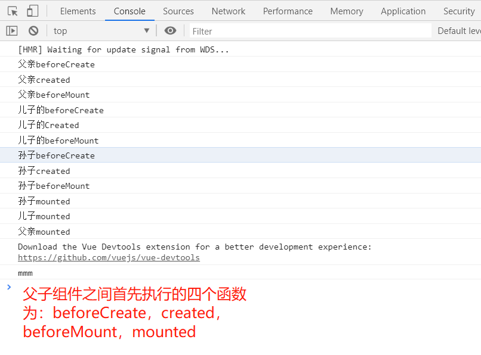

## 面试纪录

1. 打开两个页面，A和B，之前都是未关注某明星状态，如果A点击了关注，如果让B状态也变为关注？

    - **localStorage监听storage的变化事件**。
  
2. vue中，若子组件更新，父子组件的钩子执行顺序：
   - **父组件的beforeUpdate、子组件的beforeUpdate、子组件的updated、父组件的updated**

3. vue中，父子组件销毁过程
    - **父beforeDestroy -> 子beforeDestroy -> 子destroyed -> 父destroyed**
  
4. vue中，父子组件的加载渲染过程
    - **父beforeCreate -> 父created -> 父beforeMount** -> 
    - **子beforeCreate -> 子created -> 子beforeMount -> 子mounted** -> 
    - **父mounted**


1. vue3为什么用proxy取代原先的object.defineproperties？（js原生支持，出于性能因素考虑）

2. **cors中，默认是不携带cookie的，如何让它携带？xhr.withCredentials 设置为true，默认为false**。

3. cookie/session/localStorage/SessionStorage区别

4. cookie中有哪些属性，除了maxAge，httponly有什么用？

5. vue中，如何取消watch监听？

6. async函数、Promise、setTimeout打印顺序


编程题

1. if([])，[] == false，{} == false 的值

2. CSS：左右固定宽度，中间自适应

3. [1, null, undefined, 0, 4, 3, 2, 2, 4]，去重、去掉null和undefined、逆序排序

4. 提取url的search中的某key对应的值

5. 嵌套对象中提取id对应的text，比如输入1，输出北京，输入3，输出昌平

```js
const data = [{
id: 1,
text: '北京',
children: [
{
 id: 2,
 text: '海淀',
 children: null
}, {
 id: 3,
 text: '昌平',
 children: [...]
}
]
}, {
...
}]


function fn(data, id){
 let res
 for (let item of data) {
    if (item.id === id) {
      res = item.text
      break
    } else if (Array.isArray(item.children)) {
      res = fn(item.children, id)
      if (res) break
    }
 }
 return res
}

fn(data, '3')
```


标签页通信的参考资料：

- https://www.jianshu.com/p/31facd4934d7
- https://www.jianshu.com/p/5f0e6d8fd36a


1. react fiber原理

2. 实现fetch的超时断开

3. nextjs中，getInitialProps实现原理

4. mobx redux

5. hash模式 history模式，不借助框架，原生API

6. 36进制相加

7. 作用域，判断输出


```js
// 1. ES5
window.name = 'hahhaha'
function A(){
    this.name = 123
}
A.prototype.getA = function(){
  console.log(this)
  return this.name + '1'
}
let a = new A()
const func = a.getA
func()


// 2. 换成class
window.name = 'hahhaha'

class A{
 constuctor(){
  this.name = 123 
 }
 getA(){
  console.log(this)
  return this.name + '1'
 }
}
let a = new A()
const func = a.getA
func()
```


1. bable 7

2. webpack plugin

3. h5、小程序

4. electron

5. Fiber 数据结构的改变

6. 微前端如何部署

7. 拿到一个卡顿的app，如何指出问题


1. object和Map的区别


```js
const data = [
  {
    name: "a",
    children: [
      {
        name: "b",
        children: [
          { name: "c", },
          { name: "d", },
        ],
      },
      {
        name: "e",
      },
    ],
  },
  {
    name: "f",
    children: [
      {
        name: "g",
        children: [
          { name: "h", },
        ],
      },
    ],
  },
];


/**
 * 广度优先遍历，输出所有的 name
 * 比如，输出['a','f', 'b', 'e', 'g', 'c', 'd', 'h']
 */

function fn() {
  const res = []
  BFS(data, res)
  return res
}

function BFS(data, res) {
  let children = []
  if (!Array.isArray(data)) return []
  for (let item of data) {
    if (item.name) res.push(item.name)
    if (Array.isArray(item.children)) {
      children.push(...item.children)
    }
  }

  if (children.length) {
    BFS(children, res)
  }
}

fn()
```

```js
function makeInterator(array) {
  let index = 0
  return {
    next: function() {
      if (array.length > index) {
        const res = {
          value: array[index++],
          finished: false
        }
        return res
      } 
      return {
        value: undefined,
        finished: true
      }
    }
  }
}


/**
 * 实现下面的功能
 */
const a = makeInterator(['a', 'b'])
console.log(a.next()) // { value: 'a', 'finished': false }
console.log(a.next()) // { value: 'b', 'finished': false }
console.log(a.next()) // { value: undefined, 'finished': true }
```


1. diff 算法：深度优先

2. 自定义loader、plugin

3. **获取元素属性（如offset）会触发回流吗**，针对回流、重绘的优化手段

4. H5 获取用户信息

5. JS 除了immutable，其他不可变的库


```js
/**
 * @param {object|array|number|string} val - 待format的数据
 * @return nothing
 */
function format(val) {
  // TODO
  const thisType = typeof(val)
  if (thisType  === 'number') {
    return String(val)
  }
  if (thisType  === 'string') {
    return `"${val}"`
  }
  if (Array.isArray(val)) {
    let res = '['
    for (let item of val) {
      res += format(item)
      res += ','
    }
    res += ']'
    return res;
  }


  let res = '{'
  for (let item in val) {
    res += `"${item}":`
    res += format(val[item])
  }
  res += '}'
  return res
}


// test case
const data = {
  a: 1,
  b: [
    2,
    3,
    {
      c: 4
    }
  ],
  d: {
    e: 5,
    f: {
      g: '6'
    },
  }
}
 
format(data)


/*
将在控制台中打印出
{
  "a": 1,
  "b": [
    2,
    3,
    {
      "c": 4
    }
  ],
  "d": {
    "e": 5,
    "f": {
      "g": "6"
    },
  }
}
*
```