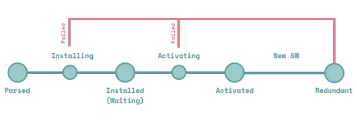

- [1. Service Worker](#1-service-worker)
  - [1.1. 概念](#11-概念)
  - [1.2. `Service Worker`主要作用](#12-service-worker主要作用)
  - [1.3. 如何检测`chrome`开启了哪些`service worker`？](#13-如何检测chrome开启了哪些service-worker)
  - [1.4. Service Worker基本特征](#14-service-worker基本特征)
  - [1.5. Service Worker生命周期](#15-service-worker生命周期)

## 1. Service Worker 


### 1.1. 概念
Service workers 本质上充当**Web应用程序**与**浏览器**之间的**代理服务器**，也可以在网络可用时作为浏览器和网络间的代理。

它们旨在创建有效的**离线体验**，**拦截网络请求**并基于网络是否可用以及更新的资源是否驻留在服务器上来采取适当的动作。他们还允许访问**推送通知**和**后台同步**API。

`Service Worker`是一个**脚本**，浏览器独立于当前网页，将其在后台运行，为实现一些不依赖页面或者用户交互的特性打开了一扇大门。

Service Worker 最主要的特点是：在页面中注册并安装成功后，**运行于浏览器后台**，**不受页面刷新的影响**，可以监听和截拦作用域范围内所有页面的 HTTP 请求。


### 1.2. `Service Worker`主要作用

1. `Service Worker`能实现`PWA`中的**离线应用**的能力（**拦截和处理网络请求**）
2. 能把大数据量的计算放在后台，不阻塞主线程


### 1.3. 如何检测`chrome`开启了哪些`service worker`？

```
chrome://serviceworker-internals/
chrome://inspect/#service-workers
```

### 1.4. Service Worker基本特征
- [x] 无法操作DOM
- [x] 只能使用`HTTPS`以及`localhost`
- [x] 可以拦截全站请求从而控制你的应用
- [ ] 与主线程独立不会被阻塞（不要再应用加载时注册`sw`）
- [ ] 完全异步，无法使用`XHR`和`localStorage`
- [x] 一旦被 `install`，就永远存在，除非被 `uninstall`或者`dev`模式手动删除
- [ ] 独立上下文
- [ ] 响应推送
- [ ] 后台同步

`service worker`是事件驱动的`worker`，生命周期与页面无关。 关联页面未关闭时，它也可以退出，没有关联页面时，它也可以启动。

### 1.5. Service Worker生命周期

<!--  -->

- [x] `register` 这个是由 client 端发起，注册一个 serviceWorker，这需要一个专门处理sw逻辑的文件

- [ ] `Parsed` 注册完成，解析成功，尚未安装

- [x] `installing` 注册中，此时 sw 中会触发 install 事件， 需知 sw 中都是事件触发的方式进行的逻辑调用，如果事件里有 `event.waitUntil()` 则会等待传入的 `Promise` 完成才会成功

- [ ] `installed(waiting)` 注册完成，但是页面被旧的 Service Worker 脚本控制, 所以当前的脚本尚未激活处于等待中，可以通过 `self.skipWaiting()` 跳过等待。

- [x] `activating` 安装后要等待激活，也就是 `activated` 事件，只要 `register` 成功后就会触发 `install` ，但不会立即触发 `activated`，如果事件里有 `event.waitUntil()` 则会等待这个 Promise 完成才会成功，这时可以调用 `Clients.claim()` 接管所有页面。

- [ ] `activated` 在 `activated` 之后就可以开始对 `client` 的请求进行拦截处理，sw 发起请求用的是 `fetch api`，XHR无法使用

- [ ] `fetch` 激活以后开始对网页中发起的请求进行拦截处理

- [ ] `terminate` 这一步是浏览器自身的判断处理，当 sw 长时间不用之后，处于闲置状态，浏览器会把该 sw 暂停，直到再次使用

- [x] `update` 浏览器会自动检测 sw 文件的更新，当有更新时会下载并 `install`，但页面中还是老的 sw 在控制，只有当用户新开窗口后新的 sw 才能激活控制页面

- [ ] `redundant` 安装失败, 或者激活失败, 或者被新的 `Service Worker` 替代掉

Service Worker 脚本最常用的功能是**截获请求和缓存资源文件**, 这些行为可以绑定在下面这些事件上:

1. `install` 事件中, 抓取资源进行缓存
2. `activate` 事件中, 遍历缓存, 清除过期的资源
3. `fetch` 事件中, 拦截请求, 查询缓存或者网络, 返回请求的资源


注意：
`event.waitUntil`的作用是，等待Promise完成(`resolved`或`rejected`)后才返回。

参考资料：
1. [Servive Worker, MDN](https://developer.mozilla.org/zh-CN/docs/Web/API/Service_Worker_API)
2. [Using Service Worker, MDN](https://developer.mozilla.org/zh-CN/docs/Web/API/Service_Worker_API/Using_Service_Workers)


