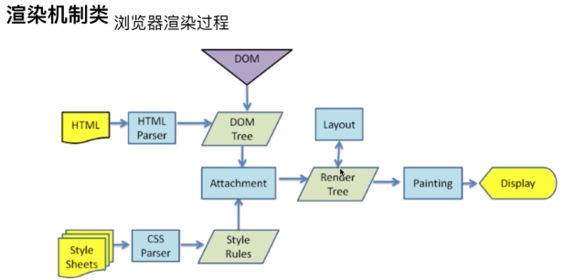
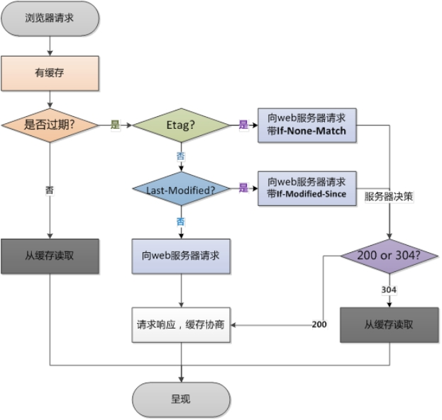
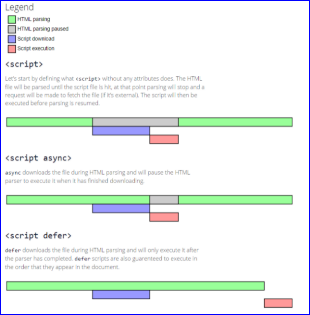
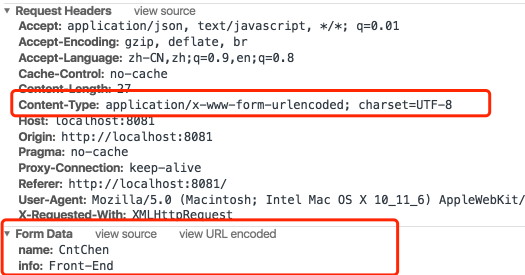
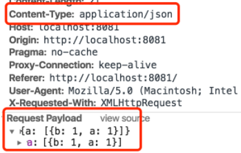
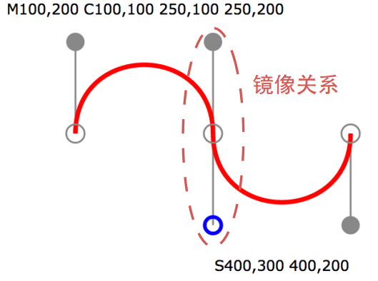

- [1. 从浏览器地址栏输入 url 到显示页面的步骤(以 HTTP 为例)](#1-从浏览器地址栏输入-url-到显示页面的步骤以-http-为例)
    - [(1) 从输入url到得到html的过程中，浏览器做的工作大致分为以下几步：](#1-从输入url到得到html的过程中浏览器做的工作大致分为以下几步)
    - [(2) 浏览器**渲染**页面的过程：](#2-浏览器渲染页面的过程)
    - [(3) DOM树的构建是文档加载完成开始的？](#3-dom树的构建是文档加载完成开始的)
    - [(4) Render树是DOM树和CSSOM树构建完毕才开始构建的吗？](#4-render树是dom树和cssom树构建完毕才开始构建的吗)
    - [(5) CSS的解析是从右往左逆向解析的](#5-css的解析是从右往左逆向解析的)
- [2. `Winow.onload`和`DomContentLoaded`的区别](#2-winowonload和domcontentloaded的区别)
- [3. cache-control 属性有哪些？](#3-cache-control-属性有哪些)
    - [(1) `immutable`](#1-immutable)
- [4. 协商缓存触发条件](#4-协商缓存触发条件)
- [5. 强缓存和协商缓存](#5-强缓存和协商缓存)
- [6. 为什么要有etag？](#6-为什么要有etag)
- [7. 常见的浏览器内核比较](#7-常见的浏览器内核比较)
- [8. 常见浏览器所用内核](#8-常见浏览器所用内核)
- [9. 事件处理程序](#9-事件处理程序)
    - [(1) DOM0 级事件处理程序](#1-dom0-级事件处理程序)
    - [(2) DOM2 级事件](#2-dom2-级事件)
    - [(3) IE 事件处理程序](#3-ie-事件处理程序)
    - [(4) 事件对象](#4-事件对象)
    - [(5) DOM事件级别：](#5-dom事件级别)
    - [(6) DOM事件模型：](#6-dom事件模型)
    - [(7) 事件流三个阶段](#7-事件流三个阶段)
    - [(8) 描述DOM事件捕获到具体流程：](#8-描述dom事件捕获到具体流程)
    - [(9) event 对象的常见应用：](#9-event-对象的常见应用)
- [10. onclick 与 addEventListener 区别？](#10-onclick-与-addeventlistener-区别)
- [11. `defer` 和 `async` 的区别](#11-defer-和-async-的区别)
- [12. 懒加载与预加载的基本概念](#12-懒加载与预加载的基本概念)
- [13. 浏览器内核的理解](#13-浏览器内核的理解)
- [14. HTML 规范中为什么要求引用资源不加协议头`http`或者`https`？](#14-html-规范中为什么要求引用资源不加协议头http或者https)
- [15. `script`标签的`crossorigin`属性](#15-script标签的crossorigin属性)
- [16. DOS攻击](#16-dos攻击)
    - [(1) DDOS](#1-ddos)
- [17. script标签的integrity属性](#17-script标签的integrity属性)
    - [(1) 如何开启 SRI 功能](#1-如何开启-sri-功能)
- [18. `cookie`和`session`](#18-cookie和session)
    - [(1) cookie ](#1-cookie-)
    - [(2) `cookie`属性](#2-cookie属性)
    - [(3) session](#3-session)
    - [(4) sesssion 与 cookie 的区别](#4-sesssion-与-cookie-的区别)
- [19. `session`和`token`](#19-session和token)
    - [(1) `token`过程](#1-token过程)
    - [(2) `session`和`token`的区别](#2-session和token的区别)
- [20. `token`可以抵抗CSRF，`cookie+session`不行](#20-token可以抵抗csrfcookie+session不行)
- [21. Viewport](#21-viewport)
- [22. HTML `<meta>` 标签](#22-html-meta-标签)
    - [(1) `name`属性](#1-name属性)
    - [(2) `http-equiv`属性](#2-http-equiv属性)
    - [(3) `HTML 4.01` 与 `HTML5`之间的差异](#3-html-401-与-html5之间的差异)
    - [(4) Content-Type 类型](#4-content-type-类型)
    - [(5) `application/x-www-form-urlencoded` 主要用于如下:](#5-application/x-www-form-urlencoded-主要用于如下)
    - [(6) `multipart/form-data`](#6-multipart/form-data)
    - [(7) `application/json`](#7-application/json)
- [23. 响应式开发](#23-响应式开发)
- [24. `class`和`id`命名规范](#24-class和id命名规范)
- [25. 回流和重绘](#25-回流和重绘)
    - [(1) 针对回流和重绘的优化点：](#1-针对回流和重绘的优化点)
- [26. HTML5的Audio](#26-html5的audio)
    - [(1) 当音频/视频处于加载过程中时，会依次发生以下事件](#1-当音频/视频处于加载过程中时会依次发生以下事件)
    - [(2) 元数据和数据的区别？](#2-元数据和数据的区别)
    - [(3) 动态的创建`<audio>`元素](#3-动态的创建audio元素)
    - [(4) 判断浏览器支持的编码方式](#4-判断浏览器支持的编码方式)
- [27. Doctype作用? 严格模式与混杂模式如何区分？它们有何意义?](#27-doctype作用-严格模式与混杂模式如何区分它们有何意义)
- [28. 严格模式与混杂模式的语句解析不同点有哪些？](#28-严格模式与混杂模式的语句解析不同点有哪些)
- [29. Doctype作用?严格模式与混杂模式如何区分？它们有何意义? TODO](#29-doctype作用严格模式与混杂模式如何区分它们有何意义-todo)
- [30. 两个标签页的sessionstorage共享吗](#30-两个标签页的sessionstorage共享吗)
- [31. Canvas](#31-canvas)
    - [(1) 若浏览器不支持canvas](#1-若浏览器不支持canvas)
    - [(2) canvas方法](#2-canvas方法)
    - [(3) canvas 是基于状态绘制的，即先定义状态，后绘制](#3-canvas-是基于状态绘制的即先定义状态后绘制)
    - [(4) 绘制一个数字，格子系统](#4-绘制一个数字格子系统)
    - [(5) 自动绘制矩形](#5-自动绘制矩形)
    - [(6) `canvas`的`save`与`restore`方法的作用](#6-canvas的save与restore方法的作用)
    - [(7) lineCap](#7-linecap)
    - [(8) lineJoin](#8-linejoin)
    - [(9) 绘制五角星](#9-绘制五角星)
    - [(10) 图形变换](#10-图形变换)
    - [(11) 变换矩阵](#11-变换矩阵)
    - [(12) 线性渐变和径向渐变](#12-线性渐变和径向渐变)
    - [(13) 线性渐变](#13-线性渐变)
    - [(14) 径向渐变](#14-径向渐变)
    - [(15) 使用图片、画布或者video](#15-使用图片画布或者video)
    - [(16) 圆弧](#16-圆弧)
    - [(17) 贝塞尔曲线](#17-贝塞尔曲线)
    - [(18) 文字渲染](#18-文字渲染)
    - [(19) 设置canvas的阴影](#19-设置canvas的阴影)
    - [(20) `globalAlpha`和`globalCompositeOperation`](#20-globalalpha和globalcompositeoperation)
    - [(21) `clip`](#21-clip)
    - [(22) 非零环绕原则 - 判断图形内、外](#22-非零环绕原则---判断图形内外)
    - [(23) `isPointInPath`判断点是否在路径内](#23-ispointinpath判断点是否在路径内)
    - [(24) 解决canvas浏览器兼容性](#24-解决canvas浏览器兼容性)
    - [(25) Canvas图像](#25-canvas图像)
    - [(26) 凸多边形](#26-凸多边形)
    - [(27) drawImage](#27-drawimage)
    - [(28) html中添加滑竿控件](#28-html中添加滑竿控件)
    - [(29) 离屏canvas技术](#29-离屏canvas技术)
    - [(30) 获取图像像素](#30-获取图像像素)
    - [(31) 滤镜](#31-滤镜)
    - [(32) 通过`createImageData`创建一个对象](#32-通过createimagedata创建一个对象)
- [32. SVG](#32-svg)
    - [(1) 基本图形](#1-基本图形)
    - [(2) 基本属性](#2-基本属性)
    - [(3) 基本操作API](#3-基本操作api)
    - [(4) `preserveAspectRatio`](#4-preserveaspectratio)
    - [(5) SVG中的图形分组](#5-svg中的图形分组)
    - [(6) SVG四个坐标系](#6-svg四个坐标系)
    - [(7) 渐变](#7-渐变)
    - [(8) SVG 圆弧命令：](#8-svg-圆弧命令)
    - [(9) 线性(左标)变换](#9-线性左标变换)
    - [(10) 颜色HSL](#10-颜色hsl)
    - [(11) 笔刷](#11-笔刷)
    - [(12) path命令](#12-path命令)
    - [(13) 弧线(`arc`)命令](#13-弧线arc命令)
    - [(14) 贝塞尔曲线命令 - 光滑曲线](#14-贝塞尔曲线命令---光滑曲线)
    - [(15) SVG文本](#15-svg文本)
    - [(16) 垂直居中](#16-垂直居中)
    - [(17) `<textPath>` 路径文本，可以让文本沿着路径排列，比如：曲线等](#17-textpath-路径文本可以让文本沿着路径排列比如曲线等)
    - [(18) 图形的引用，裁切和蒙版](#18-图形的引用裁切和蒙版)
    - [(19) 字体抗锯齿](#19-字体抗锯齿)
### 1. 从浏览器地址栏输入 url 到显示页面的步骤(以 HTTP 为例)

1. 在浏览器地址栏输入 URL
2. 浏览器查看缓存，如果请求资源在缓存中并且新鲜，跳转到转码步骤

   1. 如果资源未缓存，发起新请求
   2. 如果已缓存，检验是否足够新鲜，足够新鲜直接提供给客户端，否则与服务器进行验证。
   3. 检验新鲜通常有两个 HTTP 头进行控制`Expires`和`Cache-Control`：
      - HTTP1.0 提供 Expires，值为一个绝对时间表示缓存新鲜日期
      - HTTP1.1 增加了 Cache-Control: max-age=,值为以秒为单位的最大新鲜时间

3. 浏览器**解析 URL**获取协议，主机，端口，path
4. 浏览器**组装一个 HTTP（GET）请求报文**
5. 浏览器获取主机 ip 地址，过程如下：
   1. 浏览器缓存
   2. 本机缓存
   3. hosts 文件
   4. 路由器缓存
   5. ISP DNS 缓存
   6. DNS 递归查询（可能存在负载均衡导致每次 IP 不一样）

6. 打开一个 socket 与目标 IP 地址，端口建立 TCP 链接，三次握手如下：

   1. 客户端发送一个 TCP 的**SYN=1，Seq=X**的包到服务器端口
   2. 服务器发回**SYN=1， ACK=X+1， Seq=Y**的响应包
   3. 客户端发送**ACK=Y+1， Seq=Z**

7. TCP 链接建立后**发送 HTTP 请求**

8. 服务器接受请求并解析，将请求转发到服务程序，如虚拟主机使用 HTTP Host 头部判断请求的服务程序

9. 服务器检查**HTTP 请求头是否包含缓存验证信息**如果验证缓存新鲜，返回**304**等对应状态码

10. 处理程序读取完整请求并准备 HTTP 响应，可能需要查询数据库等操作

11. 服务器将**响应报文通过 TCP 连接发送回浏览器**

12. 浏览器接收 HTTP 响应，然后根据情况选择关闭 TCP 连接或者保留重用，关闭 TCP 连接的四次握手如下：
    1. 主动方发送**Fin=1， Ack=Z， Seq= X**报文
    2. 被动方发送**ACK=X+1， Seq=Z**报文
    3. 被动方发送**Fin=1， ACK=X， Seq=Y**报文
    4. 主动方发送**ACK=Y， Seq=X**报文

13. 浏览器检查响应状态吗：是否为 1XX，3XX， 4XX， 5XX，这些情况处理与 2XX 不同
14. 如果资源可缓存，**进行缓存**
15. 对响应进行**解码**（例如 gzip 压缩）
16. 根据资源类型决定如何处理（假设资源为 HTML 文档）
17. **解析 HTML 文档，构件 DOM 树，下载资源，构造 CSSOM 树，执行 js 脚本**，这些操作没有严格的先后顺序，以下分别解释

18. 构建 DOM 树：
    1. **Tokenizing**：根据 HTML 规范将字符流解析为标记
    2. **Lexing**：词法分析将标记转换为对象并定义属性和规则
    3. **DOM construction**：根据 HTML 标记关系将对象组成 DOM 树

19. 解析过程中遇到图片、样式表、js 文件，**启动下载**
20. 构建CSSOM 树：
    1. **Tokenizing**：字符流转换为标记流
    2. **Node**：根据标记创建节点
    3. **CSSOM**：节点创建 CSSOM 树

21. [根据 DOM 树和 CSSOM 树构建渲染树](https://developers.google.com/web/fundamentals/performance/critical-rendering-path/render-tree-construction):
    1. 从 DOM 树的根节点遍历所有**可见节点**，不可见节点包括：(1) `script`,`meta`这样本身不可见的标签。(2) 被 css 隐藏的节点，如`display: none`
    2. 对每一个可见节点，找到恰当的 CSSOM 规则并应用
    3. 发布可视节点的内容和计算样式

22. js 解析如下：
    1. 浏览器创建 Document 对象并解析 HTML，将解析到的元素和文本节点添加到文档中，此时**document.readystate 为 loading**
    2. HTML 解析器遇到**没有 async 和 defer 的 script 时**，将他们添加到文档中，然后执行行内或外部脚本。这些脚本会同步执行，并且在脚本下载和执行时解析器会暂停。这样就可以用 document.write()把文本插入到输入流中。**同步脚本经常简单定义函数和注册事件处理程序，他们可以遍历和操作 script 和他们之前的文档内容**
    3. 当解析器遇到设置了**async**属性的 script 时，开始下载脚本并继续解析文档。脚本会在它**下载完成后尽快执行**，但是**解析器不会停下来等它下载**。异步脚本**禁止使用 document.write()**，它们可以访问自己 script 和之前的文档元素
    4. 当文档完成解析，document.readState 变成 interactive
    5. 所有**defer**脚本会**按照在文档出现的顺序执行**，延迟脚本**能访问完整文档树**，禁止使用 document.write()
    6. 浏览器**在 Document 对象上触发 DOMContentLoaded 事件**
    7. 此时文档完全解析完成，浏览器可能还在等待如图片等内容加载，等这些**内容完成载入并且所有异步脚本完成载入和执行**，document.readState 变为 complete,window 触发 load 事件

23. **显示页面**（HTML 解析过程中会逐步显示页面）


#### (1) 从输入url到得到html的过程中，浏览器做的工作大致分为以下几步：

- 加载：根据请求的URL进行域名解析，向服务器发起请求，接收文件（HTML、JS、CSS、图象等）。
- 解析：对加载到的资源（HTML、JS、CSS等）进行语法解析，建议相应的内部数据结构（比如HTML的DOM树，JS的（对象）属性表，CSS的样式规则等等）
- 渲染：构建渲染树，对各个元素进行位置计算、样式计算等等，然后根据渲染树对页面进行渲染（可以理解为“画”元素）

这几个过程不是完全孤立的，会有交叉，比如HTML加载后就会进行解析，然后拉取HTML中指定的CSS、JS等。


#### (2) 浏览器**渲染**页面的过程：



- 第一步，用HTML分析器，分析HTML元素，构建一颗DOM树(标记化和树构建)。
- 第二步，用CSS分析器，分析CSS文件和元素上的inline样式，生成页面的样式表。
- 第三步，将DOM树和样式表，关联起来，构建一颗Render树(这一过程又称为Attachment)。每个DOM节点都有attach方法，接受样式信息，返回一个render对象(又名renderer)。这些render对象最终会被构建成一颗Render树。
- 第四步，有了Render树，浏览器开始布局，为每个Render树上的节点确定一个在显示屏上出现的精确坐标。
- 第五步，Render树和节点显示坐标都有了，就调用每个节点paint方法，把它们绘制出来。 


##### (3) DOM树的构建是文档加载完成开始的？
构建DOM数是一个渐进过程，为达到更好用户体验，渲染引擎会尽快将内容显示在屏幕上。它不必等到整个HTML文档解析完毕之后才开始构建render数和布局。

##### (4) Render树是DOM树和CSSOM树构建完毕才开始构建的吗？
这三个过程在实际进行的时候又不是完全独立，而是会有交叉。会造成一边加载，一遍解析，一遍渲染的工作现象。

##### (5) CSS的解析是从右往左逆向解析的
从DOM树的`下－上`解析比`上－下`解析效率高)，嵌套标签越多，解析越慢。


### 2. `Winow.onload`和`DomContentLoaded`的区别
```javascript
window.addEventListener('load', function() {
  // 页面的全部资源加载完之后才会执行，包括图片、视频等。
})
window.addEventListener('DomContentLoaded', function() {
  // DOM渲染完即可执行，此时图片、视频等可能没加载完。
})
```


### 3. cache-control 属性有哪些？

1. `cache-control: max-age=xxxx，public`

**客户端和代理服务器**都可以缓存该资源；
客户端在xxx秒的有效期内，如果有请求该资源的需求的话就直接读取缓存，statu code:200 ，如果用户做了刷新操作，就向服务器发起http请求


2. `cache-control: max-age=xxxx，private`

只让**客户端**可以缓存该资源；代理服务器不缓存
客户端在xxx秒内直接读取缓存，statu code:200

3. `cache-control: max-age=xxxx，immutable`

客户端在xxx秒的有效期内，如果有请求该资源的需求的话就直接读取缓存，statu code:200 ，即使用户做了刷新操作，也不向服务器发起http请求

4. `cache-control: no-cache`

**跳过设置强缓存**，但是不妨碍设置协商缓存；一般如果你做了强缓存，只有在强缓存失效了才走协商缓存的，设置了no-cache就不会走强缓存了，每次请求都回询问服务端。


5. `cache-control: no-store`

不缓存，这个会让**客户端、服务器都不缓存**，也就没有所谓的强缓存、协商缓存了。


#### (1) `immutable`

`immutable` 为了让用户在刷新页面的时候不要去请求服务器。

`Cache-Control: max-age=3600, immutable`，表明该资源能存活一小时，在一小时之内，即便用户刷新也不要发送条件请求，不走协商缓存的流程。

在过期之后，浏览器会发送一个不带`If-Modified-Since`和`If-None-Match`的请求来更新资源。

这里需要注意，一旦被标志成 immutable，则这个资源不可能返回 304 响应了，只有 200（Chrome 开发者工具的network里面size会显示为`from memory cache/from disk cache`）。


参考资料：[扼杀 304，Cache-Control: immutable](https://www.cnblogs.com/ziyunfei/p/5642796.html) 


### 4. 协商缓存触发条件

1. `Cache-Control`的值为`no-cache` （不强缓存）
2. 或者`max-age`过期了 （强缓存，但总有过期的时候）


参考资料：[强缓存和协商缓存](https://www.cnblogs.com/everlose/p/12779864.html)，[浅谈http中的Cache-Control](https://blog.csdn.net/u012375924/article/details/82806617)

### 5. 强缓存和协商缓存
强缓存：
- `cache-control`的单位是秒
- `Expire`绝对时间，`cache-control`是相对时间，以后者为准

协商缓存：
- `Last-Modified`是服务器下发的，`If-Modified-Since`是浏览器发送到的，记录的时间，有可能时间变了，内容不变
- `Etag`是变的是内容才会再次请求，对应的是`If-None-Match`



### 6. 为什么要有etag？

你可能会觉得使用`last-modified`已经足以让浏览器知道本地的缓存副本是否足够新，为什么还需要`etag`呢？HTTP1.1中etag的出现（也就是说，etag是新增的，为了解决之前只有If-Modified的缺点）主要是为了解决几个last-modified比较难解决的问题：

1. 一些文件也许会**周期性的更改**，但是他的**内容并不改变(仅仅改变的修改时间)**，这个时候我们并不希望客户端认为这个文件被修改了，而重新get；
2. 某些文件**修改非常频繁**，比如在**秒以下的时间内进行修改，(比方说1s内修改了N次)**，if-modified-since能检查到的粒度是秒级的，这种修改无法判断(或者说UNIX记录MTIME只能精确到秒)；
3. 某些**服务器不能精确的得到文件的最后修改时间**。

 

### 7. 常见的浏览器内核比较
```
Trident：这种浏览器内核是 IE 浏览器用的内核，因为在早期 IE 占有大量的市场份额，所以这种内核比较流行，以前有很多
网页也是根据这个内核的标准来编写的，但是实际上这个内核对真正的网页标准支持不是很好。但是由于 IE 的高市场占有率，微
软也很长时间没有更新 Trident 内核，就导致了 Trident 内核和 W3C 标准脱节。还有就是 Trident 内核的大量 Bug 等
安全问题没有得到解决，加上一些专家学者公开自己认为 IE 浏览器不安全的观点，使很多用户开始转向其他浏览器。

Gecko：这是 Firefox 和 Flock 所采用的内核，这个内核的优点就是功能强大、丰富，可以支持很多复杂网页效果和浏览器扩
展接口，但是代价是也显而易见就是要消耗很多的资源，比如内存。

Presto：Opera 曾经采用的就是 Presto 内核，Presto 内核被称为公认的浏览网页速度最快的内核，这得益于它在开发时的
天生优势，在处理 JS 脚本等脚本语言时，会比其他的内核快3倍左右，缺点就是为了达到很快的速度而丢掉了一部分网页兼容性。

Webkit：Webkit 是 Safari 采用的内核，它的优点就是网页浏览速度较快，虽然不及 Presto 但是也胜于 Gecko 和 Trid
ent，缺点是对于网页代码的容错性不高，也就是说对网页代码的兼容性较低，会使一些编写不标准的网页无法正确显示。WebKit 
前身是 KDE 小组的 KHTML 引擎，可以说 WebKit 是 KHTML 的一个开源的分支。

Blink：谷歌在 Chromium Blog 上发表博客，称将与苹果的开源浏览器核心 Webkit 分道扬镳，在 Chromium 项目中研发 B
link 渲染引擎（即浏览器核心），内置于 Chrome 浏览器之中。其实 Blink 引擎就是 Webkit 的一个分支，就像 webkit 是
KHTML 的分支一样。Blink 引擎现在是谷歌公司与 Opera Software 共同研发，上面提到过的，Opera 弃用了自己的 Presto 
内核，加入 Google 阵营，跟随谷歌一起研发 Blink。
```

### 8. 常见浏览器所用内核

```
 （1） IE 浏览器内核：Trident 内核，也是俗称的 IE 内核；

 （2） Chrome 浏览器内核：统称为 Chromium 内核或 Chrome 内核，以前是 Webkit 内核，现在是 Blink内核；

 （3） Firefox 浏览器内核：Gecko 内核，俗称 Firefox 内核；

 （4） Safari 浏览器内核：Webkit 内核；

 （5） Opera 浏览器内核：最初是自己的 Presto 内核，后来加入谷歌大军，从 Webkit 又到了 Blink 内核；

 （6） 360浏览器、猎豹浏览器内核：IE + Chrome 双内核；

 （7） 搜狗、遨游、QQ 浏览器内核：Trident（兼容模式）+ Webkit（高速模式）；

 （8） 百度浏览器、世界之窗内核：IE 内核；

 （9） 2345浏览器内核：好像以前是 IE 内核，现在也是 IE + Chrome 双内核了；

 （10）UC 浏览器内核：这个众口不一，UC 说是他们自己研发的 U3 内核，但好像还是基于 Webkit 和 Trident ，还有说
      是基于火狐内核。
```

### 9. 事件处理程序

#### (1) DOM0 级事件处理程序
1. 先把元素取出来，然后为其属性添加一个事件的方法叫DOM0级处理程序。
2. 它是一种较传统的方式：把一个函数赋值给一个事件处理程序的属性。
3. 优点：简单，跨浏览器的优势


#### (2) DOM2 级事件
两个方法：
1. 处理指定事件处理程序的操作：addEventListener()
2. 删除事件处理程序的操作：removeEventListener()

接收三个参数：
1. 要处理的事件名（**去掉前面的on**，比如直接写`click`或`mouseover`）
2. 作为事件处理程序的函数
3. 布尔值（**false是事件冒泡，true是事件捕获，默认false**）


注意：
1. 通过addEventListener添加的事件只能通过removeEventListener去掉
2. addEventListener可以添加多个事件。


#### (3) IE 事件处理程序
1. attachEvent() 添加事件 （它又加上on了，即onclick等）
2. detachEvent() 删除事件
3. 接收相同的两个参数：事件处理程序的名称和事件处理程序的函数
4. **不使用第三参数**的原因：IE8 以及更早的浏览器版本**只支持事件冒泡**！


#### (4) 事件对象
事件对象（event）：在触发 DOM 上的事件时都会产生一个对象。
DOM 中的事件对象
1. type 属性：用于获取事件类型
2. target 属性：用于获取事件目标
3. stopPropagation() 方法，阻止时间冒泡
4. preventDefault() 方法，阻止事件的默认行为（比如a标签默认跳转）


#### (5) DOM事件级别：
- DOM0：`element.onclick=function(){}`
- DOM2：`element.addEventListener(‘click’, function(){}, false)`
- DOM3：`element.addEventListener(‘keyup, function(){}, false)`


#### (6) DOM事件模型：

- 捕获（从上往下）
- 冒泡（从下往上）


#### (7) 事件流三个阶段

捕获、目标阶段、冒泡


#### (8) 描述DOM事件捕获到具体流程：

- window => document => html => body => ....=> 目标元素


#### (9) event 对象的常见应用：

- event.preventDefault()
- event.stopPropagation()
- event.stopImmediatePropagation() 
- event.currentTarget
- event.target


### 10. onclick 与 addEventListener 区别？
1. onclick事件在同一时间**只能指向唯一对象**。就算对于一个对象**绑定了多次**，但是仍然只会**执行最后的一次绑定**。
2. addEventListener 给一个事件**注册多个listener**
3. addEventListener 对任何DOM都是有效的，而 onclick 仅限于HTML
4. addEventListener 可以控制 listener 的触发阶段，（捕获/冒泡）。对于多个相同的事件处理器，不会重复触发，不需要手动使用 removeEventListener 清除
5. IE9使用 attachEvent 和 detachEvent


### 11. `defer` 和 `async` 的区别


1. defer和async在网络读取（下载）这块儿是一样的，都是异步的（相较于 HTML 解析）
2. 它俩的差别在于**脚本下载完之后何时执行**，显然 defer 是最接近我们对于应用脚本加载和执行的要求的
3. 关于defer，此图未尽之处在于它是**按照加载顺序执行脚本**的，这一点要善加利用
4. async 则是一个**乱序执行**的主，反正对它来说脚本的加载和执行是紧紧挨着的，所以不管你声明的顺序如何，只要它加载完了就会立刻执行
5. 仔细想想，async 对于应用脚本的用处不大，因为它完全不考虑依赖（哪怕是最低级的顺序执行），不过它对于那些可以不依赖任何脚本或不被任何脚本依赖的脚本来说却是非常合适的，最典型的例子：`Google Analytics`


### 12. 懒加载与预加载的基本概念

懒加载也叫延迟加载： 延迟加载图片或符合某些条件时才加载某些图片。
预加载：提前加载图片，当用户需要查看时可直接从本地缓存中渲染。


两种技术的本质：两者的行为是相反的，一个是提前加载，一个是迟缓甚至不加载。**懒加载对服务器前端有一定的缓解压力作用，预加载则会增加服务器前端压力**。

懒加载的意义及实现方式有：
意义： 懒加载的主要目的是作为服务器前端的优化，减少请求数或延迟请求数。

实现方式： 
1. 第一种是**纯粹的延迟加载**，使用`setTimeOut或setInterval`进行加载延迟.
2. 第二种是**条件加载**，符合某些条件，或触发了某些事件才开始异步下载。
3. 第三种是**可视区加载**，即仅加载用户可以看到的区域，这个主要由监控滚动条来实现，一般会在距用户看到某图片前一定距离遍开始加载，这样能保证用户拉下时正好能看到图片。

预加载的意义及实现方式有：
预加载可以说是牺牲服务器前端性能，换取更好的用户体验，这样可以使用户的操作得到最快的反映。
实现预载的方法非常多，可以用`CSS(background)、JS(Image)、HTML()`都可以。常用的是`new Image()`，设置其`src`来实现预载，再使用`onload`方法回调预载完成事件。只要浏览器把图片下载到本地，同样的src就会使用缓存，这是最基本也是最实用的预载方法。当Image下载完图片头后，会得到宽和高，因此可以在预载前得到图片的大小(方法是用记时器轮循宽高变化)。


### 13. 浏览器内核的理解

主要分成两部分：**渲染引擎(layout engineer 或 Rendering Engine) **和** JS 引擎**。

- 渲染引擎：**负责取得网页的内容（HTML、 XML 、图像等等）、整理讯息（例如加入 CSS 等），以及计算网页的显示方式，然后会输出至显示器或打印机**。
浏览器的内核的不同对于网页的语法解释会有不同，所以渲染的效果也不相同。所有网页浏览器、电子邮件客户端以及其它需要编辑、显示网络内容的应用程序都需要内核。
- JS引擎则**解析和执行 javascript 来实现网页的动态效果**。

最开始渲染引擎和JS引擎并没有区分的很明确，后来 JS 引擎越来越独立，内核就倾向于只指渲染引擎。 


### 14. HTML 规范中为什么要求引用资源不加协议头`http`或者`https`？

如果用户当前访问的页面是通过 `HTTPS` 协议来浏览的，那么网页中的资源也只能通过 `HTTPS` 协议来引用，否则浏览器会出现警告信息，不同浏览器警告信息展现形式不同。

为了解决这个问题，我们可以省略 `URL` 的协议声明，省略后浏览器照样可以正常引用相应的资源，这项解决方案称为`protocol-relative URL`，暂且可译作`协议相对 URL`。

如果使用协议相对 URL，无论是使用` HTTPS`，还是 `HTTP` 访问页面，浏览器都会以相同的协议请求页面中的资源，避免弹出类似的警告信息，同时还可以节省5字节的数据量。


### 15. `script`标签的`crossorigin`属性

引入跨域的脚本（比如用了 `apis.google.com` 上的库文件），如果这个脚本有错误，因为浏览器的限制（根本原因是协议的规定），是拿不到错误信息的。当本地尝试使用 `window.onerror` 去记录脚本的错误时，跨域脚本的错误只会返回 `Script error`。

但 HTML5 新的规定，是可以**允许本地获取到跨域脚本的错误信息**，但有两个条件：
1. 一是跨域脚本的服务器必须通过 `Access-Controll-Allow-Origin` 头信息允许当前域名可以获取错误信息
2. 二是当前域名的 `script` 标签也必须指明 `src` 属性指定的地址是支持跨域的地址，也就是 `crossorigin` 属性。


`crossorigin`属性：
- `anonymous`，对此元素的 CORS 请求将**不设置凭据标志**。
- `use-credentials`，对此元素的CORS请求将设置凭证标志；这意味着**请求将提供凭据**。
- `""`，设置一个空的值，如 `crossorigin` 或 `crossorigin=""`，和设置 `anonymous` 的效果一样。


### 16. DOS攻击

拒绝服务（英文名称`denial of service;DoS`）是指通过向服务器发送大量垃圾信息或干扰信息的方式，导致服务器无法向正常用户提供服务的现象。
拒绝服务攻击的类型按其攻击形式分为：
- 导致异常型：利用软硬件实现上的编程缺陷，导致其出现异常，从而使其拒绝服务。如`ping of death`攻击等；
- 资源耗尽型：通过大量消耗资源使得攻击目标由于资源耗尽不能提供正常服务，是资源类型的不同分为带宽耗尽和系统资源耗尽两类：
  - 带宽耗尽攻击的本质是攻击者通过方法等技巧消耗掉目标网络的所有带宽，如`smurf攻击`等；
  - 系统资源耗尽型攻击指对系统内存、cpu或程序中的其他资源进行消耗，使其无法满足正常提供服务的需求。如`syn flood` 攻击等；
- 欺骗型：`arp`拒绝服务攻击。


#### (1) DDOS

全称`Distributed Denial of Service`，中文意思为“分布式拒绝服务”，就是利用大量合法的**分布式服务器**对目标发送请求，从而导致正常合法用户无法获得服务。


### 17. script标签的integrity属性

CDN均表示以支持SRI为荣，不支持SRI功能为耻

SRI 全称是 `Subresource Integrity`，是用来解决由于 CDN 资源被污染而导致的 XSS 漏洞的方案。当浏览器检测加载脚本签名与给定的签名不一致时，会拒绝执行该脚本。

为什么CDN主推SRI功能，因为XSS，可以牵扯出`DDoS`攻击(分布式拒绝服务攻击)，XSS比劫持肉鸡简单多了！

现代网站的大部分交互都来自于JavaScript，一般我们为了优化JS的加载速度，一般会分好几个域名加载js，而众多公用库一般放在第三方CDN上。JavaScript可以发出HTTP(S)请求，实现网页内容异步加载，但它也能将浏览器变成攻击者的武器。例如，下面的代码可以向受攻击网站发出洪水般的请求：
```javascript
function imgflood() {  
  var TARGET = 'victim-website.com'
  var URI = '/index.php?'
  var pic = new Image()
  var rand = Math.floor(Math.random() * 1000)
  pic.src = 'http://'+TARGET+URI+rand+'=val'
}
setInterval(imgflood, 10)
```
上述脚本每秒钟会在页面上创建10个`image`标签。该标签指向`“victim-website.com”`，并带有一个随机查询参数。如果用户访问了包含这段代码的恶意网站，那么他就会在不知情的情况下参与了对`“victim-website.com”`的DDoS攻击。

这种攻击之所以有效是因为HTTP中缺少一种机制使网站能够禁止被篡改的脚本运行。为了解决这一问题，W3C已经提议增加一个新特性子资源一致性。该特性允许网站告诉浏览器，只有在其下载的脚本与网站希望运行的脚本一致时才能运行脚本。这是通过密码散列实现的。这就是守门神：`integrity=文件指纹`

密码散列可以唯一标识一个数据块，任何两个文件的密码散列均不相同。属性`integrity`提供了**网站希望运行的脚本文件的密码散列**。浏览器在下载脚本后会计算它的散列，然后将得出的值与`integrity`提供的值进行比较。如果不匹配，则说明**目标脚本被篡改**，浏览器将不使用它。


#### (1) 如何开启 SRI 功能

SRI 开启需要有两个条件：首先需要资源为同域或者开启 `CORS` 设置，然后需要在`<script>`中提供**签名**以供校验。由于 SRI 在不匹配的时候就不执行脚本。

```html
<script 
    crossorigin="anonymous" 
    integrity="sha384-xBuQ/xzmlsLoJpyjoggmTEz8OWUFM0/RC5BsqQBDX2v5cMvDHcMakNTNrHIW2I5f" 
    src="http://lib.baomitu.com/jquery/3.2.1/jquery.min.js">
<script>
```

### 18. `cookie`和`session`
本来`session`是一个**抽象概念**，开发者为了实现中断和继续等操作，将`user agent`和`server`之间一对一的交互，抽象为“会话”，进而衍生出“会话状态”，也就是`session`的概念。
 而`cookie`是一个**实际存在**的东西，http 协议中定义在 `header` 中的字段。可以认为是 `session`的一种后端无状态实现。
而我们今天常说的 “session”，是为了绕开 cookie 的各种限制，通常**借助 cookie 本身**和**后端存储**实现的，一种更高级的会话状态实现。
所以 cookie 和 session，你可以认为是同一层次的概念，也可以认为是不同层次的概念。具体到实现，session 因为 `session id` 的存在，通常要借助 cookie 实现，但这并非必要，只能说是通用性较好的一种实现方案。


#### (1) cookie 
服务器通过设置`set-cookie`这个响应头，将 cookie 信息返回给浏览器，浏览器将响应头中的 cookie 信息保存在本地，当下次向服务器发送 HTTP 请求时，浏览器会自动将保存的这些 cookie 信息添加到请求头中。
`set-cookie`格式如下，
`set-cookie: value[; expires=date][; domain=domain][; path=path][; secure]`

通过 cookie，服务器就会识别出浏览器，从而保证返回的数据是这个用户的。
重点：

- 通过`set-cookie`设置
- 下次请求会自动带上
- 键值对，可设置多个


#### (2) `cookie`属性
- max-age
  - 过期时间有多长
  - 默认在浏览器关闭时失效
- expires
  - 到哪个时间点过期
- secure
  - 表示这个 cookie 只会在 https 的时候才会发送
- HttpOnly
  - 设置后无法通过在 js 中使用 document.cookie 访问
  - 保障安全，防止攻击者盗用用户 cookie
- domain
  - 表示该 cookie 对于哪个域是有效的。


#### (3) session

- 存放在服务器的一种用来存放用户数据的类似 HashTable 的结构
- 浏览器第一次发送请求时，服务器自动生成了 HashTable 和 SessionID 来唯一标识这个 hash 表，并将 sessionID 存放在 cookie 中通过响应发送到浏览器。浏览器第二次发送请求会将前一次服务器响应中的 sessionID 随着 cookie 发送到服务器上，服务器从请求中提取 sessionID，并和保存的所有 sessionID 进行对比，找到这个用户对应的 hash 表。
  - 一般这个值是有时间限制的，超时后销毁，默认 30min
- 当用户在应用程序的 web 页面间挑转时，存储在 session 对象中的变量不会丢失而是在整个用户会话中一直存在下去。
- session 依赖于 cookie，因为 sessionID 是存放在 cookie 中的。
  - 如果浏览器禁用了 cookie ，同时 session 也会失效（但是可以通过其它方式实现，比如在 `url` 中传递 `sessionID`）


#### (4) sesssion 与 cookie 的区别

- cookie 存在客户端，session 存在于服务端。
- cookie 在客户端中存放，容易伪造，不如 session 安全
- session 会消耗大量服务器资源，cookie 在每次 HTTP 请求中都会带上，影响网络性能

参考资料：[github](https://github.com/huyaocode/webKnowledge/blob/master/%E7%BD%91%E7%BB%9C/cookie%E5%92%8Csession.md)


### 19. `session`和`token`

1. `session`是**有状态**的，一般存于服务器内存或硬盘中，当服务器采用**分布式或集群**时，`session`就会面对**负载均衡**问题。
2. `token`是**无状态**的，`token`字符串里就**保存了所有的用户信息**。


#### (1) `token`过程

- 客户端登陆传递信息给服务端，服务端收到后把用户信息加密（`token`）传给客户端，客户端将`token`存放于`localStroage`等容器中。
- 客户端每次访问都传递token，服务端解密`token`，就知道这个用户是谁了。
- 通过cpu加解密，服务端就不需要存储`session`占用存储空间，就很好的解决负载均衡多服务器的问题了。
- 这个方法叫做`JWT(Json Web Token)`


#### (2) `session`和`token`的区别

1. session存储于服务器，可以理解为一个状态列表，拥有一个唯一识别符号sessionId，通常存放于cookie中。服务器收到cookie后解析出sessionId，再去session列表中查找，才能找到相应session。依赖cookie。
2. cookie类似一个令牌，装有sessionId，存储在客户端，浏览器通常会自动添加。
3. token也类似一个令牌，无状态，用户信息都被加密到token中，服务器收到token后解密就可知道是哪个用户。需要开发者手动添加。
4. jwt只是一个**跨域认证**的方案


### 20. `token`可以抵抗CSRF，`cookie+session`不行

- 在post请求的瞬间，`cookie`会**被浏览器自动添加到请求头**中。
- 但`token`不同，`token`是开发者为了防范csrf而特别设计的令牌，**浏览器不会自动添加到`headers`里**，**攻击者也无法访问用户的`token`**，所以提交的表单无法通过服务器过滤，也就无法形成攻击。


### 21. Viewport

1. `iphone5`的分辨率是 `640dp * 1136 dp`（物理像素）
    `dp,pt`： `device independent pixels` 设备无关的像素
2. 开发中应该是`320px * 568px` （逻辑像素）
    `px: css pixel` （逻辑像素），浏览器使用的抽象单位
3. `dpr:devicePixelRatio` 设备像素缩放比
    计算公式：`1px`等于`dpr的平方`乘`物理像素`


- `DPI`：打印机每英寸可以喷的墨汁点（印刷行业）
- `PPI`：屏幕每英寸的像素数量，即单位英寸内的像素密度


`viewport` 的构成：

1. `visual viewport`：视口视图（**设定缩放scale**）
2. `layout viewport`：布局视图（**承载底层布局**）


手机浏览器对页面默认行为：

1. 渲染在`viewport`（保证基本布局正确）
2. 对页面进行缩放（保证页面显示完整）


注意：

- 苹果浏览器默认`layout viewport`是`980px`，所以一张`320px`或者`640px`的图片都是铺不满的。
- `meta`标签设置的是`layout viewport`


`layout viewport`和`visual viewport`对应的获取宽度API

- 布局 viewport 宽度（meta 设置）：`document.body.clientWidth`
- 度量 viewport 宽度（css 设置）：`window.innerWidth`
- 缩放比：`window.innerWidth / document.body.clientWidth`


设置`width=device-width`后, 如果页面中宽度小于`device-width`，比如`320px`，显示是没问题的， `document.body.clientWidth = window.innerWidth = 320`。

但是，如果页面总宽度大于`device-width`，那么会自动缩小，比如`document.body.clientWidth = 320，window.innerWidth = 390`，默认缩放比就是`390/320`，这时就需要设置`initial-scale=1.0`，不让它自动缩放，这样`document.body.clientWidth` 和 `window.innerWidth` 都是`320`了


总结：`width=device-width`，让`布局viewport`时刻等于设备宽度；`initial-scale=1`，让`布局viewport`时刻等于`度量viewport`。


移动web最佳`viewpoint`设置：

- `布局viewport` = 设备宽度 = `度量viewpoint`


最常用代码：

```
<meta name="viewport" content="width=device-width, initial-scale=1, user-scalable=no">
```

### 22. HTML `<meta>` 标签
元数据（Metadata）是数据的数据信息。
`<meta>` 标签提供了 HTML 文档的元数据。元数据不会显示在客户端，但是会被浏览器解析。
META元素通常用于指定网页的描述，关键词，文件的最后修改时间，作者及其他元数据。
元数据可以被使用浏览器（如何显示内容或重新加载页面），搜索引擎（关键词），或其他 Web 服务调用。


HTML 与 XHTML 之间的差异

- 在 HTML 中 `<meta>` 标签没有结束标签。
- 在 XHTML 中 `<meta>` 标签必须包含结束标签。


#### (1) `name`属性

`name`属性主要用于**描述网页**，与之对应的属性值为`content`，`content`中的内容主要是便于搜索引擎机器人查找信息和分类信息用的。 

meta标签的name属性语法格式是：
```
<meta name="参数" content="具体的参数值">
```


其中name属性主要有以下几种参数：　

- `Keywords`(关键字)　
  - `keywords`用来告诉搜索引擎你网页的关键字是什么。
- `description`(网站内容描述)
  - `description`用来告诉搜索引擎你的网站主要内容。
- `robots`(机器人向导)
  - `robots`用来告诉搜索机器人哪些页面需要索引，哪些页面不需要索引。
  - `content`的参数有`all, none, index, noindex, follow, nofollow`。默认是all。
- `author`(作者)


#### (2) `http-equiv`属性

`http-equiv`顾名思义，**相当于http的文件头**作用，它可以向浏览器传回一些有用的信息，以帮助正确和精确地显示网页内容，与之对应的属性值为`content`，`content`中的内容其实就是各个参数的变量值。

meta标签的`http-equiv`属性语法格式是：

```
<meta http-equiv="参数"content="参数变量值">；
```


其中`http-equiv`属性主要有以下几种参数：

- `Expires`(期限)
  - 可以用于设定网页的到期时间。一旦网页过期，必须到服务器上重新传输。


- `Pragma`(`cache`模式)
  - 禁止浏览器从本地计算机的缓存中访问页面内容。


- `Refresh`(刷新)
  - 自动刷新并指向新页面。

- `Set-Cookie`(`cookie`设定)
  - 如果网页过期，那么存盘的`cookie`将被删除。


- `Window-target`(显示窗口的设定)
  - 强制页面在当前窗口以独立页面显示。

- `content-Type`(显示字符集的设定)
  - 设定页面使用的字符集。

- `content-Language`（显示语言的设定）


#### (3) `HTML 4.01` 与 `HTML5`之间的差异
使用 `http-equiv` 已经不是规定 HTML 文档的字符集的唯一方式：

`HTML 4.01`：
```
<meta http-equiv="content-type" content="text/html; charset=UTF-8">
```
`HTML5`： 
```
<meta charset="UTF-8">
```


#### (4) Content-Type 类型

`application/x-www-form-urlencoded`, `multipart/form-data`, `application/json`, `application/xml` 这四个是ajax的请求，表单提交或上传文件的常用的资源类型。
form表单中可以定义`enctype`属性，该属性的含义是在发送到服务器之前应该如何对表单数据进行编码。默认的情况下，表单数据会编码为 `"application/x-www-form-unlencoded"`
enctype常用的属性值如下：

- `application/x-www-form-unlencoded`： 在发送前编码所有字符(默认情况下)；
- `multipart/form-data`, 不对字符编码。在使用文件上传时候，使用该值。

##### (5) `application/x-www-form-urlencoded` 主要用于如下:
1. 最常见的POST提交数据方式。
2. 原生form默认的提交方式(可以使用`enctype`指定提交数据类型)。
3. jquery，zepto等默认post请求提交的方式。

如上默认提交的 `contentType`为 `application/x-www-form-urlencoded`，此时提交的数据将会格式化成：`username=111&age=2;`
- 如果请求类型type是GET的话，那么格式化的字符串将直接拼接在`url`后发送到服务端； 
- 如果请求类型是POST, 那么格式化的字符串将放在`http body`的`Form Data`中发送。




##### (6) `multipart/form-data`
使用表单上传文件时，必须指定表单的 `enctype`属性值为 `multipart/form-data`. 请求体被分割成多部分，每部分使用 `--boundary`分割；


##### (7) `application/json`
在http请求中，`Content-Type`都是默认的值 `application/x-www-form-urlencoded`, 这种编码格式的特点是：`name/value`值对，每组之间使用`&`连接，而`name`与`value`之间是使用 `=` 连接，比如 `key=xxx&name=111&password=123456; `键值对一般的情况下是没有什么问题的，但是在一些复杂的情况下，比如需要传一个复杂的json对象，也就是对象**嵌套**数组的情况下，建议使用`application/json`传递比较好，



如上我们可以看到json格式提交的数据会显示 `Request Payload;`

注意：请求头`Content-Type`的`Type`的T一定大写。

### 23. 响应式开发
响应式开发：弹性网格布局+弹性图片+媒体查询

- 优点：**减少工作量**、节省时间
- 缺点：会**加载更多的样式和脚本资源**、老版本浏览器兼容不好

### 24. `class`和`id`命名规范
`class`一般都是**小写加横杠**的方式命名，如`first-button`，`id`一般是用**驼峰**的方式命名，如`firstButton`


### 25. 回流和重绘
回流(`reflow`)
- 当`render tree`中的一部分(或全部)因为元素的**规模尺寸，布局，隐藏**等改变而需要重新构建。这就称为回流(`reflow`)
- 当页面布局和几何属性改变时就需要回流


重绘(`repaint`)：
- 当`render tree`中的一些元素需要更新属性，而这些属性只是影响元素的**外观、风格**，而不会影响布局的，比如`background-color`。则就叫称为重绘。
- 回流必将引起重绘，而重绘不一定会引起回流


改革像重绘，革命像回流。


#### (1) 针对回流和重绘的优化点：

1. 用`translate`替代`top`改变
2. 用`opacity`替代`visibility`
3. 不要一条一条地修改 DOM 的样式，预先定义好 class，然后修改 DOM 的 `className`
4. 把 DOM 离线后修改，比如：先把 DOM 给 `display:none` (有一次 `reflow`)，然后你修改100次，然后再把它显示出来
5. 不要把 DOM 结点的属性值放在一个循环里当成循环里的变量
6. 不要使用`table`布局，可能很小的一个小改动会造成整个`table`的重新布局（虚拟列表就是用的div）
7. 动画实现的速度的选择
8. 对于动画新建图层
9. 启用 GPU 硬件加速


### 26. HTML5的Audio

Audio的使用：
- `audio = new Audio()`，先设置`src`，后`play`或`pause`，自动支持断点续播

Audio的属性：

- `currentTime`：当前播放时间
- `duration`：时长

Audio的事件：
- `timeupdate`，当播放位置更改时触发，播放的时候监听此事件。
- `loadedmetadata`，加载完音频的元数据时，元数据包括：时长、尺寸（仅视频）以及文本轨道


#### (1) 当音频/视频处于加载过程中时，会依次发生以下事件

- loadstart
- durationchange
- loadedmetadata
- loadeddata
- progress
- canplay
- canplaythrough

`loadeddata`在`loadedmetadata`之后，先知道元数据，后知道真正的数据


#### (2) 元数据和数据的区别？

- 元数据是用来**描述数据的数据**，比如“年龄"、"身高"、"相貌"、"性格”，数码照片的`EXIF`信息，何文件系统中的数据分为数据和元数据。
- 数据是指普通文件中的实际数据，而元数据指用来描述一个文件的特征的系统数据，诸如访问权限、文件拥有者以及文件数据块的分布信息(`inode`...)等。


#### (3) 动态的创建`<audio>`元素

```javascript
//方式1
var audio = document.createElement("audio");
audio.src = "hangge.mp3";
audio.play();
 
//方式2
var audio = new Audio("hangge.mp3");
audio.play();
```


#### (4) 判断浏览器支持的编码方式

通过`canPlayType()`方法可以判断浏览器支持的编码方式，从而设置对应的音频文件。

```javascript
if (audio.canPlayType("audio/mp3")) {
    audio.src = "hangge.mp3";
}else if(audio.canPlayType("audio/ogg")) {
    audio.src = "hangge.ogg";
}
```

### 27. Doctype作用? 严格模式与混杂模式如何区分？它们有何意义?
<!DOCTYPE>声明叫做文件类型定义（DTD），声明的作用为了告诉浏览器该文件的类型。让浏览器解析器知道应该用哪个规范来解析文档。<!DOCTYPE>声明必须在 HTML 文档的第一行，这并不是一个 HTML 标签

- 严格模式：又称标准模式，是指浏览器按照 W3C 标准解析代码。
- 混杂模式：又称怪异模式或兼容模式，是指浏览器用自己的方式解析代码。

如何区分：浏览器解析时到底使用严格模式还是混杂模式，与网页中的 DTD 直接相关。

1、如果文档包含严格的 DOCTYPE ，那么它一般以严格模式呈现。（严格 DTD ——严格模式）
2、包含过渡 DTD 和 URI 的 DOCTYPE ，也以严格模式呈现，但有过渡 DTD 而没有 URI （统一资源标识符，就是声明最后的地址）会导致页面以混杂模式呈现。（有 URI 的过渡 DTD ——严格模式；没有 URI 的过渡 DTD ——混杂模式）
3、DOCTYPE 不存在或形式不正确会导致文档以混杂模式呈现。（DTD不存在或者格式不正确——混杂模式）
4、HTML5 没有 DTD ，因此也就没有严格模式与混杂模式的区别，HTML5 有相对宽松的语法，实现时，已经尽可能大的实现了向后兼容。（ HTML5 没有严格和混杂之分）

意义：严格模式与混杂模式存在的意义与其来源密切相关，如果说只存在严格模式，那么许多旧网站必然受到影响，如果只存在混杂模式，那么会回到当时浏览器大战时的混乱，每个浏览器都有自己的解析模式。


### 28. 严格模式与混杂模式的语句解析不同点有哪些？
1）盒模型的高宽包含内边距padding和边框border
  在W3C标准中，如果设置一个元素的宽度和高度，指的是元素内容的宽度和高度，而在IE5.5及以下的浏览器及其他版本的Quirks模式下，IE的宽度和高度还包含了padding和border。
2）可以设置行内元素的高宽
   在Standards模式下，给span等行内元素设置wdith和height都不会生效，而在quirks模式下，则会生效。
3）可设置百分比的高度
   在standards模式下，一个元素的高度是由其包含的内容来决定的，如果父元素没有设置高度，子元素设置一个百分比的高度是无效的。
4）用margin:0 auto设置水平居中在IE下会失效
   使用margin:0 auto在standards模式下可以使元素水平居中，但在quirks模式下却会失效,quirk模式下的解决办法，用text-align属性:
   body{text-align:center};#content{text-align:left}
5）quirk模式下设置图片的padding会失效
6）quirk模式下Table中的字体属性不能继承上层的设置
7）quirk模式下white-space:pre会失效


### 29. Doctype作用?严格模式与混杂模式如何区分？它们有何意义? TODO
- Doctype声明于文档最前面，告诉浏览器以何种方式来渲染页面，这里有两种模式，严格模式和混杂模式。
- 严格模式的排版和JS 运作模式是 以该浏览器支持的最高标准运行。
- 混杂模式，向后兼容，模拟老式浏览器，防止浏览器无法兼容页面。

### 30. 两个标签页的sessionstorage共享吗

- 这取决于标签页如何打开。
- 通过点击链接（或者用了 window.open）打开的新标签页之间是属于同一个 session 的，但新开一个标签页总是会初始化一个新的 session，即使网站是一样的，它们也不属于同一个 session。
- 刷新当前页面，或者通过location.href、window.open、或者通过带`target="_blank"`的a标签打开新标签，之前的sessionStorage还在，但是如果你是主动打开一个新窗口或者新标签，对不起，打开F12你会发现，sessionStorage空空如也。
- 也就是说，sessionStorage的session仅限当前标签页或者当前标签页打开的新标签页，通过其它方式新开的窗口或标签不认为是同一个session。


### 31. Canvas

1. html:
```html
<canvas id="canvas1" width="800" height="800"></canvas>
```
canvas的宽高只能写在行内，同时决定**画布分辨率的大小**。css里面设定canvas的宽高并不是真正的大小，而是**同比缩放**

2. js:
```js
var canvas = document.getElementById("canvas1");
var context = canvas .getContext('2d');//绘图环境
```
#### (1) 若浏览器不支持canvas
1. html  
    `<canvas>不支持canvas的内容</canvas>`（写在canvas标签的里面）
2. js     
``` js
if (canvas.getContext('2d')){//判断浏览器是否支持canvas
//支持
}else{
//不支持
alert("");
}
```
#### (2) canvas方法
- `canvas.width`
- `canvas.height`
- `canvas.getContext('2d')`


#### (3) canvas 是基于状态绘制的，即先定义状态，后绘制
1. 起始 `context.moveTo(100,100)`
2. 终止 `context.lineTo(700,700)`
3. 线条 `context.stroke()`
4. 线宽 `context.lineWidth=5`
5. 线条颜色 `context.strokeStyle='orange'`
6. 填充颜色 `context.fillStyle = 'rgba(2,2,2,0.3)'`
7. 填充 `context.fill()`
8. 既可填充，又可描边
9. 声明开始路径 `context.beginPath()`
10. 声明结束路径 `context.closePath()`


#### (4) 绘制一个数字，格子系统

设圆的半径为R，圆与圆之间的间距为2px，所以圆所在的正方形格子的边长为`2*（R+1）`。
其中x表示起始的横坐标，y表示起始的纵坐标，i表示行数，j表示列数，因此：
第（i, j）个圆的圆心位置：
```
CenterX：x+j*2*(R+1)+(R+1)
CenterY：y+i*2*(R+1)+(R+1)
```


#### (5) 自动绘制矩形

- `context.rect(x, y, width, height);`  自动绘制矩形，规划路径
- `context.fillRect(x, y, width, height);`  绘制填充矩形 不但规划路径，还把矩形给画出来
- `context.strokeRect(x, y, width, height);`  绘制矩形边框 不但规划路径，还把矩形给画出来


#### (6) `canvas`的`save`与`restore`方法的作用

- `save`：用来保存`Canvas`的状态。`save`之后，可以调用`Canvas`的平移、放缩、旋转、错切、裁剪等操作。
- `restore`：用来恢复`Canvas`之前保存的状态。防止`save`后对`Canvas`执行的操作对后续的绘制有影响。
- 对`canvas`中特定元素的旋转平移等操作实际上是对整个画布进行了操作，所以如果不对`canvas`进行`save`以及`restore`，那么每一次绘图都会在上一次的基础上进行操作，最后导致错位。
- 比如说你相对于起始点每次30度递增旋转，`30，60，90`.如果不使用save 以及 restore 就会变成`30, 90, 150`，每一次在前一次基础上进行了旋转。`save`是入栈，`restore`是出栈。


#### (7) lineCap
- `lineCap`设置线条的帽子：`butt`（默认）、`round`、`square`。后两者绘制出的线条都要长一些（戴上了帽子）。`lineCap`适用于线条的起始处和结尾处不适用于连接处。
- 通常绘制一个封闭的多边形用`beginPath()`和`closePath()`（推荐），但也可以不用`closePath()`而用`lineCap = “square”`来实现

#### (8) lineJoin

lineJoin： 线条与线条相交的形式

- `miter(default)` 尖角；
- `bevel` 方角、斜切；
- `round` 圆角；

`miterLimit`:内角与外角的距离。默认值是10，此属性只有在`lineJoin = "miter"`下才有效，意思是`miterLimit >10`，线条连接处自动斜切（`lineJoin ="bevel"`)


#### (9) 绘制五角星

大圆坐标：
```
x: Math.cos((18 + i * 72 - rot) / 180 * Math.PI) * R + x
y: -Math.sin((18 + i * 72 - rot) / 180 * Math.PI) * R + y
```

小圆坐标：
```
x: Math.cos((54 + i * 72 - rot) / 180 * Math.PI) * r + x
y: -Math.sin((54 + i * 72 - rot) / 180 * Math.PI) * r + y)
```


对于任意多边形：
大圆坐标：

```
Math.cos((angelStart + i * (360 / pol) - rot) / 180 * Math.PI) * R + x
-Math.sin((angelStart + i * (360 / pol) - rot) / 180 * Math.PI) * R + y)
```
小圆坐标：
```
Math.cos((angelStart + 360 / (pol * 2) + i * (360 / pol) - rot) / 180 * Math.PI) * r + x
-Math.sin((angelStart + 360 / (pol * 2) + i * (360 / pol) - rot) / 180 * Math.PI) * r + y)
```
其中，pol角数， rot旋转角度， angelStart起始角度


#### (10) 图形变换
图形变换： 位移、旋转、缩放。
`context.translate(x, y); `默认多个`translate`会叠加。
`save();` ` restore();` 成对出现，中间绘图状态不会对后面造成影响。

`scale( sx, sy )`操作具有副作用，表现为不仅对图像的大小进行缩放操作，还对图像的其他数值属性（比如边框的宽度，左上角的坐标等等）进行相应的缩放操作。


#### (11) 变换矩阵
```
|a c e|
|b d f|
|0 0 1|
```
```
context.transform(a, b, c, d, e, f);
/*
  a:水平缩放(默认值1)
  b:水平倾斜(默认值0)
  c:垂直倾斜(默认值0)
  d:垂直缩放(默认值1)
  e:水平位移(默认值0)
  f:垂直位移(默认值0)
*/
```
`context.transform();`可以叠加使用，如果需要重新初始化矩阵变换的值，可以用:
`context.setTransform(a, b, c, d, e, f);`//它会使得之前设置的`context.transform()`失效


#### (12) 线性渐变和径向渐变
#### (13) 线性渐变
```js
var linearGrad = context.createLinearGradient(Xstar,Ystar,Xend,Yend); // 创建线性渐变（起始位置X，Y，结束位置X，Y）；
grd.addColorStop(stop,color); //stop是（开始填充）位置(0.0~1.0的数值)，color是要填充的颜色；这个.addColorStop()至少要2个；
context.fillStyle = linearGrad;
Context.fillRect(0,0,800,800); // 填充的形状，如现在，画布的长宽就是800,800的话，就是填充了整个画布
```


#### (14) 径向渐变

- `RadialGradient(x0,y0,r0,x1,y1,r1)`
- xy为原点坐标，r为半径


#### (15) 使用图片、画布或者video
```
createPattern(img, repeat-style);
repeat-style: no-repeat  repeat-x  repeat-y repeat
```
```
var backgroundImage = new Image()
backgroundImage.src = '6.jpg'
backgroundImage.onload = function() {
var pattern = context.createPattern(backgroundImage, 'repeat')
context.fillStyle = pattern
context.fillRect(0, 0, 800, 800)
}
```


#### (16) 圆弧

`context.arc(centerx, centery, radius, startingAngle, endingAngle, anticlockwise = false)；`

(圆心x坐标，圆心y坐标，半径的值，从哪一个弧度值为开始，到哪一个弧度值结束，可选参数：默认顺时针方向绘制（false）， 逆时针方向绘制（true）)，


- `beginPath()`和`closePath()`不必成对出现
- 用了`fill()`即使沒有`context.closePath();`也会自动闭合

 

`arcTo(x1,y1,x2,y2,radius);` `arcTo()`另一种弧线绘制方法

-  `arcTo`函数将从`(x0,y0)`开始绘制之后绘制一条弧线，这条弧线和这两个线段所组成的折线相切并且其圆弧的半径为`radius`

注意：起始点的坐标是`(x0 , y0`)此时圆弧还没有开始，终止点的坐标不一定是（x2 , y2）而是和（x1 , y1）（x2 , y2）这条线相切的地方


#### (17) 贝塞尔曲线
二次贝塞尔曲线 `QuadraticCurveTo` :
- `context.moveTo( x0, y0 );` 指定初始点
- `context.quadraticCurveTo( x1, y1, x2, y2 ); `指定控制点（x1, y1）和终止点（x2, y2）

贝塞尔三次曲线
- `context.moveTo(x0, y0);` 起始点
- `context.bezierCurveTo(x1, y1, x2, y2, x3, y3);` 控制点，控制点，结束点


#### (18) 文字渲染
- `context.font = "bold 40px Arial"`(粗框,40px大小,字体)
- `context.fillStyle="#058"`颜色
- `context.fillText(string,x,y,[maxlen](文字的最长宽度))`
- `context.strokeText(string,x,y,[maxlen])`只有外边框的文字


文本水平方向对齐 :
- `context.textAlign(left center right)`，以`fillText`或`strokeText`的X值为参考

文本垂直方向对齐 ：
- `context.textBaseline(top middle bottom ideographic hanging alphabetic)`
- `ideographic`中文、日文等，` alphabetic`拉丁字母，`hanging`印度文字

度量文本：
用`context.measureText(String).width`，需要提前确定font状态，目前只能获得宽度不能获得高


#### (19) 设置canvas的阴影

- `context.shadowColor="颜色值"；` 阴影颜色值，可以为任何颜色的表现形式
- `context.shadowOffsetX=value1;` 水平方向的偏移，值可以为负值，负值则方向相反
- `context.shadowOffsetY=value2;` 垂直方向的偏移，值可以为负值，负值则方向相反
- `context.shadowBlur=value3;` 阴影模糊程度，正比例增加


#### (20) `globalAlpha`和`globalCompositeOperation`
- `globalAlpha`设置全局的透明度
- `ctx.globalCompositeOperation = "source-over"` (默认，后绘制的图形会压在先绘制的图形上) /` "destination-over"`(先绘制的图形压在后绘制的图形上


#### (21) `clip`
- `context.clip()`使用刚才绘制的路径把它剪切为当前的绘制环境


#### (22) 非零环绕原则 - 判断图形内、外

是用来判断哪些区域属于路径内( 计算结果非0，即为路径内 )。
1. 在路径包围的区域中，随便找一点，向外发射一条射线，
2. 和所有围绕它的边相交，
3. 然后开启一个计数器，从0计数，
4. 如果这个射线遇到顺时针围绕，那么+1，
5. 如果遇到逆时针围绕，那么-1，
6. 如果最终值非0，则这块区域在路径内。


#### (23) `isPointInPath`判断点是否在路径内

```
var x = event.clientX - canvas.getBoundingClientRect().left;//在当前画布上的位置
var y = event.clientY - canvas.getBoundingClientRect().top;
```

- canvas标签不能当其他普通div标签用，里面不能内嵌其他元素。
- canvas默认是白色的不是透明的。
- canvas前面不能放元素，会被遮挡住，应该放在后面，通过绝对定位浮在canvas画布上


使用prototype来为context添加函数：
- `CancasRenderingContext2D.prototype`


#### (24) 解决canvas浏览器兼容性
`explorecanvas`
只要多引入这个js包就可以支持了 
```html
<!--[if IE]><script type="text/javascript" src="../excanvas.js"></script><![end if]>
```


#### (25) Canvas图像

图像VS图形<===>位图VS矢量图
- 图像：是由像素点阵构成的位图
- 图形：由外部轮廓线条构成的矢量图


#### (26) 凸多边形

凸多边形（Convex Polygon）指如果把一个多边形的所有边中，任意一条边向两方无限延长成为一直线时，其他各边都在此直线的同旁，

- 所有的正多边形都是凸多边形。 
- 所有的三角形都是凸多边形。
- 五角星 => 凹多边形


#### (27) drawImage

- `context.drawImage(image, dx, dy);`
- `context.drawImage(image, dx, dy, dw, dh);`
  - image 图片
  - dx dy 坐标
  - dw dh 要绘制的宽高
- `context.drawImage( image, sx, sy, sw, sh, dx, dy, dw, dh);`


#### (28) html中添加滑竿控件
```html
<input type="range" name="hg" min="0.5" max="3.0"step="0.01" value="1.0" />
```
- min="0.5" 最小缩放为原大小的0.5
- max="3.0" 最大缩放原来的三倍
- step="0.01"步数0.01


`onchange`事件只有在松开鼠标时才会触发，应该用`onmouseover`


#### (29) 离屏canvas技术

将一个canvas内容加载到另一个canvas上


#### (30) 获取图像像素

```js
imageData = context.getImageData（x，y，w，h）;
```
`imageData`对象属性：
- width
- height
- data

`putImageData`可以将`ImageData`放回canvas中


`dirtyX`、`dirtyY`会在dx、dy的基础上累加


`imageData.data`是一个一维数组，每四个数字是一个像素点信息，四个数字分别是rgba四个信息


#### (31) 滤镜
- 灰色的计算公式 ：`r*0.3 + g*0.59 + b*0.11`
- 反色滤镜：`rgb`取反
- 黑白滤镜：获得`rgb`，得到灰度值，将得到的灰度值分类：或者黑或者白
- 模糊滤镜，求每个点四周`3*3`像素点`rgb`和的平均值
  - 马赛克即将某一个区域全部赋值为该区域的平均值


#### (32) 通过`createImageData`创建一个对象
```js
var imageData = context.createImageData(canvas.width, canvas.height)
```


### 32. SVG

#### (1) 基本图形
```
<rect>，x,y,width,height,rx,ry
<circle>，cx, cy, r
<ellipse>，cx, cy, rx ry
<line>，x1,y1,x2,y2
<polyline>，points="x1 y1 x2 y2 x3 y3"
<polygon>，points="x1 y1 x2 y2 x3 y3"
```

#### (2) 基本属性
- `fill`填充颜色
- `stroke`描边颜色
- `stroke-width` 
- `transform`

注意：

- 圆的cx、cy是到圆心的位置
- 矩形的x y 是到矩形左上角的位置


#### (3) 基本操作API
创建图形：`document.createElementNS(ns,tagName);`
添加图形：`element.appendChild(childElement)`

设置/获取属性：
`element.setAttribute(name,value)`
`element.getAttribute(name)`

```html
<svg width="400" height="300" viewBox="0,0,40,30" preserveAspectRatio = "xMinYMin meet"></svg>
```
- 世界：SVG代码 无限大
- 视野：`viewBox` (观察区域)、`preserveAspectRatio`，这两属性控制视野
- 视窗：在 SVG 标签当中可以指定⼀个宽和⾼属性，来表⽰ SVG ⽂件渲染的区域⼤⼩。这个⼤⼩也可以使⽤样式表来定义。这个区域⼤⼩，就是视窗。


#### (4) `preserveAspectRatio`
- meet: 让viewBox等比例的同时，viewBox完全在SVG中显示。viewBox大于SVG，等比例缩放。
- slice: 保持viewBox比例，视野包含视窗，尽量填满SVG。viewBox大于SVG，不缩放，按SVG大小剪切。
- 对齐方式：xMinYMin xMinYMid xMinYMax xMidYMin xMidYMid xMidYMax xMaxYMin xMaxYMid xMaxYMax
- none: 不关心比例，viewBox直接拉伸到最大填满viewport.


#### (5) SVG中的图形分组
- `<g>`标签用来创建分组
- 属性继承


#### (6) SVG四个坐标系
1. User Coordinate--用户坐标系；(SVG中用户视野坐标系，也被称为原始坐标系)
2. Current Corrdinate--自身坐标系；(图形绘制后自身携带的坐标系，用户自身宽高等定义均基于自身坐标系)
3. Previous Coordinate--前驱坐标系；(父容器的坐标系)
4. Reference Coordinate--参考坐标系；（主要用于定义自身坐标系和前驱坐标系的关系）

图形变换：自身坐标系相对于前驱坐标系进行坐标变换；


#### (7) 渐变
在 SVG 中，有两种主要的渐变类型：
- 线性渐变
- 放射性渐变


线性渐变可被定义为水平、垂直或角形的渐变：

当 y1 和 y2 相等，而 x1 和 x2 不同时，可创建水平渐变
当 x1 和 x2 相等，而 y1 和 y2 不同时，可创建垂直渐变
当 x1 和 x2 不同，且 y1 和 y2 不同时，可创建角形渐变


#### (8) SVG 圆弧命令：
`A（a）rx ry x-axis-rotation large-arc-flag sweep-flag x y`
命令解析如下：
- .rx：规定圆弧在x轴方向的半径尺寸。
- .ry ：规定元素在y轴方向的半径尺寸，如果与rx相等则正圆圆弧，否则是椭圆圆弧。
- .x-axis-rotation：规定圆弧的横轴与x轴的夹角，正数表示顺时针旋转，反之表示逆时针。
- .large-arc-flag：规定绘制大圆弧还是小圆弧，1表示绘制大角度圆弧，0表示绘制小角度圆弧。
- .sweep-flag：规定绘制顺时针方向绘制，还是逆时针方向绘制，1表示顺时针，0表示逆时针。
- .x：规定圆弧终点的x轴坐标。
- .y：规定圆弧终点的y轴坐标。


#### (9) 线性(左标)变换


```
X = aX + cY +e
```
平移是e f，缩放是a d，旋转是b c


#### (10) 颜色HSL

H：表示色环的度数（红：0deg，绿：120deg，蓝：240deg）
S：表示色彩饱和度（100%颜色最艳，0%颜色退化为灰度）
L：表示明暗程度（100%颜色最亮为白色，0%颜色最暗为黑色）


配色的一个网站 http://paletton.com/


#### (11) 笔刷
绘制纹理，`<pattern>`标签
- `patternUnits="userSpaceOnUse"`，指定pattern标签本身的属性单位基于世界坐标系
  - patternUnits 笔刷使用单位
- `patternContentUnits="objectBoundingBox"`，pattern里面的每一个元素的单位都是基于绘制图形的一个八维盒
  - patternContentUnits 笔刷内容（笔刷内部包含的图形单元）使用单位


`objectBoundingBox` 模式下的比例均为相对于`boundingbox`。也就是不是根据父标签来定义比例。


#### (12) path命令
参数之间可以⽤空格或逗号隔开，有⼀种情况例外，就是下⼀个数值是负数。
如`<path d="M0,0L10,20C30-10,40,20,100,100" stroke="red">`


`M(X,Y)` 移动画笔，后面如果有重复参数，会当做是`L`命令处理


path命令基本规律：
1. 区分大小写：大写表示坐标参数为绝对位置，小写为相对位置
2. 最后的参数表示最终要到达的位置
3. 上一个命令结束的位置就是下一个命令开始的位置
4. 命令可以重复参数表示重复执行同一条命令


#### (13) 弧线(`arc`)命令
`A(rx, ry, xr, laf, sf, x, y)`  七个参数


- rx - (radius-x) 弧线所在椭圆的x半轴长
- ry - (radius-y) 弧线所在椭圆的y半轴长
- xr - (xAxis-rotation) 弧线所在椭圆的长轴角度
- laf - (large-arc-flag) 是否选择弧长较长的那一段弧
- sf - (sweep-flag) 是否选择逆时针方向的那一段弧
- x,y = 弧的终点位置


#### (14) 贝塞尔曲线命令 - 光滑曲线
- T:Q的光滑版本
  C1是上一段曲线的控制点关于当前曲线起始点的镜像位置
- S:C的简化版本
  C1是上一段曲线的控制点2关于当前曲线起始点的镜像位置




#### (15) SVG文本
`<text x="" y="" dx="10 20 30 40 50 60" dy=""></text>`
`dx`可对每个字体控制

`text`中的`dy`能被`tspan`中的`dy`覆盖
`dy`具有向下传递的效果，`text`传递给下个字符，`tspan`传递给下个`tspan`(当无`tspan` 传递给字符)


##### (16) 垂直居中
- 水平居中对齐 `text-anchor`
- 垂直居中对齐 `dominant-baseline`  加上自己模拟


##### (17) `<textPath>` 路径文本，可以让文本沿着路径排列，比如：曲线等
- 定位属性 `x y dx dy`
- `dy` 影响法线方向的偏移量
- `text-anchor`和`startOffSet` 设置文本偏移的方向和大小

使用`textpath` 属性` xlink:href="#path1"` 将包含的文本节点text设置到对应的id的path上,
设置该属性需要使用
`setAttributeNS(NS,attrName,attrValue);`


#### (18) 图形的引用，裁切和蒙版

1. use 标签创建图形引用
2. clip标签裁切图形
3. mask标签创建蒙版
```
<use>
 xlink:href="#id"
<clipPath>
 clip-path="url(#clip-id)"
<mask>
 mask="url(#mask-id)
```

svg是内联元素,不将`font-size,line-height`设为0撑满之后会出现滚动条
使用use标签,属性`xlink:href`通过ID引用一个绘制好的图形，`defs`标签内定义的图形不会被显示。

`xLink:href` 已经废除， 可用href 代替。

```
viewBox="-400 -300 800 600"  preserveAspectRatio="xMidYMid slice" 
```
指定SVG坐标系原点在屏幕中央，方便对齐


#### (19) 字体抗锯齿
```css
-webkit-font-smothing: antialiased;
```
